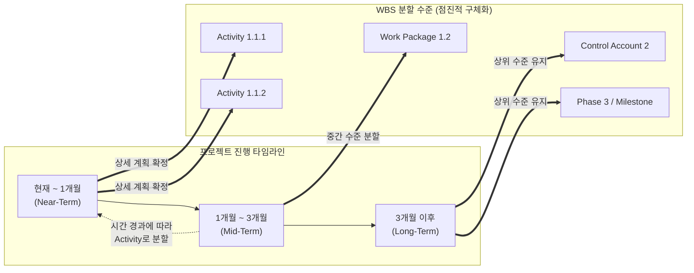

최신 프로젝트 관리 지식 체계(PMBOK) 및 애자일([[Agile]]) 하이브리드 방법론에서의 연동계획(Rolling Wave Planning) 적용 기법에 대한 사전 조사 및 사실관계 검증을 완료하였습니다. 이를 바탕으로 지시하신 정보관리기술사 1교시형 모범답안 양식에 맞추어 작성된 답안입니다.

# 연동계획 (Rolling Wave Planning)

---

## I. 프로젝트 불확실성 극복을 위한, 연동계획의 개요

* **정의**: 프로젝트 수행 초기에는 가까운 단기 일정만 WBS의 하위(Activity) 수준까지 상세하게 계획하고, 먼 장기 일정은 상위 수준(마일스톤 등)으로 둔 후 시간이 지남에 따라 점진적으로 구체화하는 일정 계획 기법
* **필요성 및 등장배경**:
* **불확실성 대응**: 프로젝트 초기에 모든 변수를 예측하기 어려운 한계를 극복하고, 정보가 명확해지는 시점에 계획을 구체화하여 리스크 감소
* **점진적 구체화(Progressive Elaboration)**: 계획의 정확도를 높이고 유연한 변경 수용을 통해 애자일(Agile) 및 린([[린 방법론|Lean]]) 방식의 관리 철학 지원

* **특징**: WBS의 단계적 분할, 유연성 확보, 재계획(Re-planning) 오버헤드 최소화

---

## II. 연동계획의 개념도 및 핵심 구성요소

### 가. 연동계획의 아키텍처 및 동작 원리

* 현재 시점과 가까운 단기 과제는 작업(Activity) 단위로 상세하게 WBS를 분할함
* 먼 미래의 장기 과제는 통제 계정(Control Account)이나 단계(Phase) 수준의 개괄적 계획으로 남겨두고, 해당 시점이 도래할 때 상세화함

### 나. 연동계획의 핵심 기술 및 구성 요소

| 구분 | 요소기술(키워드) | 세부 설명 |
| --- | --- | --- |
| **핵심 원리** | **점진적 구체화 (Progressive Elaboration)** | 프로젝트 진행에 따라 가용 정보가 증가하면, 계획을 지속적으로 상세화하고 정확도를 높이는 원리 |
| **분할 도구** | **[[WBS|WBS (Work Breakdown Structure)]]** | 전체 프로젝트 범위를 관리 및 통제 가능한 단위(Work Package, Activity)로 계층화하여 분할 |
| **단기 계획** | **Activity / Work Package** | 1~2개월 내에 수행할 작업은 일정, 자원, 원가 산정이 가능하도록 최하위 수준으로 상세 계획 수립 |
| **장기 계획** | **Control Account / Milestone** | 당장 구체화할 수 없는 장기 작업은 성과 측정의 기준점이 되는 상위 수준의 통제 계정으로 유지 |
| **일정 관리** | **베이스라인 (Schedule Baseline)** | 승인된 일정 기준선. 연동계획에 의한 구체화 작업은 공식적인 변경 통제 절차 없이 베이스라인 내에서 수행 |
| **연계 기법** | **단계 관문 (Phase Gate)** | 특정 프로젝트 단계가 끝나고 다음 단계의 연동계획을 상세하게 수립하기 전 수행하는 리뷰 포인트 |
| **위험 관리** | **리스크 완화 (Risk Mitigation)** | 불확실한 미래를 조기에 확정하지 않음으로써, 잘못된 계획 수립에 따른 재작업(Rework) 및 비용 리스크 차단 |
| **애자일 연계** | **스프린트 백로그 (Sprint Backlog)** | 애자일 방법론의 릴리즈 계획(장기)과 스프린트 계획(단기) 패턴은 연동계획의 철학을 소프트웨어 공학에 구현한 형태 |

---

## III. 전통적 계획 방식과의 비교 및 활용 전망

### 가. 연동계획과 전통적 확정 계획(Big Bang) 비교

| 비교 항목 | 연동계획 (Rolling Wave Planning) | 전통적 확정 계획 (Big Bang Planning) |
| --- | --- | --- |
| **개념** | **점진적 구체화** (근거리 상세, 원거리 개괄) | **일괄 상세화** (초기에 전체 일정을 상세 확정) |
| **WBS 분할** | 시점별로 분할 깊이(Depth)가 다름 | 모든 범위가 동일한 시점에 최하위로 분할됨 |
| **적용 환경** | R&D, SW 개발 등 **불확실성이 높고 잦은 변경이 예상되는 분야** | 건설, 제조 등 초기 **요구사항이 명확하고 변동성이 낮은 분야** |
| **유연성** | 매우 높음 (환경 변화에 신속 대응) | 낮음 (변경 발생 시 대규모 재작획 및 승인 필요) |
| **활용 방법론** | 애자일(Agile), 하이브리드(Hybrid) 프로젝트 | [[워터폴|폭포수]](Waterfall), 예측형(Predictive) 프로젝트 |

### 나. 산업 적용 동향 및 향후 전망

* **하이브리드 프로젝트 관리(Hybrid PM)의 표준 정착**: 최근 대형 SI 프로젝트에서는 전체 마스터플랜은 예측형(전통적 WBS)으로 수립하되, 세부 모듈의 구현 단계에는 연동계획 기반의 [[스크럼]]([[SCRUM|Scrum]]) 및 이터레이션(Iteration)을 적용하는 하이브리드 모델이 필수적으로 도입됨
* **AI 기반 자동화 일정 갱신**: 과거에는 사람이 수동으로 장기 계획을 단기 계획으로 구체화(Decomposition)했으나, 최근에는 프로젝트 관리 시스템(PMS)에 AI 에이전트가 도입되어 과거 유사 프로젝트 데이터를 바탕으로 도래하는 작업의 WBS 및 리소스를 자동 추천/분할하는 지능형 스케줄링으로 발전 중

---

### 🔗 연관 토픽

- **소속 도메인**: [[00_프로젝트관리_MOC|📋 프로젝트관리]]
- **세부 분류**: `1. PMBOK 표준 & 프로젝트 거버넌스`
- **핵심 연관 토픽**:
  - [[SCRUM]]
  - [[프로젝트 관리 계획서]]
  - [[린 방법론|린 (Lean) 방법론]]
  - [[스크럼|스크럼 (SCRUM)]]
  - [[Agile]]
