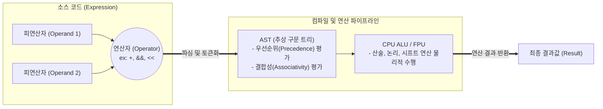

# 연산자 (Operator)

---

## I. 데이터 가공 및 제어 흐름의 핵심, 연산자의 개요

* **정의**: 프로그램 내에서 하나 이상의 피연산자(Operand)를 대상으로 수학적, 논리적, 관계적 연산을 수행하여 특정한 결과값을 산출하도록 컴파일러나 인터프리터에 지시하는 기호 또는 예약어
* **필요성 및 특징**:
* **데이터 처리**: 변수나 상수의 값을 가공하고 결합하여 새로운 정보를 생성
* **흐름 제어**: 관계/논리 연산자를 통해 조건문(if), 반복문(while)의 실행 분기를 결정
* **다형성 및 최적화**: 연산자 오버로딩(Overloading)을 통한 객체 지향성 지원 및 비트 연산을 통한 하드웨어 제어/초고속 연산 수행

---

## II. 연산자의 개념도 및 핵심 구성 요소

### 가. 연산자의 구문 분석 및 실행(Evaluation) 개념도

* 수식(Expression) 내의 연산자는 파싱 단계를 거쳐 AST로 구성되며, 연산자 우선순위와 결합 법칙에 따라 실행 순서가 결정됨
* 최종적으로 [[CPU]]의 ALU(산술논리연산장치)로 전달되어 기계어 수준의 물리적 연산이 수행됨

### 나. 연산자의 주요 분류 및 핵심 기술 요소

| 분류 | 요소기술(키워드) | 세부 설명 |
| --- | --- | --- |
| **기본 연산** | **산술 연산자 (Arithmetic)** | `+`, `-`, `*`, `/`, `%` 등 수학적 계산 수행. 실수 연산 시 부동소수점 오차 주의 |
| **기본 연산** | **관계 연산자 (Relational)** | `==`, `!=`, `>`, `<` 등 두 피연산자의 크기나 동등성을 비교하여 Boolean 값 반환 |
| **논리 제어** | **논리 연산자 (Logical)** | `&&` (AND), ` |
| **하드웨어 제어** | **비트 연산자 (Bitwise)** | `&`, ` |
| **조건 분기** | **삼항 연산자 (Ternary)** | `조건 ? 참 : 거짓` 형태로, if-else 문을 간결한 단일 수식으로 대체하여 코드 가독성 향상 |
| **연산 평가** | **단축 평가 (Short-Circuit)** | `&&`, ` |
| **객체 지향** | **연산자 오버로딩 (Overload)** | 사용자 정의 [[클래스]]/객체에 대해 기존 연산자의 동작을 재정의하여 다형성([[다형성|Polymorphism]]) 구현 |
| **안전성 제어** | **Null 병합 / 옵셔널 체이닝** | `??` (Null 대체), `?.` (Null 안전 접근) 등 모던 언어에서 NullPointerException을 방지하는 연산자 |

---

## III. 연산자 평가 방식 비교 및 컴파일러 최적화 동향

### 가. 논리 연산자(단축 평가)와 비트 연산자 비교

| 비교 항목 | 논리 연산자 (Logical Operator) | 비트 연산자 (Bitwise Operator) |
| --- | --- | --- |
| **대표 기호** | `&&`, ` |  |
| **평가 방식** | **단축 평가 (Short-Circuit Evaluation)** 적용 | **엄격한 평가 (Eager Evaluation)** 적용 (모두 평가) |
| **연산 단위** | Boolean (True / False) 논리값 | 정수형 데이터의 개별 Bit 단위 |
| **주요 용도** | 조건문 분기, 복합 논리식 검증 | 임베디드 장치 제어, 마스킹(Masking), 고속 연산 |

### 나. 연산자 관련 최신 트렌드 및 최적화 동향

* **컴파일러의 연산자 강도 경감(Operator Strength Reduction)**: 컴파일러 최적화 기법 중 하나로, 연산 비용이 비싼 곱셈(`* 2`)이나 나눗셈을 실행 속도가 매우 빠른 비트 시프트 연산(`<< 1`)이나 덧셈으로 자동 변환하여 시스템 성능을 극대화함
* **Null Safety 중심의 모던 연산자 확산**: Kotlin, Swift, TypeScript 등 현대 프로그래밍 언어에서는 런타임 크래시의 주원인인 Null 처리를 위해, 엘비스 연산자(`?:`), 널 병합 연산자(`??`) 등을 기본 문법으로 채택하여 견고한 [[소프트웨어 아키텍처]] 구성을 지원함

---

### 🔗 연관 토픽

- **소속 도메인**: [[00_컴퓨터구조_MOC|💻 컴퓨터구조]]
- **세부 분류**: `3. 고성능 AI 가속기 & 입출력 시스템`
- **핵심 연관 토픽**:
  - [[클래스]]
  - [[Boolean Type]]
  - [[CPU]]
  - [[다형성|다형성 (Polymorphism)]]
  - [[PCI Express (Peripheral Component Interconnect Express)]]
