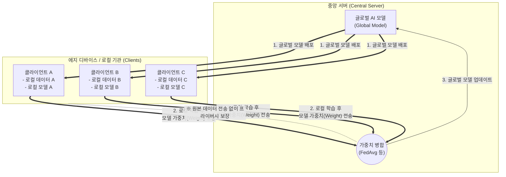

# 연합 학습 (Federated Learning)

---

## I. 프라이버시 보호와 데이터 사일로 극복, 연합 학습의 개요

* **정의**: 사용자 단말(에지 디바이스)이나 개별 기관에 원본 데이터를 유지한 채, 로컬에서 학습된 모델의 가중치(Weight)나 기울기(Gradient)만을 중앙 서버로 전송하여 글로벌 모델을 공동 학습하는 분산형 머신러닝 기법
* **등장배경 및 특징**:
* **프라이버시 규제 강화**: GDPR, [[마이데이터]] 등 개인정보 보호법 강화로 데이터의 중앙 집중화 제약 발생
* **데이터 사일로(Data Silo) 극복**: 서로 다른 기업이나 병원 간에 원본 데이터 공유 없이 협력적 AI 모델 구축 가능
* **통신 비용 및 서버 부하 감소**: 원본 빅데이터 전송 대신 작은 크기의 모델 파라미터만 교환하여 네트워크 대역폭 절감

---

## II. 연합 학습의 개념도 및 핵심 기술 요소

### 가. 연합 학습의 아키텍처 및 동작 원리

* 로컬 디바이스는 수신된 글로벌 모델을 자신의 데이터로 재학습한 후, 변경된 모델 파라미터만 중앙 서버로 전송함
* 중앙 서버는 수집된 파라미터들을 병합(Aggregation)하여 새로운 글로벌 모델을 생성하고 다시 배포하는 과정을 반복함

### 나. 연합 학습의 핵심 기술 요소

| 구분 | 요소기술(키워드) | 세부 설명 |
| --- | --- | --- |
| **핵심 [[알고리즘]]** | **FedAvg (Federated Averaging)** | 수집된 각 클라이언트의 로컬 모델 가중치를 평균화(또는 가중 평균)하여 글로벌 모델 업데이트 |
| **프라이버시 보호** | **[[차분 프라이버시]] (Differential Privacy)** | 로컬 파라미터 전송 시 인위적인 노이즈를 주입하여 특정 개인의 데이터 역추적 방지 |
| **프라이버시 보호** | **동형암호 ([[동형 암호|Homomorphic Encryption]])** | 모델 가중치를 암호화된 상태 그대로 전송하고 병합 연산까지 수행하여 중간 탈취 위험 원천 차단 |
| **통신 최적화** | **모델 압축 / 양자화 (Quantization)** | 에지 기기의 통신 대역폭 한계를 극복하기 위해 파라미터의 정밀도를 낮추거나 희소화(Sparsification) 전송 |
| **학습 환경 분류** | **Cross-Device FL** | 스마트폰, IoT 등 수백만 대의 모바일 에지 기기가 참여하는 B2C 형태의 연합 학습 |
| **학습 환경 분류** | **Cross-Silo FL** | 병원, 은행 등 소수의 거대 기관들이 고품질 데이터를 기반으로 연합하는 B2B 형태의 학습 |
| **데이터 불균형** | **Non-IID 데이터 대응** | 각 기기마다 데이터 분포가 다른(독립 항등 분포가 아닌) 특성을 극복하기 위한 FedProx 등의 알고리즘 적용 |
| **개인화 기법** | **Personalized FL** | 글로벌 모델을 기반으로 하되, 각 기기별로 일부 레이어를 재조정하여 사용자 맞춤형 추론 제공 |

---

## III. 연합 학습과 중앙집중형 학습 비교 및 향후 전망

### 가. 중앙집중형 학습(Centralized Learning)과의 구조적 비교

| 비교 항목 | 중앙집중형 학습 (Centralized) | 연합 학습 (Federated Learning) |
| --- | --- | --- |
| **데이터 보관 위치** | **중앙 서버**로 모두 수집되어 통합 저장 | **개별 디바이스 (로컬)** 에 분산 보관 |
| **네트워크 전송 대상** | 원본 데이터 전체 (이미지, 텍스트 등 방대함) | **모델 파라미터 / 가중치** (상대적 소용량) |
| **프라이버시 수준** | 낮음 (데이터 유출 및 오용 위험 존재) | **매우 높음** (원본 노출 원천 차단) |
| **컴퓨팅 자원 의존도** | 중앙 서버의 막대한 [[GPU]] 컴퓨팅 파워 요구 | 에지 디바이스의 [[NPU]]/AP 자원을 분산 활용 |

### 나. 연합 학습의 최신 트렌드 및 산업 적용 전망

* **분할 학습(Split Learning)과의 융합 (SFL)**: 단말 기기의 연산 한계를 극복하기 위해, 모델의 앞단은 에지 기기에서, 뒷단은 서버에서 나누어 연산하는 분할 학습 기법을 연합 학습과 결합한 SFL(Split Federated Learning) 연구 활발
* **[[01_IT Tech/블록체인]](Blockchain) 기반 탈중앙화**: 중앙 서버(Aggregator)가 단일 장애점(SPOF)이 되거나 악의적으로 조작될 위험을 방지하기 위해 스마트 컨트랙트 기반으로 가중치를 병합하는 완전 탈중앙화 연합 학습 대두
* **민감 데이터 산업 표준으로 부상**: 구글의 Gboard 단어 예측 수준을 넘어, 현재는 다기관 의료 영상 분석(의료 데이터 외부 반출 금지 극복) 및 금융 기관 간 사기 탐지(FDS) 모델 공동 구축의 사실상(De Facto) 표준으로 정착 중

---

### 🔗 연관 토픽

- **소속 도메인**: [[00_인공지능_MOC|🤖 인공지능]]
- **세부 분류**: `6. 설명가능한 AI (XAI) & AI 윤리 · 거버넌스`
- **핵심 연관 토픽**:
  - [[동형 암호|동형 암호 (Homomorphic Encryption)]]
  - [[GPU]]
  - [[NPU|NPU(Neural Processing Unit)]]
  - [[비식별화]]
  - [[온디바이스 AI]]
