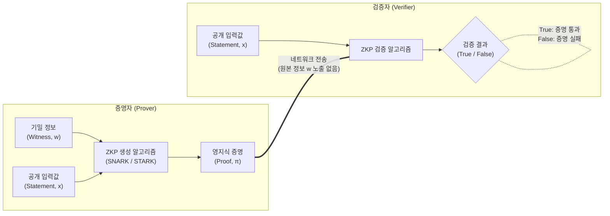

# 영지식증명 (Zero Knowledge Proof, ZKP)

---

## I. 완벽한 프라이버시 보장을 위한 암호학적 프로토콜, 영지식증명의 개요

* **정의**: 증명자(Prover)가 검증자(Verifier)에게 자신이 특정 기밀 정보(Secret)를 알고 있음을 그 정보 자체를 전혀 노출하지 않고도 수학적·확률적으로 증명할 수 있는 암호학적 기법
* **필요성 및 등장배경**:
* **데이터 프라이버시 규제**: [[마이데이터]], GDPR 환경에서 민감한 원본 데이터의 노출 없이 자격 및 신원(DID) 증명 요구 증대
* **[[01_IT Tech/블록체인]] 한계 극복**: 이더리움 등 퍼블릭 블록체인의 투명성으로 인한 개인정보 유출 문제 해결 및 Layer 2(ZK-Rollup) 확장성 확보 필요

* **3대 핵심 속성**: 완전성(Completeness), 건전성(Soundness), 영지식성(Zero-Knowledge)

---

## II. 영지식증명의 개념도 및 핵심 기술 요소

### 가. 영지식증명(비대화형, NIZK)의 아키텍처 및 동작 원리

* 증명자는 기밀 정보(Witness)와 공개 입력값을 결합하여 원본을 유추할 수 없는 증명값(Proof)을 생성함
* 검증자는 증명자로부터 받은 Proof와 공개 입력값만을 활용하여, 원본 데이터 확인 없이 수학적 검증 알고리즘을 통해 참/거짓을 판별함

### 나. 영지식증명의 핵심 기술 및 구성 요소

| 구분 | 요소기술(키워드) | 세부 설명 |
| --- | --- | --- |
| **참여 주체** | **Prover / Verifier** | 기밀 정보를 소유하고 증명하는 주체(Prover)와 이를 검증하는 주체(Verifier) |
| **핵심 속성** | **완전성 (Completeness)** | 조건이 참(True)인 경우, 정직한 검증자는 정직한 증명자의 증명을 **항상 납득(수락)**함 |
| **핵심 속성** | **건전성 (Soundness)** | 조건이 거짓(False)인 경우, 어떠한 악의적 증명자도 검증자를 **속일 수 없음 (기만 확률 0 수렴)** |
| **핵심 속성** | **영지식성 (Zero-Knowledge)** | 검증자는 명제의 참/거짓 결과 외에는 증명자의 기밀 정보에 대한 **어떠한 지식도 얻을 수 없음** |
| **증명 방식** | **대화형 (Interactive ZKP)** | 증명자와 검증자 간의 지속적인 질의응답 챌린지를 반복하여 확률적으로 증명 (오버헤드 큼) |
| **증명 방식** | **비대화형 (NIZK)** | 해시 함수나 타원곡선 암호를 활용하여 단 한 번의 증명값 생성 및 전송으로 검증 완료 |
| **수학적 변환** | **산술 회로 (Arithmetic Circuit)** | 비즈니스 로직(컴퓨터 프로그램)을 증명 가능한 형태의 다항식(Polynomial) 구조로 변환하는 기술 |
| **신뢰 가정** | **Trusted Setup (신뢰할 수 있는 설정)** | [[프로토콜]] 초기화 시 생성되는 난수(Toxic Waste) 파기 과정. (보안 취약점 요소로 작용 가능) |

---

## III. 대표적 영지식증명 알고리즘 비교 및 최신 동향

### 가. 대표적 NIZK 알고리즘 비교 (zk-SNARK vs zk-STARK)

| 비교 항목 | zk-SNARK | zk-STARK |
| --- | --- | --- |
| **기본 개념** | Succinct Non-interactive ARgument of Knowledge | Scalable Transparent ARgument of Knowledge |
| **암호학적 기반** | [[타원곡선 암호]] (Elliptic Curve) | 충돌 회피 해시 함수 (Collision-Resistant Hash) |
| **Trusted Setup** | **반드시 필요함** (초기 난수 유출 시 치명적) | **불필요함** (Transparent, 투명성 보장) |
| **증명 크기** | **매우 작음** (약 288 Bytes, 검증 속도 매우 빠름) | 큼 (수십~수백 KB, 네트워크 대역폭 소모 큼) |
| **양자 내성** | **취약함** (Shor 알고리즘에 의해 타원곡선 파훼) | **안전함** (해시 함수 기반으로 [[양자컴퓨터]] 내성 보유) |
| **주요 활용** | Zcash, zkSync, 초기 ZK-Rollup 프로젝트 | StarkNet, dYdX 등 대규모 연산 및 차세대 확장성 솔루션 |

### 나. 영지식증명의 산업 적용 동향 및 향후 전망

* **이더리움 ZK-Rollup 대중화**: 메인넷(L1)의 연산 부하를 오프체인(L2)에서 처리하고, 그 결과의 무결성을 증명하는 영지식 증명값만 메인넷에 기록하여 블록체인 트릴레마(확장성, 보안성, 탈중앙화)를 극복하는 핵심 기술로 정착
* **개인정보보호 및 프라이버시 강화 기술(PET) 융합**: 신원 확인 시 "성인 여부"만 증명하고 주민등록번호나 생년월일은 제공하지 않는 분산신원증명(DID), 금융권의 중앙은행 디지털화폐([[CBDC]]) 익명성 보장 및 헬스케어 연합학습(Federated Learning)의 핵심 보안 레이어로 적극 활용 중

---

### 🔗 연관 토픽

- **소속 도메인**: [[00_보안_MOC|🛡️ 보안]]
- **세부 분류**: `2. 현대 암호학 & 키 관리 · 전자서명`
- **핵심 연관 토픽**:
  - [[CBDC]]
  - [[01_IT Tech/블록체인|블록체인 (Block Chain)]]
  - [[마이데이터]]
  - [[블록체인 플랫폼|블록체인 (Block Chain) 플랫폼]]
  - [[타원곡선 암호|타원곡선 (Elliptic Curve Cryptography)]]
