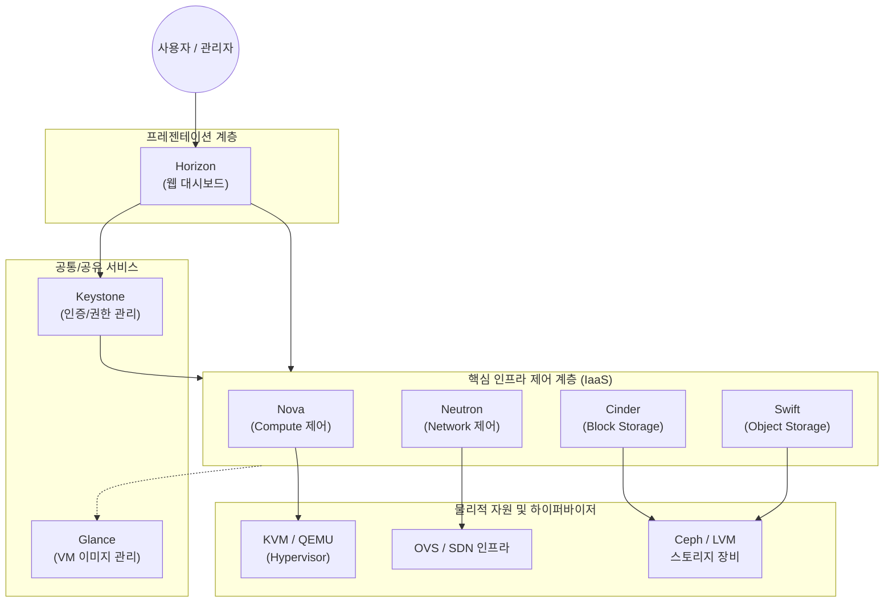

# 오픈스택 프로젝트 (OpenStack Project)

---

## I. 오픈소스 기반 클라우드 인프라 표준, 오픈스택의 개요

* **정의**: 프라이빗 및 퍼블릭 클라우드 환경(IaaS)을 구축하고 관리하기 위해 가상화된 컴퓨팅, 스토리지, 네트워크 자원을 제어하는 오픈소스 소프트웨어 플랫폼
* **등장배경**: AWS, VMware 등 특정 기업의 클라우드 기술 종속성(Vendor Lock-in) 탈피 및 개방형 클라우드 생태계 조성 필요
* **특징**: 모듈형 아키텍처(독립적 프로젝트 결합), 표준 RESTful API 제공, 대규모 확장성(SDDC 구현의 핵심 기반)

---

## II. 오픈스택의 아키텍처 및 핵심 프로젝트 요소

### 가. 오픈스택의 아키텍처 및 동작 원리

* Horizon 대시보드나 CLI를 통해 요청이 들어오면, Keystone의 인증을 거쳐 각 코어 모듈(Nova, Neutron 등)이 REST API로 통신함
* 각 모듈은 하위의 물리적 하드웨어 및 하이퍼바이저 자원을 추상화하여 가상 머신(VM) 및 리소스를 프로비저닝함

### 나. 오픈스택의 핵심 프로젝트 구성 요소

| 구분 | 요소기술 (프로젝트명) | 세부 설명 |
| --- | --- | --- |
| **컴퓨팅** | **Nova** (Compute) | 가상 머신(VM)의 라이프사이클 관리 및 프로비저닝을 담당하는 핵심 컨트롤러 |
| **네트워크** | **Neutron** (Network) | 가상 네트워크, [[라우터]], 로드밸런서 등을 제공하는 [[SDN(Software Defined Network)|SDN]](소프트웨어 정의 네트워크) 제어 모듈 |
| **스토리지** | **Cinder** (Block) | VM에 연결하여 사용하는 블록 스토리지 볼륨의 생성, 연결, 스냅샷 관리 |
| **스토리지** | **Swift** (Object) | 대규모 분산 환경에 적합한 페타바이트급 비정형 객체 스토리지 시스템 |
| **공통/보안** | **Keystone** (Identity) | 오픈스택 전반의 사용자 인증, 토큰 발급 및 서비스 엔드포인트 카탈로그 관리 |
| **공통/이미지** | **Glance** (Image) | 가상 머신 배포에 사용되는 [[OS(운영체제)|운영체제]](OS) 템플릿(이미지)의 등록, 조회, 검색 지원 |
| **편의/제어** | **Horizon** (Dashboard) | 클라우드 관리자와 사용자를 위한 직관적인 웹 기반 GUI 통합 관리 콘솔 |
| **확장/오케스트레이션** | **Heat / Magnum** | Heat는 인프라를 코드(IaC)로 템플릿화하여 배포하며, Magnum은 [[쿠버네티스]](K8s) 클러스터 [[프로비저닝]] 지원 |

---

## III. 오픈스택과 상용 솔루션 비교 및 최근 기술 동향

### 가. 오픈스택 vs VMware vSphere 비교

| 비교 항목 | OpenStack (오픈스택) | VMware vSphere |
| --- | --- | --- |
| **라이선스 형태** | 오픈소스 (Apache 2.0) | 상용 (독점 소프트웨어 라이선스) |
| **아키텍처 철학** | 분산형, 모듈 결합 형태의 유연한 IaaS | 중앙집중형, 통합된 강력한 하이퍼바이저 관리 |
| **하드웨어 호환성** | 화이트박스 및 이기종 범용 H/W 폭넓게 지원 | 특정 인증을 받은 엔터프라이즈 H/W 중심 지원 |
| **도입 비용** | 라이선스 무료, 단 [[유지보수]]/구축 기술 인건비 큼 | 라이선스 고가이나 벤더의 직접 기술 지원 용이 |
| **적합한 환경** | 대규모 통신사(Telco), 퍼블릭 클라우드, 오픈 인프라 | 기업 내 미션 크리티컬 워크로드, 전통적 프라이빗 |

### 나. 오픈스택의 최근 트렌드 및 향후 전망

* **OpenInfra Foundation으로의 진화**: 단일 오픈스택 프로젝트를 넘어, 엣지 컴퓨팅(StarlingX), CI/CD(Zuul) 등을 포괄하는 개방형 인프라 재단으로 거버넌스 확대
* **LOKI (Linux, OpenStack, Kubernetes, Infrastructure) 스택 부상**: 오픈스택이 쿠버네티스의 경쟁자가 아닌, K8s를 구동하기 위한 가장 안정적인 밑단 IaaS(베어메탈, 네트워킹) 레이어로 통합 발전하는 하이브리드 [[컨테이너]] 생태계 정착
* **AI 및 [[GPU]] 가속기 지원 고도화**: [[인공지능]] 워크로드 처리를 위해 **Cyborg** 프로젝트를 통한 GPU, FPGA 등 하드웨어 가속기(Accelerator)의 통합 프로비저닝 및 라이프사이클 관리 기능 강화

---

### 🔗 연관 토픽

- **소속 도메인**: [[00_디지털서비스_MOC|🚀 디지털서비스]]
- **세부 분류**: `1. 클라우드 컴퓨팅 & 가상화 인프라`
- **핵심 연관 토픽**:
  - [[쿠버네티스|쿠버네티스(Kubernates)]]
  - [[컨테이너|컨테이너 (Container)]]
  - [[가상화]]
  - [[OS(운영체제)]]
  - [[라우터]]
