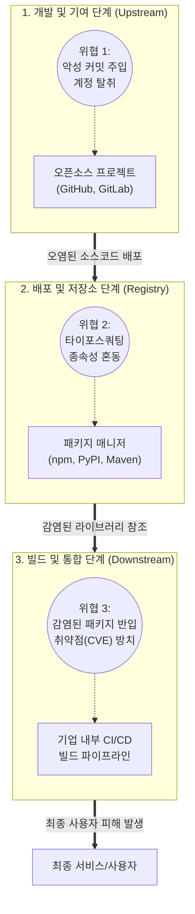

최신 오픈소스 소프트웨어 공급망 보안 위협(Log4j, XZ Utils 사태 등)과 이에 대응하기 위한 글로벌 방어 체계([[SBOM]], SLSA, Sigstore)에 대한 사전 조사 및 사실관계 검증을 완료하였습니다. 이를 바탕으로 지시하신 정보관리기술사 1교시형 모범답안 양식에 맞추어 작성된 답안입니다.

# 오픈소스 SW 보안위협

---

## I. SW 공급망 전체를 위협하는, 오픈소스 SW 보안위협의 개요

* **정의**: 오픈소스의 개발, 배포, 통합 과정에 개입하여 취약점을 악용하거나 악성코드를 주입함으로써, 최종 소프트웨어 사용자의 시스템까지 연쇄적으로 침해하는 공급망(Supply Chain) 타겟형 사이버 공격
* **등장배경 및 특징**:
* **오픈소스 의존도 심화**: 현대 애플리케이션 코드의 80~90% 이상이 오픈소스로 구성되어 단일 취약점의 파급력 극대화 (예: Log4j 사태)
* **공격 벡터의 지능화**: 단순 취약점 악용을 넘어 메인테이너(Maintainer) 권한 탈취 및 장기간에 걸친 정교한 백도어 주입(XZ Utils 사태) 등 사회공학적 기법 결합
* **가시성 확보의 한계**: N차 종속성(Transitive Dependency)으로 인해 기업이 자체적으로 포함된 취약점을 식별하고 패치하기 어려움

---

## II. 오픈소스 SW 보안위협의 공격 벡터 및 핵심 요소 기술

### 가. 오픈소스 SW 생태계의 공격 벡터(Attack Vector) 개념도

* 개발(악성 코드 은닉), 배포(유사 패키지명 위장), 통합(취약한 버전 유지) 등 소프트웨어 라이프사이클 전 단계에서 위협 발생
* 한 번 오염된 오픈소스 컴포넌트는 CI/CD 파이프라인을 타고 다수의 기업 및 최종 사용자에게 연쇄적으로 피해를 유발함

### 나. 오픈소스 SW 보안위협 유형 및 방어 핵심 기술

| 분류 | 요소기술(키워드) | 세부 설명 |
| --- | --- | --- |
| **공격 위협** | **타이포스쿼팅 (Typosquatting)** | 정상 패키지명과 유사한 이름(예: `requests` $\rightarrow$ `requesst`)으로 악성 패키지를 업로드하여 다운로드 유도 |
| **공격 위협** | **종속성 혼동 (Dependency Confusion)** | 내부 저장소의 비공개 패키지명과 동일한 이름의 더 높은 버전을 외부 공개 저장소에 올려 강제 다운로드 유발 |
| **공격 위협** | **악성 커밋 / 백도어 (Backdoor)** | 관리자 권한을 탈취하거나 선의의 기여자로 위장하여 장기간에 걸쳐 감지하기 어려운 악성코드 주입 (XZ Utils) |
| **공격 위협** | **N-Day 취약점 악용** | 패치가 공개되었으나([[CVE]] 발급), 기업 내 업데이트 지연으로 방치된 오픈소스 컴포넌트의 알려진 취약점 공격 |
| **방어 체계** | **SBOM (SW 자산 명세서)** | 소프트웨어를 구성하는 모든 오픈소스 컴포넌트, 버전, 종속성 관계를 식별하고 명세화하는 표준 포맷(SPDX, CycloneDX) |
| **방어 체계** | **SCA (SW 구성 분석 도구)** | 소스코드 및 바이너리를 분석하여 포함된 오픈소스 라이선스 및 알려진 보안 취약점(CVE)을 자동 식별하는 도구 |
| **[[무결성]] 검증** | **SLSA [[프레임워크]]** | 소스코드 작성부터 빌드, 배포까지 전 과정의 무결성을 4단계로 보장하기 위해 구글/OpenSSF가 주도하는 표준 체계 |
| **무결성 검증** | **Sigstore (코드 서명)** | 오픈소스 패키지의 릴리스 및 [[컨테이너]] 이미지에 암호학적 서명을 부여하여 위변조 여부를 검증하는 서명 인프라 |

---

## III. 전통적 위협과의 비교 및 오픈소스 보안 대응 전망

### 가. 전통적 SW 취약점과 오픈소스 공급망 보안위협 비교

| 비교 항목 | 전통적 SW 취약점 (Traditional Vulnerability) | 오픈소스 공급망 위협 (Supply Chain Threat) |
| --- | --- | --- |
| **공격 대상** | 특정 기업이 자체 개발한 시스템 및 애플리케이션 | **오픈소스 생태계 인프라** (GitHub, npm, PyPI 등) |
| **발생 원인** | [[시큐어코딩]] 미준수, 비즈니스 로직 오류 | 권한 탈취, **악의적 패키지 업로드**, N차 종속성 방치 |
| **파급 효과** | 해당 시스템 및 단일 서비스 피해 국한 | **글로벌 규모의 연쇄 침해** (Log4j 등 광범위한 확산) |
| **대응 주체** | 자사 보안팀 및 개발팀 | 글로벌 커뮤니티, OSPO(오픈소스 전담 조직) 협력 필수 |

### 나. 최신 보안 트렌드 및 산업 적용 전망

* **미국 행정명령(EO 14028) 기반 SBOM 의무화 확산**: 미국 정부 기관 납품 SW에 대한 SBOM 제출 의무화가 전 세계적인 표준으로 자리 잡으며, 국내 국정원 및 금융권의 'SW 공급망 보안 가이드라인' 수립 및 망분리 완화의 핵심 통제 요건으로 도입 중
* **OSPO(Open Source Program Office) 조직 중심의 [[DevSecOps]] 내재화**: 오픈소스 도입 시 개발자의 자율성에만 의존하지 않고, CI/CD 파이프라인에 SCA 검사 및 SBOM 생성 단계를 강제화하여 취약점 포함 패키지의 반입을 원천 차단하는 능동적 방어 아키텍처 구축 확산

---

### 🔗 연관 토픽

- **소속 도메인**: [[00_소프트웨어공학_MOC|🏗️ 소프트웨어공학]]
- **세부 분류**: `6. 소프트웨어 테스팅 & 품질 보증 (QA/QC)`
- **핵심 연관 토픽**:
  - [[SBOM]]
  - [[DevSecOps]]
  - [[시큐어코딩]]
  - [[프레임워크]]
  - [[공통감리 절차]]
