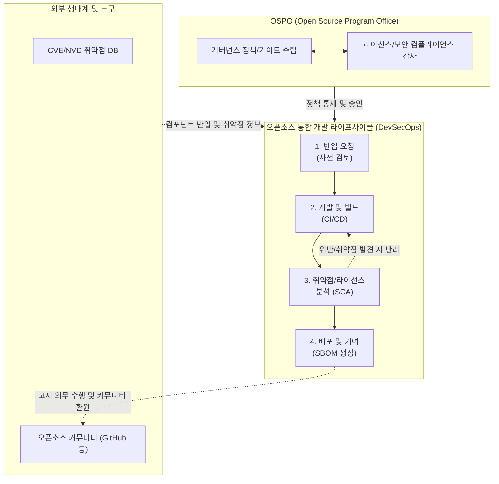

# 오픈소스 거버넌스 (Open Source Governance)

---

## I. 안전한 SW 공급망 확보를 위한, 오픈소스 거버넌스의 개요

* **정의**: 기업 내 오픈소스 소프트웨어의 도입, 사용, 수정, 배포, 기여에 이르는 전 과정을 안전하고 적법하게 관리하기 위한 정책, [[프로세스]], 조직 및 도구의 통합 관리 체계
* **필요성 및 등장배경**:
* **라이선스 컴플라이언스**: GPL 등 전염성(Copyleft) 라이선스 위반 시 지적재산권 소송 및 소스코드 강제 공개 리스크 방지
* **SW 공급망 보안 강화**: Log4j, XZ Utils 백도어 등 오픈소스 취약점을 타겟으로 한 [[공급망 공격]] 방어 및 [[SBOM]](SW 자산 명세서) 제출 의무화 대응

* **특징**: 전담 조직(OSPO) 중심 운영, [[DevSecOps]] 파이프라인 연계, 글로벌 표준(OpenChain) 준수

---

## II. 오픈소스 거버넌스의 개념도 및 핵심 구성 요소

### 가. 오픈소스 거버넌스의 아키텍처 및 라이프사이클

* OSPO(전담 조직)의 통제하에 SW 개발 라이프사이클 전반에 걸쳐 반입, 분석, 승인, 배포가 자동화된 프로세스로 수행됨
* SCA 도구를 활용하여 소스코드 내 오픈소스 라이선스 충돌 여부 및 최신 [[CVE]] 취약점을 실시간으로 분석함

### 나. 오픈소스 거버넌스의 핵심 기술 및 구성 요소

| 구분 | 핵심 요소 (키워드) | 세부 설명 |
| --- | --- | --- |
| **조직 체계** | **OSPO (전담 조직)** | 오픈소스 정책 수립, 교육, 라이선스 검토 및 외부 커뮤니티 소통을 총괄하는 전담 부서 (Open Source Program Office) |
| **정책/규정** | **컴플라이언스 (Compliance)** | 양립성(Compatibility) 검토 및 고지(Notice), 소스코드 공개 의무 등 오픈소스 라이선스별 의무사항 준수 체계 |
| **분석 도구** | **SCA (SW Composition Analysis)** | 소스코드 및 바이너리를 분석하여 포함된 오픈소스의 식별, 라이선스 확인, 알려진 취약점(CVE)을 탐지하는 자동화 도구 |
| **자산 명세** | **SBOM (SW Bill of Materials)** | SW를 구성하는 오픈소스 컴포넌트, 버전, 종속성 정보를 구조화한 명세서 (SPDX, CycloneDX 표준 활용) |
| **보안 관리** | **Vulnerability Management** | NVD 등 글로벌 취약점 데이터베이스와 연동하여 자사 서비스에 적용된 오픈소스의 보안 패치 라이프사이클 관리 |
| **국제 표준** | **OpenChain (ISO/IEC 5230)** | 리눅스 재단 주도로 제정된 기업의 오픈소스 라이선스 컴플라이언스 역량을 평가하고 인증하는 국제 표준 규격 |
| **국제 표준** | **OpenChain (ISO/IEC 18974)** | 오픈소스 기반 소프트웨어 공급망 보안 관리 체계에 대한 국제 표준 규격 |
| **기여/배포** | **업스트림 기여 (Upstream)** | 내부에서 개선한 오픈소스 코드를 원본 프로젝트(커뮤니티)에 환원하여 생태계 활성화 및 기술 리더십 확보 |

---

## III. 전통적 SW 자산 관리와 비교 및 최신 동향

### 가. 전통적 상용 SW 자산 관리와 오픈소스 거버넌스 비교

| 비교 항목 | 전통적 상용 SW 자산 관리 (SAM) | 오픈소스 거버넌스 |
| --- | --- | --- |
| **핵심 관리 목적** | 불법 복제 방지 및 **라이선스 구매 비용 최적화** | **법적 리스크(코드 공개 등) 회피** 및 공급망 보안 |
| **검증 방식** | 구매 계약서, 영수증, 설치 수량 추적 | **SCA 도구** 기반 소스코드 및 종속성(Dependency) 분석 |
| **보안 대응** | 벤더사(Vendor)가 제공하는 공식 패치에 의존 | 커뮤니티 모니터링 및 **직접 소스코드 패치/기여** 필요 |
| **산출물** | SW 설치 대장 및 라이선스 증서 | **SBOM (SPDX, CycloneDX 등)** 및 오픈소스 고지문 |

### 나. 최신 기술 동향 및 향후 전망

* **공공 및 금융권 SBOM 제출 의무화 확산**: 미국 행정명령 14028호 발령 이후, 국내에서도 국정원 및 행정안전부를 중심으로 공공 정보화 사업 및 망분리 완화 정책 추진 시 SBOM 제출 및 검증이 핵심 필수 요건으로 자리매김함
* **AI 및 [[초거대 언어 모델|LLM]] 오픈소스 거버넌스의 대두**: 소프트웨어 코드를 넘어, AI 모델의 가중치(Weights), 파라미터, 학습 데이터셋에 대한 새로운 개방형 라이선스(OpenRAIL 등) 준수 여부 및 [[AI 윤리]](Safety) 검증으로 거버넌스 범위가 확장 중
* **자동화된 거버넌스 파이프라인 (GovOps)**: 개발 속도 저하를 막기 위해, GitHub Actions나 Jenkins CI/CD 파이프라인에 SCA 및 SBOM 생성 도구를 내재화하여 개발자의 명시적 개입 없이 백그라운드에서 거버넌스가 실시간 강제화되는 구조로 진화 중

---

### 🔗 연관 토픽

- **소속 도메인**: [[00_소프트웨어공학_MOC|🏗️ 소프트웨어공학]]
- **세부 분류**: `6. 소프트웨어 테스팅 & 품질 보증 (QA/QC)`
- **핵심 연관 토픽**:
  - [[SBOM]]
  - [[DevSecOps]]
  - [[공급망 공격|공급망 공격(Supply Chain Attack)]]
  - [[오픈소스 SW 보안위협]]
  - [[난독화]]
