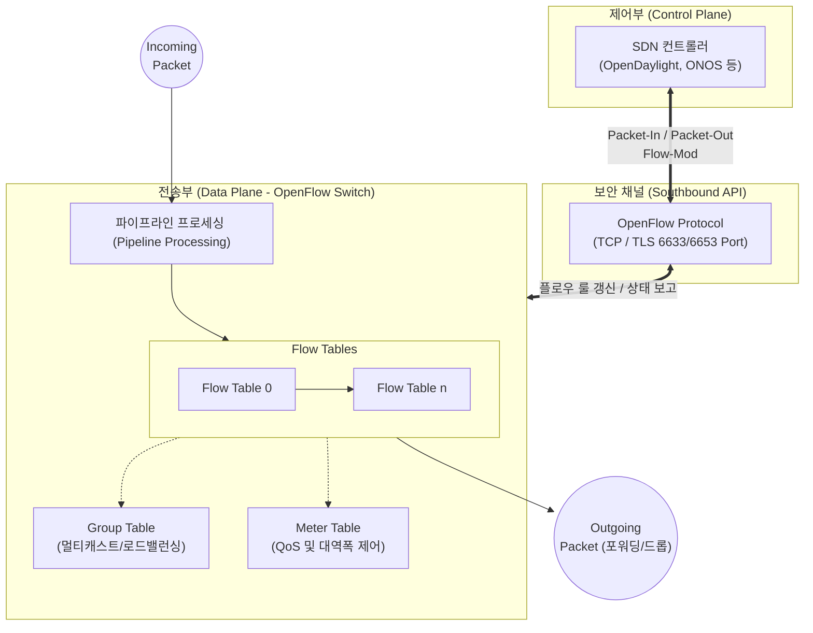

# 오픈플로우 (OpenFlow)

---

## I. SDN 사우스바운드 API의 핵심 표준, 오픈플로우의 개요

* **정의**: 소프트웨어 정의 네트워크([[SDN(Software Defined Network)|SDN]]) 환경에서 네트워크 장비의 제어부(Control Plane)와 전송부(Data Plane)를 분리하고, 중앙의 컨트롤러가 스위치의 플로우 테이블을 직접 제어할 수 있게 하는 개방형 통신 [[프로토콜]]
* **등장배경 및 특징**:
* **벤더 종속성(Lock-in) 탈피**: 하드웨어와 제어 소프트웨어가 결합된 기존 네트워크 장비의 폐쇄성 한계 극복
* **중앙집중형 프로그래머빌리티**: 네트워크 전체 뷰(Global View) 확보 및 API 기반의 유연한 트래픽 경로 제어
* **사우스바운드 API (Southbound API)**: SDN 컨트롤러와 인프라 계층(오픈플로우 [[스위치 (Layer 3 Switch)|스위치]]) 간의 표준화된 인터페이스 제공 (ONF 주도)

---

## II. 오픈플로우의 아키텍처 및 핵심 구성요소

### 가. 오픈플로우의 아키텍처 및 동작 원리

* 미등록 패킷 유입 시 스위치는 컨트롤러에 질의(Packet-In)하고, 컨트롤러는 최적 경로를 계산하여 룰을 하달(Packet-Out / Flow-Mod)함
* 오픈플로우 스위치는 다중 플로우 테이블 기반의 파이프라인 처리를 통해 매치(Match)된 패킷에 대해 액션(Action)을 수행함

### 나. 오픈플로우의 핵심 기술 및 구성 요소

| 구분 | 요소기술(키워드) | 세부 설명 |
| --- | --- | --- |
| **제어/통신** | **SDN 컨트롤러** | 오픈플로우 프로토콜을 통해 스위치를 제어하며, 토폴로지 관리 및 라우팅 계산 수행 |
| **제어/통신** | **보안 채널 (Secure Channel)** | 컨트롤러와 스위치 간 명령 및 패킷 전송을 위해 TLS 또는 [[TCP]] 기반 [[암호화]] 통신 제공 |
| **데이터 구조** | **플로우 테이블 (Flow Table)** | 패킷 처리를 위한 규칙 집합. **Match(조건), Counter(통계), Action(동작)**으로 구성 |
| **처리 방식** | **파이프라인 (Pipelining)** | 패킷이 순차적으로 여러 플로우 테이블을 거치며 복합적인 포워딩 및 변조를 수행하는 구조 |
| **룰 매칭** | **Match Field** | L2([[MAC]])부터 L4(TCP/UDP Port)까지 다양한 헤더 필드 조합을 통해 세밀한 트래픽 식별 |
| **룰 실행** | **Action / Instruction** | 매칭된 패킷에 대해 포워딩(Forward), 드롭(Drop), 헤더 변조, 메타데이터 추가 등 수행 |
| **확장 구조** | **Group Table** | 멀티캐스트, 브로드캐스트, 로드밸런싱 등 다수의 포트로 패킷을 복제/분산 전송 (OF 1.1+) |
| **[[QoS]] 제어** | **Meter Table** | 특정 플로우의 트래픽 전송률(Rate)을 측정하고 패킷 드롭/마킹을 통해 대역폭 제어 (OF 1.3+) |

---

## III. 전통적 네트워크 라우팅과의 비교 및 향후 전망

### 가. 전통적 라우팅 프로토콜(OSPF/BGP)과 오픈플로우 비교

| 비교 항목 | 전통적 라우팅 (Legacy Network) | 오픈플로우 기반 SDN |
| --- | --- | --- |
| **아키텍처** | 제어부와 전송부가 스위치 내에 **통합 (분산 제어)** | 제어부와 전송부가 **논리적 분리 (중앙집중 제어)** |
| **포워딩 기준** | **목적지 IP 주소** 기반 (Destination-based) | **플로우(L2~L4 헤더 조합)** 기반 (Flow-based) |
| **설정 방식** | Box-by-Box 개별 장비 CLI 설정 | 중앙 컨트롤러의 통합 API 제어 (Programmable) |
| **주요 활용** | 일반적인 기업망, 인터넷 백본 | 클라우드 데이터센터 인프라, 5G 코어망, 트래픽 엔지니어링 |

### 나. 오픈플로우의 향후 기술 동향 및 진화 전망

* **화이트박스(White-box) 스위치 확산**: 오픈플로우의 등장으로 인텔 칩이나 브로드컴 기반의 범용 하드웨어(Bare-metal)에 SDN용 OS를 탑재하여 사용하는 개방형 네트워킹 생태계 가속화
* **데이터 플레인 프로그래밍(P4)으로의 진화**: 오픈플로우가 사전에 정의된 프로토콜 헤더만을 매칭할 수 있는 한계를 극복하기 위해, 사용자가 패킷 파싱(Parsing) 규칙을 직접 정의할 수 있는 **P4 (Programming Protocol-independent Packet Processors)** 언어로 SDN 데이터 플레인 패러다임이 고도화되는 추세임

---

### 🔗 연관 토픽

- **소속 도메인**: [[00_네트워크_MOC|🌐 네트워크]]
- **세부 분류**: `1. OSI 7계층 & 데이터링크 계층 (L1/L2)`
- **핵심 연관 토픽**:
  - [[스위치 (Layer 3 Switch)]]
  - [[프로토콜]]
  - [[TCP]]
  - [[SDN(Software Defined Network)]]
  - [[QoS|QoS (Quality of Service)]]
