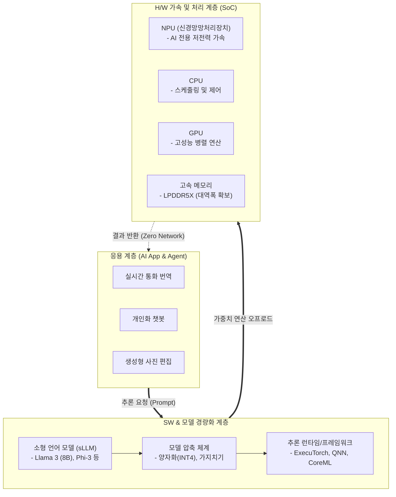

# 온디바이스 AI (On-Device AI)

---

## I. 클라우드 의존성을 탈피한 에지 지능, 온디바이스 AI의 개요

* **정의**: 외부 클라우드 서버를 거치지 않고 스마트폰, PC, IoT 등 사용자 단말(Device) 내부에서 자체적으로 AI 모델을 구동하고 추론(Inference)을 수행하는 지능형 기술
* **필요성 및 특징**:
* **강력한 프라이버시(Privacy)**: 민감한 개인 데이터(사진, 메시지 등)가 외부로 전송되지 않아 정보 유출 원천 차단
* **초저지연(Ultra-Low Latency)**: 네트워크 통신 지연이 없어 실시간 반응 속도 보장 및 오프라인(Offline) 환경 구동 가능
* **인프라 비용 절감**: AI 추론 연산을 수억 대의 개별 디바이스로 분산하여 빅테크 기업의 막대한 클라우드 서버 유지 비용 감소

---

## II. 온디바이스 AI의 아키텍처 및 핵심 기술 요소

### 가. 온디바이스 AI의 추론 아키텍처 및 동작 원리

* 응용 계층의 추론 요청은 압축된 경량 언어 모델([[sLLM (Smaller Large Language Model)|sLLM]])과 최적화된 런타임을 거쳐 디바이스의 SoC로 전달됨
* [[CPU]]/[[GPU]] 부하를 최소화하기 위해 AI 전용 하드웨어인 [[NPU]](신경망처리장치)와 고대역폭 메모리를 활용하여 독립적인 초고속 연산을 수행함

### 나. 온디바이스 AI의 핵심 기술 요소

| 구분 | 핵심 기술 (키워드) | 세부 설명 |
| --- | --- | --- |
| **모델 구현** | **sLLM (소형 언어 모델)** | 수십억 개(7B~8B) 수준의 파라미터로 모바일 기기 메모리에 적재 가능하도록 최적화된 언어 모델 |
| **모델 압축** | **양자화 (Quantization)** | 모델 가중치의 데이터 정밀도를 부동소수점(FP32)에서 정수형(INT8, INT4)으로 변환하여 메모리 및 연산량 대폭 축소 |
| **모델 압축** | **[[지식 증류|지식 증류 (Knowledge Distillation)]]** | 대규모 교사 모델(Teacher)의 복잡한 지식을 소형 학생 모델(Student)로 전달하여 경량화 대비 성능 저하 방지 |
| **하드웨어** | **NPU (Neural Processing Unit)** | 딥러닝의 행렬 곱셈 누산([[MAC]]) 연산을 저전력으로 고속 처리하는 AI 전용 하드웨어 가속기 (TOPS 지표 활용) |
| **하드웨어** | **LPDDR5X / LPCAMM2** | 수 GB에 달하는 모델 가중치를 NPU로 병목 없이 실시간 전송하기 위한 초고속·저전력 모바일 D램 |
| **소프트웨어** | **온디바이스 런타임** | 디바이스별 이기종 하드웨어(CPU, GPU, NPU)에 연산을 최적으로 분배하는 [[프레임워크]] (TensorRT, ExecuTorch) |
| **보안 체계** | **TEE (신뢰 실행 환경)** | TrustZone, Secure Enclave 등을 활용하여 민감한 프롬프트 및 사용자 컨텍스트를 물리적으로 격리하여 처리 |
| **연동 아키텍처** | **하이브리드 AI (Hybrid AI)** | 온디바이스 AI의 성능 한계를 극복하기 위해, 복잡도에 따라 로컬 처리와 프라이빗 클라우드(PCC) 처리를 동적 분기 |

---

## III. 클라우드 AI와의 비교 및 향후 전망

### 가. 클라우드 AI와 온디바이스 AI 비교

| 비교 항목 | 클라우드 AI (Cloud AI) | 온디바이스 AI (On-Device AI) |
| --- | --- | --- |
| **연산 수행 위치** | 중앙 집중형 데이터센터 서버 | 사용자 단말 기기 내부 (스마트폰, PC, 자동차 등) |
| **네트워크 의존성** | 필수 (인터넷 미연결 시 서비스 불가) | **불필요 (오프라인 상태(에어플레인 모드) 구동 가능)** |
| **프라이버시/보안** | 낮음 (데이터 외부 전송에 따른 해킹/오용 리스크) | **매우 높음 (데이터가 디바이스를 벗어나지 않음)** |
| **응답 지연(Latency)** | 네트워크 상태에 따른 지연(Ping) 발생 | **초저지연 (즉각적인 인터랙션 보장)** |
| **활용 모델 규모** | 초거대 [[초거대 언어 모델|LLM]] (수천억 파라미터 이상) | **경량화 sLLM (수십억 파라미터, 4~8GB RAM 점유)** |

### 나. 향후 전망 및 기술 동향

* **하이브리드 AI 패러다임의 표준화**: 애플 인텔리전스(Apple Intelligence), 갤럭시 AI와 같이 단순 번역/요약은 온디바이스로 처리하고, 고도의 추론이 필요한 작업은 보안이 강화된 전용 클라우드로 오프로딩하는 '하이브리드 아키텍처'가 산업 표준으로 정착 중
* **AI PC 및 엣지 디바이스 폼팩터 확산**: 마이크로소프트의 Copilot+ PC 규격(NPU 40 TOPS 이상 요구) 발표를 기점으로, 스마트폰을 넘어 윈도우 랩탑, 스마트 가전, [[Smart Car(자율주행)|자율주행]] 차량 등 일상 속 모든 기기에 온디바이스 AI 연산 칩셋 탑재가 의무화되는 추세임

---

### 🔗 연관 토픽

- **소속 도메인**: [[00_인공지능_MOC|🤖 인공지능]]
- **세부 분류**: `6. 설명가능한 AI (XAI) & AI 윤리 · 거버넌스`
- **핵심 연관 토픽**:
  - [[초거대 언어 모델|초거대 언어 모델(Large Language Model)]]
  - [[sLLM (Smaller Large Language Model)]]
  - [[GPU]]
  - [[지식 증류|지식 증류 (Knowledge Distillation)]]
  - [[CPU]]
