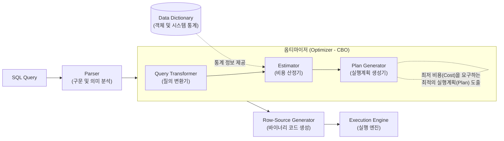

# 옵티마이저 (Optimizer)

---

## I. SQL 최적 실행 경로 탐색기, 데이터베이스 옵티마이저의 개요

* **정의**: 사용자가 요청한 [[SQL(Structured Query Language)|SQL]] 질의를 분석하여, [[데이터베이스]] 내에서 최소의 비용으로 가장 빠르게 데이터를 추출할 수 있는 최적의 처리 경로(Execution Plan)를 결정하는 [[DBMS]]의 핵심 두뇌 엔진
* **필요성 및 등장배경**:
* **선언적 언어의 한계 보완**: SQL은 결과(What)만을 명시하므로, 처리 방법(How)에 대한 시스템적, 지능적 판단 필수
* **최소 비용 및 응답속도 보장**: 디스크 I/O를 최소화하고 [[CPU]] 및 메모리 자원을 효율적으로 사용하여 쿼리 [[처리량]](Throughput) 극대화

* **특징**: 파서(Parser) 구문 분석 이후 동작, 데이터 딕셔너리 통계정보 의존성(CBO 환경), 힌트(Hint)를 통한 강제 제어 지원

---

## II. 옵티마이저의 아키텍처 및 핵심 기술 요소

### 가. 옵티마이저의 개념도 및 동작 원리

* 파서(Parser)를 거친 SQL은 질의 변환기에서 표준 형태로 논리적 변환이 이루어지며, 비용 산정기가 데이터 딕셔너리의 통계정보를 참조하여 실행 대안들의 예상 비용(Cost)을 수치화함
* 실행계획 생성기는 산출된 비용 중 가장 적은 리소스를 요구하는 최적의 트리(Execution Plan)를 선택하여 실행 엔진으로 전달함

### 나. 옵티마이저의 핵심 기술 및 구성 요소

| 구분 | 요소기술(키워드) | 세부 설명 |
| --- | --- | --- |
| **세부 모듈** | **질의 변환기 (Query Transformer)** | 비표준/비효율적 SQL을 처리하기 쉬운 동치(Equivalent) 형태의 쿼리로 논리적 변환 수행 (예: 서브쿼리 언네스팅) |
| **세부 모듈** | **비용 산정기 (Estimator)** | 선택도, 카디널리티, 데이터 블록 수 등의 통계정보를 활용하여 각 [[조인]] 및 인덱스 스캔 경로의 총 예상 비용(Cost) 연산 |
| **세부 모듈** | **계획 생성기 (Plan Generator)** | 비용 산정기가 도출한 대안 경로 중 최저 비용을 가진 실행계획(Execution Plan) 트리를 최종 선택하여 생성 |
| **기반 데이터** | **통계 정보 (Statistics)** | 객체(테이블 크기, Row 수) 및 시스템(CPU, I/O 속도) 통계. CBO가 비용을 산정하는 가장 핵심적인 근거 지표 |
| **최적화 방식** | **CBO (Cost-Based [[OPTIMIZER|Optimizer]])** | 통계정보 기반으로 비용을 계산해 최적화하는 방식 (현대 DBMS 표준). 주기적인 통계정보 갱신 작업이 필수적 |
| **핵심 지표** | **선택도 (Selectivity)** | 전체 레코드 중에서 특정 조건에 의해 선택될 것으로 예상되는 레코드의 비율 ($1 / NDV$, NDV: Number of Distinct Values) |
| **핵심 지표** | **카디널리티 (Cardinality)** | 조건을 만족할 것으로 예상되는 결과 건수 ($총 로우 수 \times 선택도$). 조인 [[알고리즘]] 및 순서 결정의 핵심 기준 |
| **성능 튜닝** | **힌트 (Hint)** | 통계정보의 부정확성으로 인한 옵티마이저의 오판(Sub-optimal) 시, 개발자가 실행 경로를 강제로 명시하는 지시어 |

---

## III. 옵티마이저 최적화 방식 비교 및 최근 기술 동향

### 가. 규칙 기반 (RBO) 및 비용 기반 (CBO) 옵티마이저 비교

| 비교 항목 | RBO (Rule-Based Optimizer) | CBO (Cost-Based Optimizer) |
| --- | --- | --- |
| **최적화 기준** | 사전 정의된 **우선순위 규칙** (총 15개 랭크) | 객체 및 시스템의 **통계 정보 기반 비용(Cost)** |
| **경로 결정 요인** | 인덱스 존재 여부, [[연산자]](Operator) 형태 | 테이블 크기, 데이터 분포도, 인덱스 클러스터링 팩터 |
| **장점** | 규칙이 고정되어 있어 **실행계획 예측이 용이** | 데이터 특성을 실시간 반영하여 **대용량 처리에 최적화** |
| **단점** | 데이터 양과 실제 분포를 무시하여 비효율 발생 | 통계정보가 오래되거나 부정확할 경우 치명적인 오판 발생 |

### 나. 옵티마이저 기술의 향후 전망 및 산업 동향

* **지능형 Learned Optimizer (AI4DB) 대두**: 기존 CBO의 통계 히스토그램 기반 연산 오차 한계를 극복하기 위해, 머신러닝 기반 카디널리티 정밀 예측 및 [[강화학습]](RL) 기반 조인 순서(Join Order) 최적화 트렌드 확산 (예: PostgreSQL의 Bao 알고리즘 연구)
* **자율운영 데이터베이스(Autonomous DB)로의 진화**: 옵티마이저가 수집하는 SQL 프로파일과 런타임 워크로드 패턴을 딥러닝으로 분석하여, DBA의 수동 개입 없이 인덱스 자동 생성/삭제 및 최적 실행계획을 스스로 튜닝하는 완전 자율화 인프라 구축이 가속화됨

---

### 🔗 연관 토픽

- **소속 도메인**: [[00_데이터베이스_MOC|🗄️ 데이터베이스]]
- **세부 분류**: `6. SQL 표준 문법 & 쿼리 성능 튜닝`
- **핵심 연관 토픽**:
  - [[SQL(Structured Query Language)]]
  - [[OPTIMIZER]]
  - [[데이터베이스]]
  - [[관계대수|관계대수(Relational Algebra)]]
  - [[DBMS]]
