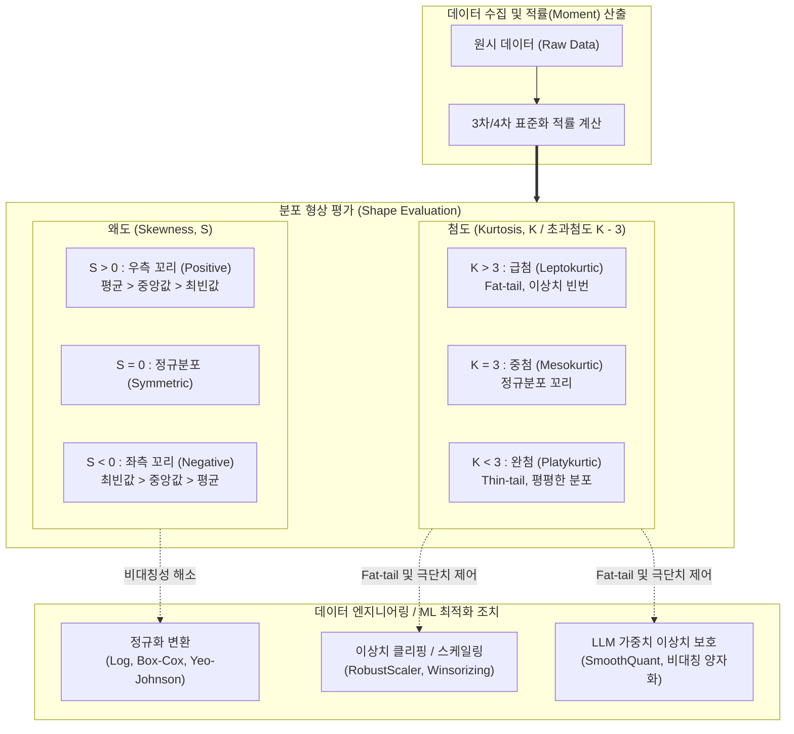

# 왜도 (Skewness) & 첨도 (Kurtosis)

---

## I. 데이터 분포의 비대칭성과 꼬리 두께를 측정하는 통계 척도, 왜도와 첨도의 개요

* **정의**: 데이터셋의 확률분포가 정규분포로부터 얼마나 벗어났는지를 수치화하기 위해, 평균을 중심으로 한 비대칭 정도(왜도, 3차 적률)와 극단치의 발생 빈도 및 꼬리의 두터움(첨도, 4차 적률)을 측정하는 기술통계 척도
* **필요성 및 등장배경**:
* **정규성 가정 검증**: 선형 회귀, 분산 분석([[ANOVA(Analysis of variance)|ANOVA]]) 등 통계적 기법 및 [[딥러닝]] 모델의 [[정규분포]] 가정 충족 여부 진단
* **[[이상치]](Outlier) 및 리스크 탐지**: 금융 공학(Fat-tail 리스크, VaR 산출) 및 [[MLOps]] 환경에서 데이터 왜곡과 이상 징후 조기 감지

* **특징**: 표준화 적률(Standardized Moment) 기반, [[데이터 전처리]](로그/Box-Cox 변환)의 기준점, 분포 형상 파악 지표

---

## II. 왜도와 첨도의 개념도 및 핵심 기술 요소

### 가. 왜도와 첨도의 판별 구조 및 데이터 변환 파이프라인

* 원시 데이터의 3차 및 4차 적률을 산출하여 데이터의 치우침(왜도)과 이상치 집중도(첨도)를 정량 평가함
* 분포가 왜곡되었을 경우 로그/Box-Cox 변환을 통해 정규성을 회복시키며, 급첨(Fat-tail)인 경우 이상치 클리핑 및 양자화 보정을 수행함

### 나. 왜도와 첨도의 핵심 기술 및 구성 요소

| 구분 | 요소기술 (키워드) | 세부 설명 |
| --- | --- | --- |
| **왜도 (3차 적률)** | **Positive Skewness (우측 꼬리)** | 데이터가 왼쪽에 집중되고 오른쪽으로 긴 꼬리를 갖는 형태 ($평균 > 중앙값 > 최빈값$). 소득 분포 등 |
| **왜도 (3차 적률)** | **Negative Skewness (좌측 꼬리)** | 데이터가 오른쪽에 집중되고 왼쪽으로 긴 꼬리를 갖는 형태 ($최빈값 > 중앙값 > 평균$). 수명 분포 등 |
| **첨도 (4차 적률)** | **Leptokurtic (급첨 / 고첨)** | 첨도 > 3 (초과첨도 > 0). 중심부가 뾰족하고 꼬리가 두터운(Fat-tail) 분포로 극단적 이상치 존재 가능성 큼 |
| **첨도 (4차 적률)** | **Platykurtic (완첨 / 저첨)** | 첨도 < 3 (초과첨도 < 0). 중심부가 완만하고 꼬리가 얇은(Thin-tail) 분포로 이상치 발생 빈도가 극히 낮음 |
| **정규성 검정** | **Jarque-Bera Test** | 표본 왜도와 첨도가 정규분포의 값(0과 3)과 통계적으로 유의미하게 일치하는지 종합 검정하는 기법 |
| **데이터 변환** | **Box-Cox / Yeo-Johnson** | 왜곡된 분포의 왜도를 0에 가깝게 변환하여 머신러닝 모델의 정규분포 가정을 충족시키는 멱변환(Power Transform) |
| **데이터 변환** | **Log / Root 변환** | 극단적인 우측 꼬리 분포(Positive Skew)를 보이는 금융/비용 데이터의 스케일을 압축하여 분산 안정화 |
| **이상치 제어** | **Winsorizing (윈저화)** | 첨도가 높은 데이터에서 최상위/최하위 극단값을 특정 백분위수 경계값으로 대체하여 첨도 영향력 축소 |

---

## III. 왜도(Skewness)와 첨도(Kurtosis) 비교 및 최신 AI 활용 동향

### 가. 왜도와 첨도 비교

| 비교 항목 | 왜도 (Skewness) | 첨도 (Kurtosis) |
| --- | --- | --- |
| **통계적 정의** | 확률밀도함수의 **3차 표준화 적률** ($\mu_3 / \sigma^3$) | 확률밀도함수의 **4차 표준화 적률** ($\mu_4 / \sigma^4$) |
| **측정 대상** | 데이터 분포의 **비대칭성 (치우침 정도)** | 데이터 분포의 **꼬리 두께(Fat-tail) 및 중심 뾰족함** |
| **정규분포 기준** | **$0$** (완전 대칭) | **$3$** (초과첨도: $Kurtosis - 3 = 0$) |
| **주요 위협 요인** | 모델 [[편향]](Bias) 유발, 평균값 왜곡 | 극단치(Outlier)로 인한 모델 발산 및 분산 왜곡 |
| **주요 대응 기법** | Log 변환, Square-root 변환, Box-Cox | 이상치 Trimming/Winsorizing, Robust 정규화 |

### 나. 최신 머신러닝 및 LLM 파이프라인에서의 활용 동향

* **MLOps 데이터 드리프트(Data Drift) 실시간 모니터링**: 서빙 중인 실시간 입력 데이터의 왜도와 첨도를 지속 모니터링하여, 기준 데이터셋(Baseline) 대비 통계적 변위가 감지되면 모델 성능 저하 이전에 재학습(Retraining) 트리거 발동
* **[[초거대 언어 모델|LLM]] 양자화(PTQ) 시 활성화 이상치(Activation Outlier) 제어**: 대규모 언어 모델의 텐서는 특정 채널에서 극단적인 첨도(Fat-tail)를 보임에 따라 단순 양자화 시 심각한 정확도 저하가 발생하므로, SmoothQuant나 AWQ처럼 채널별 왜도/첨도 특성을 계산하여 가중치와 활성화 값의 스케일을 사전 조정하는 아키텍처 도입 필수화

---

### 🔗 연관 토픽

- **소속 도메인**: [[00_인공지능_MOC|🤖 인공지능]]
- **세부 분류**: `1. 수학 · 통계학 & 데이터 전처리`
- **핵심 연관 토픽**:
  - [[이상치]]
  - [[정규분포|정규분포(Normal Distribution)]]
  - [[편향]]
  - [[MLOps]]
  - [[ANOVA(Analysis of variance)]]
