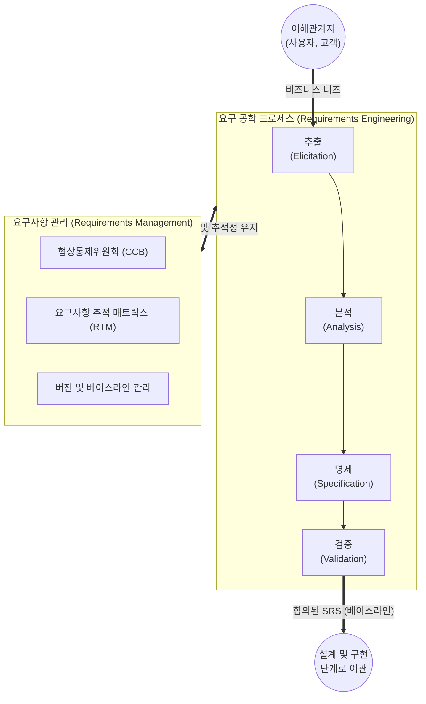

# 요구 공학 (Requirements Engineering)

---

## I. 성공적인 SW 개발의 첫 단추, 요구 공학의 개요

* **정의**: 이해관계자의 요구사항을 체계적으로 추출, 분석, 명세, 검증하고 시스템 개발 전 과정에 걸쳐 발생하는 변경 사항을 통제 및 관리하는 소프트웨어 공학 [[프로세스]]
* **등장배경 및 특징**:
* **프로젝트 실패 방지**: 부정확한 요구사항으로 인한 일정 지연, 예산 초과 및 재작업(Rework) 비용 발생 등 Chaos Report의 SW 실패 주요 원인 해결 필요
* **기준선(Baseline) 제공**: 개발 범위(Scope) 명확화 및 테스트/인수 검사의 절대적 기준 제공
* **추적성(Traceability) 확보**: 요구사항과 설계, 구현, 테스트 산출물 간의 양방향 연결 고리 유지

---

## II. 요구 공학의 개념도 및 핵심 기술 요소

### 가. 요구 공학의 프로세스 개념도

* 추출, 분석, 명세, 검증의 4단계 순환적 개발 프로세스를 통해 최종 [[요구사항 명세서]](SRS)를 베이스라인으로 확정함
* 전 수명주기에 걸쳐 형상통제위원회(CCB)와 추적 매트릭스(RTM)를 활용한 요구사항 관리가 지속적으로 병행됨

### 나. 요구 공학의 핵심 기술 및 구성 요소

| 구분 | 요소기술(키워드) | 세부 설명 |
| --- | --- | --- |
| **추출 (Elicitation)** | **인터뷰 / 브레인스토밍** | 이해관계자 식별 후 직접 대면하거나 자유로운 토론을 통해 숨겨진(Tacit) 요구사항 도출 |
| **추출 (Elicitation)** | **델파이 기법 (Delphi)** | 전문가 그룹을 대상으로 익명의 반복적인 설문을 통해 요구사항의 합의점 도출 |
| **분석 (Analysis)** | **구조적 / [[객체지향]] 분석** | DFD(자료흐름도), DD(자료사전) 또는 [[UML]](Use-Case 등)을 활용한 시각적 모델링 및 타당성 분석 |
| **명세 (Specification)** | **IEEE 830 (SRS 표준)** | 기능적/비기능적 요구사항을 정형(수학적 논리) 또는 비정형(자연어) 기법으로 문서화하는 글로벌 표준 |
| **검증 (Validation)** | **인스펙션 / 워크스루** | 작성된 명세서의 모호성, 완전성, 일관성을 공식적(Inspection) 또는 비공식적(Walkthrough)으로 검토 |
| **관리 (Management)** | **추적 매트릭스 (RTM)** | 요구사항 식별자와 설계, 코드, 테스트 케이스 간의 Forward/Backward 양방향 추적성 보장 매트릭스 |
| **최신 기법 ([[Agile]])** | **에픽 / 사용자 스토리** | 문서 중심의 명세 대신 "나는 [역할]로서 [목적]을 위해 [기능]을 원한다" 형태의 백로그 기반 명세화 |
| **최신 기법 (AI4RE)** | **[[초거대 언어 모델|LLM]] 기반 프롬프팅** | 생성형 AI를 활용하여 요구사항 초안 작성, 모호성 자동 탐지 및 테스트 케이스 자동 생성 지원 |

---

## III. 전통적 요구 공학과 애자일(Agile) 요구 공학 비교 및 향후 전망

### 가. 전통적 요구 공학(폭포수)과 애자일 요구 공학 비교

| 비교 항목 | 전통적 요구 공학 (Waterfall) | 애자일 요구 공학 (Agile) |
| --- | --- | --- |
| **접근 방식** | **Up-front (초기 확정)** | **Continuous (지속적 진화)** |
| **주요 산출물** | 두꺼운 소프트웨어 요구사항 명세서 (SRS) | 제품 백로그 (Product Backlog), 사용자 스토리 |
| **문서화 수준** | 공식적, 상세한 다이어그램 (UML, DFD 등) | 간소화, 구두 커뮤니케이션 및 인수 조건(포스트잇 등) |
| **변경 통제 체계** | CCB(형상통제위원회) 중심의 엄격한 변경 통제 | 스프린트(Sprint) 단위의 유연하고 즉각적인 변경 수용 |
| **고객 참여 시점** | 프로젝트 초기 추출 단계 및 최종 [[인수 테스트]] 시점 | 프로젝트 전 과정에 걸친 상시 참여 및 피드백 (PO 역할) |

### 나. 요구 공학의 최신 기술 트렌드 및 산업 전망

* **AI-Augmented Requirements Engineering (AI4RE)**: 챗GPT(ChatGPT) 등 대규모 언어 모델(LLM)을 활용하여 방대한 인터뷰 녹취록에서 자동으로 유스케이스를 추출하고, 자연어로 작성된 요구사항의 논리적 모순과 누락을 시스템이 사전 검증하는 AI 보조 공학 정착
* **[[DevOps]] 통합 및 MBSE 확산**: 요구사항 관리(Jira, Confluence 등)가 CI/CD 파이프라인과 실시간으로 연동되어 코드 커밋(Commit)과 요구사항의 완벽한 추적성을 제공하며, 복잡한 국방/항공 분야에서는 문서 대신 시스템 모델 자체로 요구사항을 검증하는 모델 기반 시스템 공학(MBSE) 도입이 가속화됨

---

### 🔗 연관 토픽

- **소속 도메인**: [[00_소프트웨어공학_MOC|🏗️ 소프트웨어공학]]
- **세부 분류**: `3. 요구사항 공학 & UML 객체지향 분석/설계`
- **핵심 연관 토픽**:
  - [[인수 테스트]]
  - [[유즈케이스 다이어그램]]
  - [[UML|UML (정적, 동적 다이어그램)]]
  - [[객체지향]]
  - [[Agile]]
