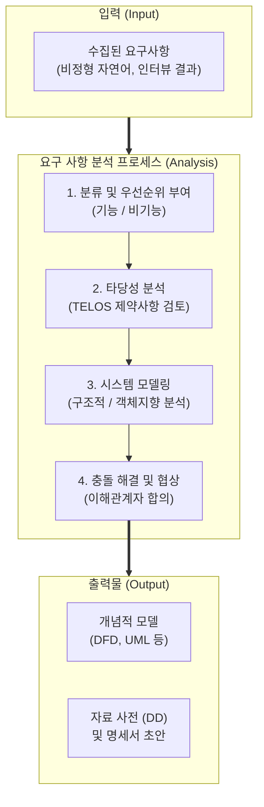

# 요구 사항 분석 (Requirements Analysis)

---

## I. 성공적 시스템 구현을 위한 논리적 뼈대, 요구 사항 분석의 개요

* **정의**: 요구사항 추출(Elicitation) 단계를 통해 수집된 비정형 요구사항의 모순, 누락, 모호성을 제거하고 타당성을 검증하여 시스템의 논리적 모델(Logical Model)로 구조화하는 소프트웨어 공학 핵심 [[프로세스]]
* **필요성 및 등장배경**:
* **이해관계자 간 충돌 해소**: 부서별, 사용자별 상충되는 요구사항의 조율 및 우선순위 확립
* **타당성 확보**: 기술적, 경제적, 법적 제약사항을 고려한 구현 가능성 사전 검증

* **특징**: 모델링(시각화) 중심, 분할과 정복(Divide & Conquer) [[추상화]], 설계 단계의 기준선(Baseline) 제공

---

## II. 요구 사항 분석의 개념도 및 핵심 기술 요소

### 가. 요구 사항 분석의 개념도 및 동작 원리

* 추출된 초기 요구사항을 기능적/비기능적으로 분류하고 타당성을 검증한 후, 시각적 모델링(DFD, [[UML]])을 수행함
* 이해관계자 간의 상충되는 요구를 협상하여 일관성 있는 분석 모델과 [[자료 사전]](Data Dictionary)을 도출함

### 나. 요구 사항 분석의 핵심 기술 및 구성 요소

| 분류 | 요소기술(키워드) | 세부 설명 |
| --- | --- | --- |
| **구조적 분석** | **DFD (자료 흐름도)** | 시스템의 기능을 프로세스, 데이터 스토어, 외부 [[엔티티]], 데이터 흐름으로 모델링하는 버블 차트 |
| **구조적 분석** | **DD (자료 사전)** | DFD에 나타난 데이터 요소의 논리적 정의 및 구성 방식을 메타데이터 형태로 상세히 기술 |
| **구조적 분석** | **Mini-Spec (소명세서)** | DFD의 최하위 프로세스(Primitive)의 내부 동작 논리를 자연어, 구조적 언어, 의사코드 등으로 기술 |
| **구조적 분석** | **STD (상태 전이도)** | 시스템의 상태 변화와 상태를 변화시키는 이벤트(조건)를 시각화하여 제어 흐름 분석 |
| **[[객체지향]] 분석** | **Use Case Diagram** | 사용자와 시스템 간의 상호작용을 기능 중심으로 모델링하여 시스템의 동적 행위 분석 |
| **객체지향 분석** | **Class Diagram** | 시스템을 구성하는 객체의 속성과 오퍼레이션, 객체 간의 관계를 정적인 구조로 분석 |
| **분석 기법** | **타당성 분석 (TELOS)** | Technical(기술), Economic(경제), Legal(법률), Operational(운영), Schedule(일정) 측면 타당성 검토 |
| **분석 기법** | **요구사항 할당 (Allocation)** | 분석된 요구사항을 소프트웨어 모듈, 하드웨어 장비, 인적 자원 등 시스템 구성요소에 적절히 배분 |

---

## III. 요구 사항 분석 방법론 비교 및 최신 동향

### 가. 전통적 분석 방법론 비교 (구조적 vs 객체지향 분석)

| 비교 항목 | 구조적 분석 (Structured Analysis) | 객체지향 분석 (Object-Oriented Analysis) |
| --- | --- | --- |
| **핵심 관점** | **기능(Function) 및 데이터 흐름** 중심 | **객체(Object) 및 상호작용** 중심 |
| **모델링 도구** | DFD, DD, Mini-Spec, ERD, STD | UML (Use Case, Class, [[순차 다이어그램|Sequence Diagram]] 등) |
| **분석 단위** | 프로세스 (Process) | 객체 (상태 + 행위의 [[캡슐화]]) |
| **재사용성** | 상대적으로 낮음 (기능 종속적) | 높음 (상속, [[다형성]] 등 객체지향 특성 활용) |
| **적합한 시스템** | 데이터 처리 중심의 절차적/전통적 시스템 | 변경이 잦고 UI 상호작용이 복잡한 최신 엔터프라이즈 시스템 |

### 나. 요구 사항 분석의 최근 기술 동향 및 향후 전망

* **AI-Augmented RE (AI4RE)**: 대규모 언어 모델([[초거대 언어 모델|LLM]])을 활용하여 비정형 자연어 요구사항 문서에서 모호성(Ambiguity) 및 일관성 오류를 자동 식별하고, UML 다이어그램을 자동 생성하는 [[프롬프트 엔지니어링]] 융합 확산
* **애자일([[Agile]]) 환경의 백로그 기반 지속적 분석**: 빅뱅 방식의 일괄 분석(Up-front Analysis)에서 벗어나, 에픽(Epic)과 사용자 스토리(User Story) 형태의 백로그를 통해 스프린트 단위로 요구사항을 점진적/반복적으로 구체화하는 추세
* **모델 기반 시스템 공학(MBSE) 연계**: 항공/국방/[[Smart Car(자율주행)|자율주행]] 등 복잡도가 극도로 높은 도메인에서는 문서(Text) 기반 분석의 한계를 극복하기 위해 SysML(Systems Modeling Language)을 활용한 다차원 구조/행위 모델링 기반 분석 표준화 진행 중

---

### 🔗 연관 토픽

- **소속 도메인**: [[00_소프트웨어공학_MOC|🏗️ 소프트웨어공학]]
- **세부 분류**: `2. 애자일(Agile) & 지속적 통합/배포(CI/CD)`
- **핵심 연관 토픽**:
  - [[추상화|추상화 (Abstraction)]]
  - [[객체지향]]
  - [[다형성|다형성 (Polymorphism)]]
  - [[Agile]]
  - [[캡슐화|캡슐화 (encapsulation)]]
