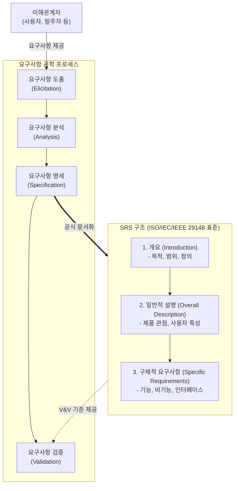

# 요구사항 명세서 (SRS: Software Requirements Specification)

---

## I. 성공적인 SW 프로젝트의 기준선, 요구사항 명세서(SRS)의 개요

* **정의**: 소프트웨어 시스템이 수행해야 할 기능# 요구사항 명세서 (SRS)

---

## I. 시스템 개발의 나침반, 요구사항 명세서(SRS)의 개요

* **정의**: 발주자와 개발자 간의 원활한 의사소통을 위해 소프트웨어가 수행해야 할 기능적, 비기능적 요구사항을 완전하고 명확하게 기술한 공식 문서
* **특징 및 필요성**:
* **의사소통의 기준**: 이해관계자(고객, 개발자, 테스터 등) 간의 명확한 합의점 도출
* **베이스라인(Baseline) 제공**: 프로젝트 일정, 비용 산정 및 변경 통제의 기준선 역할
* **검증(V&V) 기준**: 개발 완료 후 시스템의 [[인수 테스트]] 및 품질 보증의 척도 제공

---

## II. SRS의 개념도 및 핵심 구성 요소

### 가. 요구사항 명세서(SRS)의 작성 프로세스 및 구조 개념도

* 요구사항 도출 및 분석 결과를 바탕으로 ISO/IEC/IEEE 29148 국제 표준에 맞춰 공식 문서화 수행
* 작성된 SRS는 베이스라인으로 설정되어 검증(Validation) 및 변경 통제의 핵심 기준물로 활용됨

### 나. SRS의 핵심 기술 및 구성 요소

| 구분 | 핵심 기술/요소 | 설명 |
| --- | --- | --- |
| **작성 표준** | ISO/IEC/IEEE 29148 | 기존 IEEE 830 표준을 통합 및 대체한 최신 요구사항 공학 국제 표준 |
| **주요 구성** | 기능적 요구사항 | 시스템이 입력받아 처리하고 출력해야 하는 고유 행위 및 동작 명세 |
| **주요 구성** | 비기능적 요구사항 | 성능, [[HA(High Availability)|가용성]], 보안, 유지보수성 등 시스템의 품질 속성 및 제약사항 명세 |
| **품질 속성** | 명확성 (Unambiguous) | 모든 독자가 동일한 의미로 해석할 수 있도록 모호성 배제 |
| **품질 속성** | 완전성 (Complete) | 사용자의 모든 요구사항과 시스템 제약사항이 누락 없이 기술됨 |
| **품질 속성** | 추적성 (Traceable) | 요구사항의 출처 파악 및 설계/구현/테스트 단계로의 연결 상태 확인 가능 |
| **품질 속성** | 검증 가능성 (Verifiable) | 요구사항의 충족 여부를 테스트 또는 측정할 수 있도록 정량적으로 기술됨 |
| **관리 기법** | RTM (요구사항 추적 매트릭스) | 요구사항과 하위 산출물(설계서, 소스코드, 테스트케이스) 간의 연관관계를 매핑 |

---

## III. 전통적 요구사항 명세서(SRS)와 애자일 명세서 비교 및 최근 동향

### 가. 전통적 SRS vs 애자일(Agile) 명세서 비교

| 비교 항목 | 전통적 명세서 (SRS) | 애자일 명세서 ([[Agile]]) |
| --- | --- | --- |
| **문서 형태** | 정형화된 공식 문서 (ISO/IEC/IEEE 29148 등) | 제품 백로그 (Product Backlog), 사용자 스토리 |
| **작성 시점** | 프로젝트 초기 분석/설계 단계에 확정 | 스프린트(Sprint) 반복 주기에 따라 지속적 업데이트 |
| **상세 수준** | 매우 구체적이고 포괄적 (사전 정의) | 핵심 가치 중심 기술, 개발 중 상세화 (Just-in-Time) |
| **변경 수용성** | 엄격한 변경 통제 위원회(CCB) 거침 | 변경을 환영하며 백로그 우선순위 조정을 통해 즉각 반영 |
| **적합한 프로젝트** | 미션 크리티컬 시스템, 대규모 공공/금융 차세대 | 요구사항 변화가 극심한 웹/모바일 서비스, 스타트업 |

### 나. 요구사항 명세 분야의 향후 전망 및 최신 동향

* **AI/[[초거대 언어 모델|LLM]] 기반 요구사항 분석 지원**: 대형 언어 모델(LLM)을 활용하여 모호한 요구사항 문장을 탐지하고, 완전성과 일관성을 자동 검증하는 기술 도입 확대
* **MBSE(모델 기반 시스템 엔지니어링) 연계**: 텍스트 중심의 한계를 극복하기 위해 SysML 등을 활용한 정형 명세(Formal Specification) 및 시각화 모델링 적용 증가

---

### 🔗 연관 토픽

- **소속 도메인**: [[00_프로젝트관리_MOC|📋 프로젝트관리]]
- **세부 분류**: `5. 애자일 프로젝트 관리 & 개발 운영 (Agile PM)`
- **핵심 연관 토픽**:
  - [[인수 테스트]]
  - [[요구 공학|요구 공학 (Requirements Engineering)]]
  - [[Agile]]
  - [[워터폴]]
  - [[SDLC]]
