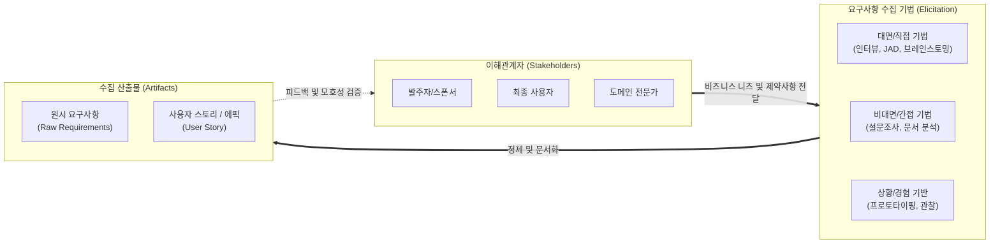

# 요구사항 수집기법 (Requirements Elicitation Techniques)

---

## I. 성공적인 프로젝트의 출발점, 요구사항 수집기법의 개요

* **정의**: 시스템이나 소프트웨어를 개발하기 위해 다양한 이해관계자(Stakeholders)로부터 비즈니스 니즈, 문제점, 제약사항 등을 식별하고 도출하는 체계적인 활동
* **필요성 및 특징**:
* **재작업(Rework) 비용 최소화**: 프로젝트 실패 및 일정 지연의 주원인인 '불명확한 요구사항'을 조기에 식별(Shift-Left)하여 설계/구현 단계의 리스크 감소
* **암묵지의 형식지화**: 사용자 스스로도 인지하지 못하는 암묵적 요구사항(Tacit Knowledge)을 시각화 및 문서화(Explicit Knowledge)
* **다양성 확보**: 인터뷰, 관찰, 모델링 등 직접/간접적 채널을 융합하여 요구사항의 완전성(Completeness) 확보

---

## II. 요구사항 수집의 개념도 및 핵심 기술 요소

### 가. 요구사항 수집 프로세스 및 개념도

* 이해관계자의 특성과 프로젝트 환경에 맞추어 대면, 비대면, 경험 기반의 다양한 수집 기법을 융합 적용함
* 도출된 원시 요구사항은 백로그(Backlog)나 명세서 초안 형태로 문서화되며, 반복적인 피드백 루프를 통해 구체화됨

### 나. 요구사항 핵심 수집기법 및 요소

| 분류 | 요소기술(키워드) | 세부 설명 |
| --- | --- | --- |
| **직접 도출** | **인터뷰 (Interview)** | 이해관계자와 1:1 또는 1:N 대면 질의응답을 통해 깊이 있는 요구사항 및 숨은 의도 파악 |
| **직접 도출** | **JAD (Joint Application Dev)** | 사용자와 개발자, 시스템 분석가가 합동 회의(Workshop)를 열어 단기간에 요구사항을 확정하는 기법 |
| **직접 도출** | **브레인스토밍 (Brainstorming)** | 익명성 또는 자유로운 분위기 속에서 비판 없이 다양한 아이디어를 발산(Divergence)하여 도출 |
| **전문가 활용** | **델파이 기법 (Delphi)** | 전문가 집단을 대상으로 익명의 반복적인 설문조사를 수행하여 의견의 합의점(Consensus)을 도출 |
| **간접 도출** | **설문조사 (Questionnaire)** | 물리적으로 분산된 다수의 이해관계자로부터 객관적이고 통계화하기 쉬운 데이터를 수집할 때 유용 |
| **간접 도출** | **문서 분석 (Doc. Analysis)** | 기존 시스템의 매뉴얼, 업무 규정, 서식 등을 분석하여 누락되기 쉬운 제약사항 및 비즈니스 룰 도출 |
| **시각/경험** | **프로토타이핑 (Prototyping)** | 화면 설계서나 작동하는 시제품(Mock-up)을 제공하여 사용자의 피드백을 통해 요구사항을 구체화 |
| **상황 인지** | **관찰 (Observation / Shadowing)** | 사용자의 실제 업무 환경을 관찰하여, 말로 표현하기 힘든 암묵적 지식 및 [[프로세스]] 병목 구간 도출 |

---

## III. 전통적 기법과 애자일 수집기법 비교 및 향후 전망

### 가. 전통적 수집기법(폭포수)과 애자일(Agile) 기법 비교

| 비교 항목 | 전통적 요구사항 수집 (Waterfall) | 애자일 요구사항 수집 ([[Agile]]) |
| --- | --- | --- |
| **수집 시점** | 프로젝트 초기 집중 (Up-front) | 프로젝트 전 주기에 걸쳐 지속적 수집 (Continuous) |
| **참여 주체** | 요구사항 분석가(SA) 주도 | 제품 책임자(PO) 및 전체 [[스크럼]] 팀 참여 |
| **주요 기법** | 공식 인터뷰, JAD, 상세 문서 분석 | 사용자 스토리 매핑, [[페르소나]](Persona), 백로그 정제 |
| **산출물 형태** | 방대한 요구사항 정의서 (Text 위주) | 에픽(Epic), 사용자 스토리 (포스트잇, 티켓 형태) |

### 나. 요구사항 수집 분야의 최신 기술 동향 및 전망

* **생성형 AI 기반 수집 자동화 (AI4RE)**: ChatGPT, Claude 등 대규모 언어 모델([[초거대 언어 모델|LLM]])을 활용하여 이해관계자와의 인터뷰 녹취록에서 자동으로 핵심 요구사항을 추출하고 유스케이스(Use Case) 시나리오 초안을 생성하는 [[프롬프트 엔지니어링]] 융합 확산
* **데이터 기반 요구사항 도출 (Data-driven Elicitation)**: 기존 직관이나 인터뷰에 의존하던 방식을 넘어, A/B 테스트 로그, 프로덕트 애널리틱스(GA, Amplitude) 및 프로세스 마이닝(Process Mining)을 분석하여 사용자 행동 데이터 기반의 객관적 요구사항을 도출하는 방식으로 진화 중

---

### 🔗 연관 토픽

- **소속 도메인**: [[00_프로젝트관리_MOC|📋 프로젝트관리]]
- **세부 분류**: `1. PMBOK 표준 & 프로젝트 거버넌스`
- **핵심 연관 토픽**:
  - [[프롬프트 엔지니어링|프롬프트 엔지니어링(Prompt Engineering)]]
  - [[스크럼|스크럼 (SCRUM)]]
  - [[PMBOK 프로세스 그룹 (5단계)]]
  - [[애자일 선언문]]
  - [[ISO 21500]]
