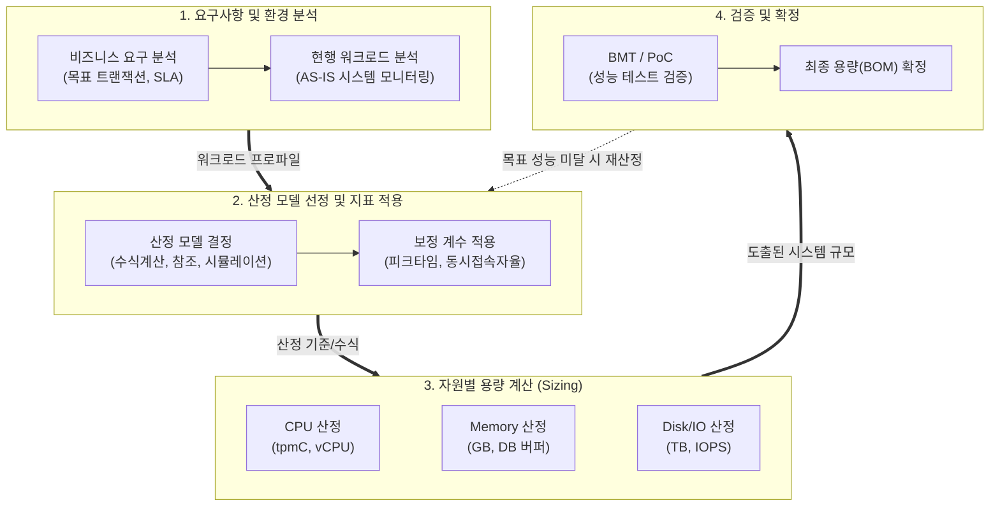

# 용량산정 (Capacity Sizing)

---

## I. 안정적 IT 서비스 제공을 위한 기반, 용량산정의 개요

* **정의**: 정보시스템의 목표 성능([[SLA]])과 미래 비즈니스 데이터 증가량을 고려하여, 최적의 하드웨어([[CPU]], Memory, Disk, Network) 및 소프트웨어 자원 규모를 수치화하여 도출하는 체계적인 과정
* **필요성 및 특징**:
* **[[자원 최적화]]**: 과다 산정(Over-provisioning)에 따른 TCO 낭비 방지 및 과소 산정(Under-provisioning)으로 인한 성능 장애 예방
* **서비스 연속성**: 피크 타임(Peak Time) 부하 및 연평균 성장률(CAGR)을 반영하여 무중단 서비스 아키텍처 보장
* **클라우드 패러다임 대응**: 클라우드 마이그레이션 시 기존 레거시 자원을 단순히 1:1 매핑하지 않고, 탄력성을 고려한 Right-sizing 수행

---

## II. 용량산정의 개념도 및 핵심 기술 요소

### 가. 용량산정의 프로세스 및 개념도

* 업무 특성과 [[트랜잭션]] 규모를 분석한 후 적절한 산정 기법을 적용하여 자원별(CPU, Mem, Disk 등) 요구량을 수치화함
* 도출된 용량은 [[성능 테스트]](BMT/PoC)를 통해 병목 현상 여부를 검증하고 최종 인프라 스펙으로 확정함

### 나. 용량산정의 핵심 기술 및 구성 요소

| 구분 | 요소기술(키워드) | 세부 설명 |
| --- | --- | --- |
| **산정 방식** | **수식 계산법 (Analytic)** | 시스템 구성 요소의 성능 수치(트랜잭션 건수, [[응답시간]] 등)를 기반으로 수학적 공식을 적용하여 산출 |
| **산정 방식** | **참조 모델법 (Reference)** | 유사한 업무 특성 및 아키텍처를 가진 기 구축 시스템의 자원 사용량 지표를 참조하여 용량 추정 |
| **산정 방식** | **시뮬레이션 (Simulation)** | 가상의 워크로드를 생성하여 부하 테스트 도구(LoadRunner, JMeter)로 모델링 후 적정 임계치 산출 |
| **성능 지표** | **tpmC (TPC-C)** | 1분당 처리할 수 있는 평균 트랜잭션 수(DB 중심). TPC(Transaction Processing Performance Council) 규격 |
| **성능 지표** | **IOPS (I/O Per Second)** | 초당 처리 가능한 디스크의 입출력 횟수로, 스토리지 성능 산정 및 병목 예방의 핵심 기준 |
| **보정 변수** | **피크 타임 계수 (Peak)** | 평시 대비 접속이나 트랜잭션이 폭증하는 특정 시간대(이벤트, 마감일 등)의 부하를 대비하기 위한 가중치 |
| **보정 변수** | **동시 사용자 수 (Concurrent)** | 전체 등록 사용자 중 피크 타임에 실제로 시스템에 동시 접속하여 트랜잭션을 일으키는 활성 사용자 비율 |
| **클라우드** | **Right-sizing (적정 규모 산정)** | 클라우드 환경에서 사용량 패턴(CPU, RAM, Net)을 분석하여 [[인스턴스]] 타입을 축소/변경하는 비용 최적화 활동 |

---

## III. 온프레미스 vs 클라우드 용량산정 비교 및 향후 전망

### 가. 전통적 용량산정(On-Premise)과 클라우드(Cloud) 용량산정 비교

| 비교 항목 | 온프레미스(On-Premise) 용량산정 | 클라우드(Cloud) 용량산정 |
| --- | --- | --- |
| **산정 시점** | **초기 일괄 산정** (시스템 도입/구축 시점) | **지속적 산정** (운영 중 상시 [[프로비저닝]]) |
| **목표 규모** | **Max(최대치) 기준** (향후 3~5년 증가분 포함) | **최적치(Right-sizing) 기준** (Auto-scaling 의존) |
| **자원 확보** | Scale-Up 중심 (H/W 장비 추가 도입) | Scale-Out 중심 (인스턴스 및 [[컨테이너]] 동적 확장) |
| **핵심 고려사항** | 장비 단종(EoL), 상면/전력, 벤더 종속성 | 클라우드 서비스 비용(FinOps), 네트워크 인바운드/아웃바운드 요금 |

### 나. 최신 기술 동향 및 향후 전망

* **FinOps 기반의 지속적 Sizing 정착**: [[클라우드 네이티브]] 환경에서는 구축 초기의 1회성 산정보다, AWS Cost Explorer나 써드파티 도구(Datadog, 커스텀 대시보드)를 활용하여 사용률 미달(Under-utilized) 자원을 지속적으로 회수하고 인스턴스 타입을 조절하는 FinOps 프로세스가 필수화됨
* **AI/ML 기반 예측형(Predictive) Auto-scaling**: 과거의 트랜잭션 시계열 데이터를 머신러닝 알고리즘으로 학습하여, 특정 이벤트나 시간에 부하가 발생하기 전 선제적으로 자원을 증설하는 AI 기반 지능형 용량 관리 기술 도입 확산

---

### 🔗 연관 토픽

- **소속 도메인**: [[00_데이터베이스_MOC|🗄️ 데이터베이스]]
- **세부 분류**: `3. 장애 회복 기법 & 데이터 무결성`
- **핵심 연관 토픽**:
  - [[성능 테스트]]
  - [[컨테이너|컨테이너 (Container)]]
  - [[인스턴스]]
  - [[응답시간]]
  - [[클라우드 네이티브]]
