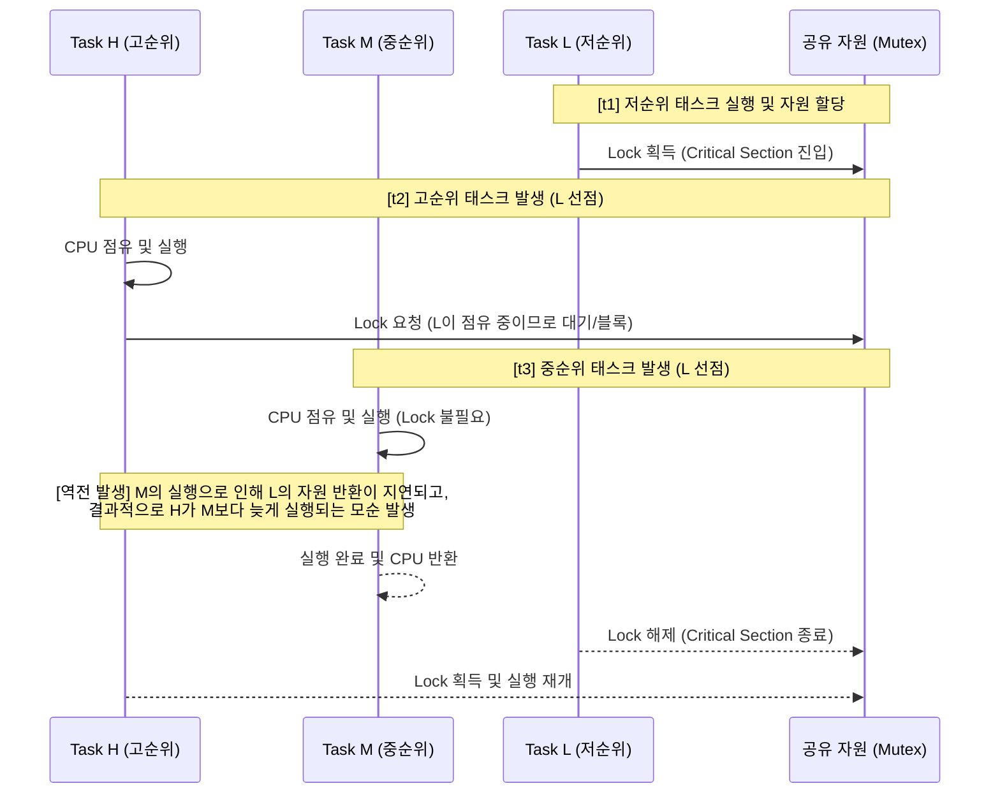

# 우선순위 역전현상 (Priority Inversion)

---

## I. 실시간 스케줄링의 데드라인 위협 요소, 우선순위 역전현상의 개요

* **정의**: 다중 프로그래밍 환경에서 공유 자원(Mutex 등)에 대한 동기화 문제로 인해, 높은 우선순위의 태스크가 낮은 우선순위의 태스크가 가진 자원을 기다리는 동안, 중간 우선순위의 태스크에게 선점당해 무한 대기하는 [[스케줄링]] 이상 현상
* **등장배경 및 특징**:
* **임계구역 보호 한계**: 상호배제(Mutual Exclusion)를 위한 락(Lock) 메커니즘과 선점형 스케줄링이 결합할 때 발생
* **시스템 치명적 오류 유발**: 1997년 화성 탐사선(Mars Pathfinder)의 잦은 리셋 사태가 대표적 사례로, 하드 리얼타임(Hard Real-time) 시스템에서 데드라인 위반 유발
* **해결의 필수성**: [[Smart Car(자율주행)|자율주행]], 항공우주 등 미션 크리티컬 시스템의 기능 안전성([[ISO 26262]] 등) 확보를 위해 필수적 제어 대상

---

## II. 우선순위 역전현상의 개념도 및 핵심 기술 요소

### 가. 우선순위 역전현상의 동작 원리 및 개념도

* 높은 우선순위 태스크(H)가 공유 자원을 대기하는 동안, 자원과 무관한 중간 우선순위 태스크(M)가 낮은 우선순위 태스크(L)를 선점함
* 결과적으로 가장 우선순위가 높은 H가 중간 우선순위인 M이 종료될 때까지 대기하게 되는 스케줄링 역전 현상이 발생함

### 나. 우선순위 역전현상 해결 및 관련 핵심 기술 요소

| 구분 | 요소기술(키워드) | 세부 설명 |
| --- | --- | --- |
| **발생 원인** | **임계 구역 (Critical Section)** | 둘 이상의 스레드가 동시에 접근해서는 안 되는 공유 자원 접근 코드 영역 |
| **발생 원인** | **뮤텍스 (Mutex)** | 임계 구역 접근 시 상호배제를 보장하기 위해 단일 스레드만 소유할 수 있는 락 객체 |
| **해결 기법** | **우선순위 상속 (PIP)** | 고순위 태스크가 자원 대기 시, 자원을 점유한 저순위 태스크의 우선순위를 일시적으로 **고순위와 동일하게 상속(상승)**시켜 선점 방지 |
| **해결 기법** | **우선순위 올림 (PCP)** | 공유 자원에 접근할 수 있는 태스크 중 **가장 높은 우선순위(Ceiling)**를 자원 획득 시점부터 할당하여 데드락(Deadlock) 및 다중 역전 방지 |
| **OS 지원** | **Random [[부스팅|Boosting]]** | Windows 등 범용 OS에서 [[기아|기아(Starvation)]] 및 역전 방지를 위해 대기 중인 스레드의 우선순위를 무작위/일시적으로 상승시킴 |
| **최신 기법** | **MPCP / FMLP** | 멀티코어 환경에서 [[스핀락]](Spinlock)과 결합하여 프로세서 간 우선순위 역전을 방지하는 다중 프로세서 동기화 [[프로토콜]] |
| **설계 검증** | **WCET 분석** | 실시간 시스템에서 최악 실행 시간(Worst-Case Execution Time)을 분석하여 역전으로 인한 마감 시간 초과 여부 검증 |
| **안전 표준** | **ISO 26262 / DO-178C** | 자동차 및 항공기 SW 안전성 검증 표준으로, 스케줄링 분석 및 역전 현상 회피 설계 명세화 요구 |

---

## III. 우선순위 역전 해결 기법 비교 및 향후 전망

### 가. 핵심 해결 기법 비교 (우선순위 상속 vs 우선순위 올림)

| 비교 항목 | 우선순위 상속 (Priority Inheritance, PIP) | 우선순위 올림 (Priority Ceiling, PCP) |
| --- | --- | --- |
| **우선순위 변경 시점** | **고순위 태스크가 자원(Lock)을 요청**하여 대기할 때 | 저순위 태스크가 **공유 자원을 획득(Lock)하는 즉시** |
| **상승되는 우선순위** | 자원을 요청한 고순위 태스크의 우선순위 | 자원에 미리 정의된 **상한치(Ceiling) 우선순위** |
| **[[교착상태]](Deadlock)** | 교착상태(Deadlock) **예방 불가** (연쇄 상속 발생) | 교착상태 및 연쇄적인 락 대기 **사전 예방 가능** |
| **구현 및 오버헤드** | 구현이 비교적 단순하나 런타임 추적 오버헤드 발생 | 정적 분석(상한치 사전 정의) 필요, 구현 난이도 높음 |
| **활용 환경** | Linux (FUTEX_PI), 일반적 RTOS | POSIX (PTHREAD_PRIO_PROTECT), VxWorks 등 |

### 나. 향후 전망 및 산업 적용 동향

* **멀티코어 및 이기종(Heterogeneous) 환경으로의 확장**: 최신 차량용 SoC 및 자율주행 플랫폼(AUTOSAR Adaptive 등)에서는 멀티코어 분산 처리가 기본이 됨에 따라, 단일 코어 기반의 PIP/PCP를 넘어 **MPCP(Multiprocessor PCP)** 및 MSRP(Multiprocessor SRP)와 같은 진보된 동기화 기법이 필수적으로 적용되고 있음
* **무잠금(Lock-free) 자료구조 도입**: 뮤텍스 병목 및 역전 현상을 원천적으로 회피하기 위해, CAS(Compare-And-Swap) 기반의 Lock-free 및 Wait-free 알고리즘을 시스템 코어 로직에 적용하여 실시간 성능과 확장성을 극대화하는 추세임

---

### 🔗 연관 토픽

- **소속 도메인**: [[00_컴퓨터구조_MOC|💻 컴퓨터구조]]
- **세부 분류**: `5. 핵심 알고리즘 & 계산 복잡도 (Algorithms)`
- **핵심 연관 토픽**:
  - [[교착상태|교착상태 (Deadlock)]]
  - [[기아|기아(Starvation)]]
  - [[ISO 26262]]
  - [[스핀락|스핀락 (Spin Lock)]]
  - [[프로토콜]]
