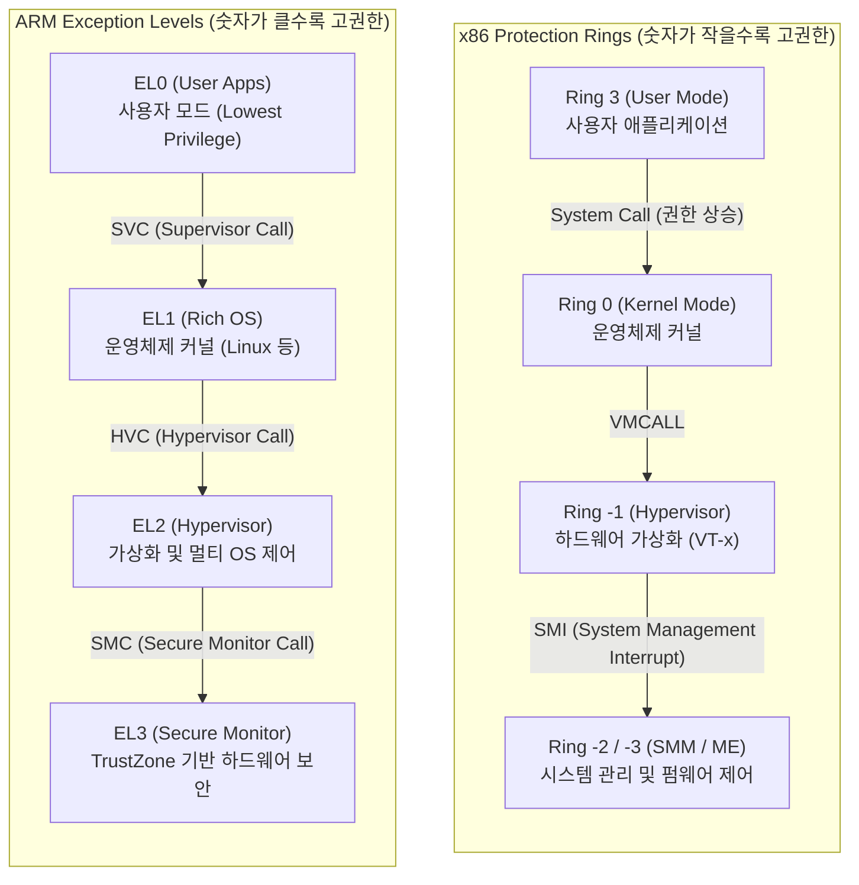

# 운영체제 특권레벨 (OS Privilege Levels)

---

## I. 시스템 자원 보호를 위한, 운영체제 특권레벨의 개요

* **정의**: 운영체제가 시스템 보안을 유지하고 사용자 애플리케이션의 무단 하드웨어 자원 접근을 차단하기 위해 [[CPU]] 명령 실행 권한을 물리적/논리적으로 분리한 하드웨어 기반 보호 메커니즘.
* 멀티태스킹 환경에서 [[프로세스]] 간 격리(Isolation)와 커널 영역 보호를 목적으로 Ring 구조(x86) 또는 Exception Level(ARM) 형태로 발전.
* **특징**: 최소 권한의 원칙(Least Privilege) 적용, 시스템 콜(System Call)을 통한 제한적 권한 상승, 클라우드 [[가상화]] 및 하드웨어 보안을 위한 마이너스 링(Ring -1 등) 계층 확장.

---

## II. 운영체제 특권레벨의 아키텍처 및 핵심 구성요소

### 가. 권한 계층 아키텍처 및 동작 원리

* 평문 상태의 사용자 모드(Ring 3 / EL0)에서 특권 명령이 필요한 경우, 시스템 콜(SVC 등)을 발생시켜 커널 모드(Ring 0 / EL1)로 Context Switching을 수행함객관적인 기술 정보를 바탕으로 1교시형 단답형 모범답안 작성을 준비하겠습니다. 제공해주신 프롬프트 템플릿에 맞추어 개조식, 3단락 구조, Mermaid 다이어그램, 테이블 등을 활용하여 답변을 생성합니다.

---

## III. 특권레벨 (User vs Kernel Mode) 비교 및 최근 동향

### 가. 사용자 모드(Ring 3)와 커널 모드(Ring 0) 비교

| 비교 항목 | 사용자 모드 (User Mode) | 커널 모드 ([[커널|Kernel]] Mode) |
| --- | --- | --- |
| **실행 계층** | Ring 3 | Ring 0 |
| **접근 권한** | 제한적 (응용 프로그램 할당 영역만 접근) | 시스템 전체 (메모리, 하드웨어, [[인터럽트]] 제어) |
| **오류 발생 영향** | 해당 프로세스만 종료됨 (격리 유지) | 시스템 전체 장애 발생 (Kernel Panic, BSOD) |
| **자원 요청 방식** | API 및 시스템 콜(System Call) 경유 | 드라이버 및 하드웨어 직접 제어 |
| **실행 대상 예시** | 웹 브라우저, 게임, 워드 프로세서 등 | OS 코어, 메모리 관리자, 디바이스 드라이버 |

### 나. 향후 전망 및 최신 동향

* **기밀 컴퓨팅([[기밀컴퓨팅|Confidential Computing]])의 부상**: 클라우드 환경에서 사용 중인 데이터(Data in Use)를 보호하기 위해, OS조차 접근할 수 없는 Ring -2 수준의 하드웨어 기반 격리 환경(TEE: Trusted Execution Environment) 적용 확대
* **경량 가상화와 하이퍼바이저 진화**: 서버리스(Serverless) 및 [[컨테이너]] 환경의 보안 강화를 위해, Ring -1 수준에서 동작하는 마이크로VM(Firecracker 등) 기반의 강력한 특권 분리 기술 활용 증가
* **[[부채널 공격]](Side-Channel Attack) 방어**: 멜트다운(Meltdown), 스펙터(Spectre)와 같은 특권레벨 우회 공격을 원천 차단하기 위해, 하드웨어(CPU) 수준의 보안 패치 및 OS 레벨의 KPTI(커널 페이지 테이블 격리) 기법 적용 보편화

---

### 🔗 연관 토픽

- **소속 도메인**: [[00_운영체제_MOC|⚙️ 운영체제]]
- **세부 분류**: `1. 프로세스 & 스레드 관리`
- **핵심 연관 토픽**:
  - [[프로세스]]
  - [[커널|커널(Kernel)]]
  - [[인터럽트|인터럽트 (Interrupt)]]
  - [[컨테이너|컨테이너 (Container)]]
  - [[가상화]]
