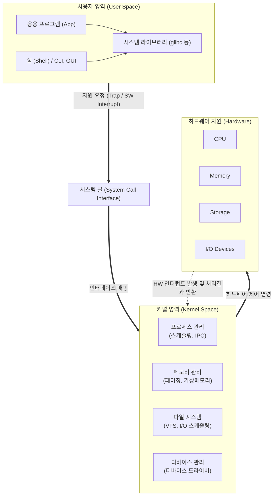

# 운영체제 (Operating System)

---

## I. 하드웨어 자원의 효율적 관리자, 운영체제(OS)의 개요

* **정의**: 컴퓨터의 하드웨어 자원([[CPU]], 메모리 등)과 응용 프로그램 간의 중재자(Interface) 역할을 수행하며, 시스템 자원을 스케줄링하고 효율적으로 분배하는 시스템 소프트웨어
* **필요성 및 특징**:
* **자원 [[추상화]]**: 복잡한 물리적 하드웨어 디테일을 숨기고 논리적 자원([[프로세스]], 가상메모리, 파일) 제공
* **안전성 및 격리**: 커널 모드([[커널|Kernel]] Mode)와 사용자 모드(User Mode)의 듀얼 모드 동작을 통한 메모리 및 자원 보호
* **동시성 제어**: 다중 프로그래밍(Multi-programming) 및 시분할(Time-sharing) 처리로 자원 활용률 극대화

---

## II. 운영체제의 아키텍처 및 핵심 구성요소

### 가. 운영체제의 계층적 아키텍처 및 동작 원리

* 사용자 영역의 응용 프로그램은 시스템 콜(System Call)을 통해 커널 모드로 전환(Trap)되어 안전하게 하드웨어 자원을 요청함
* 커널은 프로세스, 메모리, 파일 시스템, I/O 장치를 추상화하여 한정된 물리 자원을 다수의 애플리케이션에 분배하고 제어함

### 나. 운영체제의 핵심 기술 및 구성 요소

| 구분 | 요소기술(키워드) | 세부 설명 |
| --- | --- | --- |
| **[[프로세스 관리]]** | **CPU [[스케줄링]] (Scheduling)** | 다중 프로세스 환경에서 CPU 할당 순서를 결정 (FCFS, RR, SRT, Multilevel [[Queue]] 등) |
| **프로세스 관리** | **IPC (Inter-Process Comm.)** | 독립된 프로세스 간 데이터 통신 및 동기화 기술 (공유 메모리, 메시지 큐, 파이프 등) |
| **[[메모리 관리]]** | **[[가상 메모리]] (Virtual Memory)** | 물리적 메모리의 크기 한계를 극복하기 위해 디스크의 일부(Swap)를 메모리처럼 사용하는 기술 |
| **메모리 관리** | **페이징 (Paging)** | 프로세스의 논리적 주소 공간을 동일한 크기의 페이지(Page)로 분할하여 물리 메모리에 적재 |
| **파일 시스템** | **VFS (Virtual File System)** | EXT4, NTFS 등 상이한 파일 시스템에 대해 표준화된 인터페이스(open, read 등)를 제공하는 추상화 계층 |
| **입출력 관리** | **[[인터럽트|인터럽트 (Interrupt)]]** | 하드웨어 장치나 예외 상황 발생 시, 현재 작업을 멈추고 해당 서비스 루틴(ISR)을 실행하는 비동기 메커니즘 |
| **커널 구조** | **마이크로커널 (Microkernel)** | 커널에는 프로세스/메모리 관리 등 최소 기능만 남기고, 나머지는 사용자 영역의 서버로 분리 (안정성 극대화) |
| **커널 구조** | **모놀리식 커널 (Monolithic)** | 모든 OS 서비스(네트워크, 파일, 디바이스 제어)가 단일 커널 공간에서 동작 (빠른 성능, Linux 등) |

---

## III. 운영체제 커널 아키텍처 비교 및 최신 기술 동향

### 가. 핵심 커널 아키텍처 비교 (모놀리식 커널 vs 마이크로커널)

| 비교 항목 | 모놀리식 커널 (Monolithic Kernel) | 마이크로커널 (Microkernel) |
| --- | --- | --- |
| **구조적 특징** | 모든 서비스 기능이 단일 커널 공간에 통합 | 최소 기능만 커널에 유지, 나머지는 사용자 영역 배치 |
| **통신 메커니즘** | 커널 내부의 직접 함수 호출 (빠른 통신) | 메시지 패싱(Message Passing, IPC) 방식 적용 |
| **성능 및 오버헤드** | 오버헤드가 적어 **시스템 성능이 우수함** | IPC 통신에 따른 **[[문맥 교환]](Context Switch) 오버헤드 큼** |
| **안정성 및 보안** | 특정 모듈 오류 시 시스템 전체 패닉(Crash) 위험 | 모듈 오류가 다른 컴포넌트에 영향을 주지 않아 **안전성 높음** |
| **대표 [[OS(운영체제)|운영체제]]** | Linux, Unix, MS-[[DoS (Denial of Service)|DOS]] | QNX, L4, Google Fuchsia(Zircon) |

### 나. 운영체제 기술의 향후 전망 및 산업 동향

* **[[클라우드 네이티브]] 기반 경량화 OS 부상**: [[쿠버네티스]](Kubernetes) 등 [[컨테이너]] 환경의 오버헤드를 줄이고 공격 표면(Attack Surface)을 최소화하기 위해, 불필요한 라이브러리를 제거한 컨테이너 전용 운영체제(Amazon Bottlerocket, Flatcar Container Linux) 도입 가속화
* **메모리 안전성(Memory Safety) 보장을 위한 커널 언어의 진화**: 기존 C언어 기반의 리눅스 커널이 가진 메모리 누수 및 버퍼 오버플로우 취약점을 해결하기 위해, 메모리 안전성이 보장된 **Rust 언어**를 Linux Kernel 6.1 이후부터 공식 커널 모듈 개발 언어로 채택 및 확대 적용
* **소프트웨어 정의 차량(SDV) 및 하드 실시간 OS(RTOS)의 핵심 기술화**: [[Smart Car(자율주행)|자율주행]] 및 커넥티드 카 환경에서 기능 안전성([[ISO 26262]])을 보장하기 위해, 마이크로커널 기반의 차량용 RTOS(AUTOSAR, QNX)가 모빌리티 생태계의 핵심 플랫폼으로 정착 중

---

### 🔗 연관 토픽

- **소속 도메인**: [[00_운영체제_MOC|⚙️ 운영체제]]
- **세부 분류**: `1. 프로세스 & 스레드 관리`
- **핵심 연관 토픽**:
  - [[프로세스]]
  - [[커널|커널(Kernel)]]
  - [[OS(운영체제)]]
  - [[스케줄링]]
  - [[인터럽트|인터럽트 (Interrupt)]]
