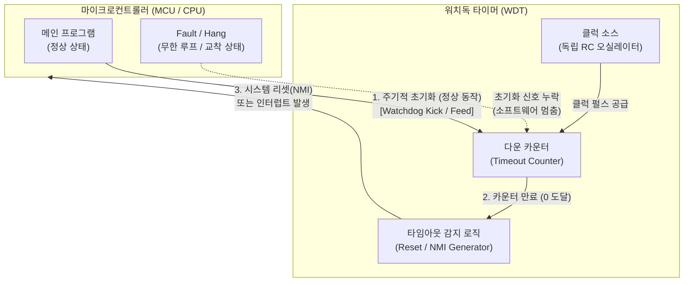

# 워치독 타이머 (Watchdog Timer)

---

## I. 무인 환경 및 고신뢰성 시스템을 위한, 워치독 타이머(WDT)의 개요

* **정의**: 마이크로컨트롤러(MCU)나 OS의 정상 동작 여부를 지속적으로 감시하고, 소프트웨어 교착 상태나 하드웨어 결함 시 시스템을 자동 복구(Reset)하는 결함 감내형(Fault-Tolerant) 타이머 메커니즘
* **등장 배경 및 필요성**: 원격지 무인 장비(IoT, 산업용 제어기)의 수동 재부팅 한계 극복, 단일 장애점(SPOF) 방지 및 무중단 운영 보장
* **특징**: 독립적인 카운터 기반 타이머, 주기적 초기화(Kick/Feed) 요구, 조건 불충족 시 최우선 순위 [[인터럽트]](NMI) 또는 하드웨어 리셋 발생

---

## II. 워치독 타이머의 개념도 및 핵심 기술 요소

### 가. 워치독 타이머의 개념도 및 동작 원리

* 정상 동작 시 메인 프로그램이 WDT 카운터를 주기적으로 초기화(Kick/Feed)하여 타임아웃을 방지함
* 소프트웨어 멈춤이나 데드락으로 인해 카운터가 초기화되지 않고 0에 도달하면, NMI 또는 리셋 핀을 통해 시스템을 강제 재시작함

### 나. 워치독 타이머의 핵심 기술 및 구성 요소

| 구분 | 요소기술(키워드) | 세부 설명 |
| --- | --- | --- |
| **하드웨어 구성** | 전용 클럭/오실레이터 | 메인 시스템 클럭과 독립적으로 동작하여, 메인 클럭 장애 시에도 WDT 작동을 보장함 |
| **하드웨어 구성** | 카운터/프리스케일러 | 시스템 응답 주기에 맞춰(일반적으로 1.5~2배) 타임아웃 주기를 결정하고 카운트다운 수행 |
| **동작 메커니즘** | Watchdog Kick (Feed) | 메인 프로그램이 시스템이 정상임을 알리기 위해 카운터 값을 초기값으로 재설정하는 행위 |
| **동작 메커니즘** | NMI (Non-Maskable Interrupt) | 타임아웃 발생 시 OS나 [[CPU]]가 소프트웨어적으로 무시(마스킹)할 수 없는 최상위 인터럽트를 유발 |
| **적용 유형** | 하드웨어 WDT (HWDT) | 외부 IC 회로로 구현되어 MCU의 전원이나 메인 클럭 결함까지 감지 후 물리적 리셋 수행 |
| **적용 유형** | 소프트웨어 WDT (SWDT) | OS [[커널]] 스레드(데몬) 형태로 동작하며, 특정 태스크나 프로세스의 행(Hang) 상태를 개별 감시 |
| **다중 보호** | 멀티 스테이지 WDT | 1차 타임아웃 시 경고 인터럽트(덤프 로그 저장 등) 발생, 2차 타임아웃 시 강제 리셋을 수행하는 구조 |
| **안전 강화** | 윈도우 워치독 (WWDT) | 지정된 '시간 창(Time Window)' 내에서만 초기화(Kick)를 허용하여 클럭 폭주 등 비정상적 고속 루프를 차단 |

---

## III. WDT 기술의 진화(WWDT)와 주요 산업 활용 동향

### 가. 표준 WDT와 Window WDT(WWDT) 비교

| 비교 항목 | Standard WDT | Window WDT (WWDT) |
| --- | --- | --- |
| **Kick 허용 시점** | 타임아웃 이전 언제든지 허용 | 설정된 **'Window(개방 창)' 내에서만** 허용 |
| **고속 루프/클럭 오류** | 감지 불가 (무한 루프 내 Kick 발생 시 정상으로 오인) | **감지 가능** (Window 시작 전 조기 Kick 발생 시 리셋) |
| **주요 보호 대상** | 지연(Delay), 시스템 멈춤(Hang) | 지연(Delay) 및 **비정상적 고속 실행(Early Pulse)** 동시 차단 |
| **안전성 요구 수준** | 일반 임베디드, 산업용 [[라우터]], 가전 기기 | 자동차 [[ASIL]] D, 생명 유지 장치 등 **초고신뢰성** 요구 |

### 나. 최신 산업별 WDT 활용 및 동향

* **[[Smart Car(자율주행)|자율주행]] 및 자동차 전장 (Automotive)**: 차량 내 다수의 ECU 및 센서의 클럭 결함 감시를 위해 필수 도입되며, [[ISO 26262]] ASIL(Automotive Safety Integrity Level) 달성을 위한 전압 슈퍼바이저 통합형 Window WDT 적용이 의무화되는 추세임
* **산업용 사물인터넷 (IIoT & [[EDGE|Edge]])**: 원격지나 열악한 환경(스마트 팩토리, 통신 [[게이트웨이]])에 설치된 엣지 기기의 소프트웨어 크래시 발생 시 수동 [[유지보수]] 없이 자가 복구(Self-Healing)를 수행하는 1차 방어선으로 활용됨
* **우주/항공 및 국방 시스템**: 방사선, 전자파 노출에 의한 단일 사건 업셋(SEU, 비트 플립) 발생 시, 논리적 오류로 인한 시스템 먹통을 방지하고 안전한 상태(Safe State)로 즉각 전환하기 위해 멀티 코어와 연계된 다중 감시 체계로 발전 중임

---

### 🔗 연관 토픽

- **소속 도메인**: [[00_컴퓨터구조_MOC|💻 컴퓨터구조]]
- **세부 분류**: `3. 고성능 AI 가속기 & 입출력 시스템`
- **핵심 연관 토픽**:
  - [[EDGE|edge]]
  - [[커널|커널(Kernel)]]
  - [[인터럽트|인터럽트 (Interrupt)]]
  - [[게이트웨이]]
  - [[ISO 26262]]
