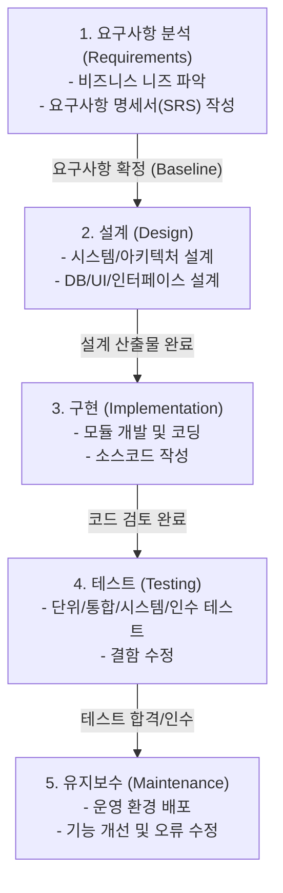

# 워터폴 개발방법론

---

## I. [순차적 소프트웨어 개발의 표준], 워터폴 개발방법론의 개요

- **정의**: 요구사항 분석부터 설계, 구현, 테스트, 유지보수까지 하향식(Top-Down)으로 폭포수가 떨어지듯 순차적으로 진행되는 선형적(Linear) 소프트웨어 생명주기(SDLC) 모델
- 한 단계가 완료되어야 다음 단계로 넘어가는 Phase-Gate 방식 채택
- **특징**: 명확한 단계별 산출물 기반(Document-driven), 프로젝트 가시성 확보 및 강한 통제(Control) 용이, 초기 요구사항 확정 필수, 개발 도중 요구사항 변경 수용의 어려움(경직성)

---

## II. 워터폴 개발방법론의 프로세스 및 핵심 요소

### 가. 워터폴 개발방법론의 생명주기 프로세스

* 각 단계는 독립적으로 수행되며, 이전 단계의 완료(Sign-off) 및 산출물(Document)이 다음 단계의 입력물(Input)로 사용됨
* 역방향 진행이 원칙적으로 제한되나, 실제 현장에서는 피드백 루프를 통한 부분적 반복(Iteration)을 허용하기도 함

### 나. 워터폴 프로세스의 단계별 핵심 산출물 및 관리 요소

| 구분 (Phase) | 요소기술 및 산출물 (키워드) | 세부 설명 |
| --- | --- | --- |
| **요구사항 분석** | SRS, 요구사항 추적표 | 이해관계자의 니즈를 기능/비기능 요구사항으로 구체화 및 명세화 |
| **시스템 설계** | 아키텍처 정의서, ERD | 요구사항을 시스템 구조, [[데이터베이스]], UI/UX 디자인으로 매핑 |
| **구현 (개발)** | Source Code, 주석 | 설계서를 기반으로 실제 프로그래밍 언어를 이용해 소프트웨어 구현 |
| **[[소프트웨어 테스트]]** | Test Case, 결함 보고서 | V-Model 기반의 단위/통합/시스템/인수 테스트를 통한 품질 검증 |
| **배포 및 유지보수** | 릴리즈 노트, 운영 매뉴얼 | 상용 환경 이관 및 운영 중 발생하는 버그 수정, 시스템 기능 고도화 |
| **[[형상 관리]]** | Baseline, 버전 관리 | 각 단계별 산출물과 소스코드의 [[무결성]] 보장 및 변경 통제 수행 |
| **품질 보증(QA)** | 리뷰(Review), 감사(Audit) | 각 마일스톤(Milestone)별 진입/제출 기준(Entry/Exit Criteria) 충족 여부 검증 |
| **프로젝트 관리** | [[WBS]], Gantt Chart | 전체 일정, 자원 배분, 위험 관리 계획 수립 및 진척도 모니터링 |

---

## III. 워터폴 개발방법론의 비교 및 향후 전망

### 가. 워터폴 vs 애자일(Agile) 개발방법론 비교

| 비교 항목 | 워터폴 (Waterfall) | 애자일 ([[Agile]]) |
| --- | --- | --- |
| **설계 및 접근 철학** | 계획 주도형 (Plan-driven) | 가치 주도형 (Value-driven) |
| **[[프로세스]] 흐름** | 선형적, 순차적 (하향식) | 반복적, 점진적 (스프린트 기반) |
| **요구사항 변경** | 변경 수용이 어려움 (경직성) | 지속적 변경 수용 및 반영 (유연성) |
| **핵심 성과물** | 상세한 산출물(문서) 중심 | 동작하는 소프트웨어 중심 |
| **고객 참여도** | 프로젝트 초기 및 인수 단계 집중 | 프로젝트 전체 주기에 걸쳐 지속적 참여 |
| **팀 구성 및 구조** | 직무/기능별 분리 (기획/개발/QA) | 크로스펑셔널(Cross-functional) 통합 팀 |
| **적합한 프로젝트** | 요구사항이 명확한 대규모/공공 프로젝트 | 불확실성이 높고 빠른 TTM이 필요한 서비스 |

### 나. 한계 극복 방안 및 최신 동향

* **한계점**: 후반부 테스트 단계에서 중대한 설계 결함 발견 시 재작업(Rework) 비용과 시간의 기하급수적 증가
* **해결 방안 및 트렌드**:
* 워터폴의 강력한 관리 체계(거버넌스)와 애자일의 유연한 개발 방식(스프린트)을 결합한 **하이브리드(Hybrid) 방법론** 도입 증가
* 프로젝트 특성(규모, 위험도, 규제)에 맞게 표준 프로세스를 수정 및 최적화하는 **방법론 [[테일러링]](Tailoring)** 적극 적용

---

### 🔗 연관 토픽

- **소속 도메인**: [[00_소프트웨어공학_MOC|🏗️ 소프트웨어공학]]
- **세부 분류**: `6. 소프트웨어 테스팅 & 품질 보증 (QA/QC)`
- **핵심 연관 토픽**:
  - [[테일러링|테일러링 (Tailoring)]]
  - [[Agile]]
  - [[WBS|WBS (Work Breakdown Structure)]]
  - [[공통감리 절차]]
  - [[정보시스템 감리 의무 대상과 관점별 점검 기준]]
