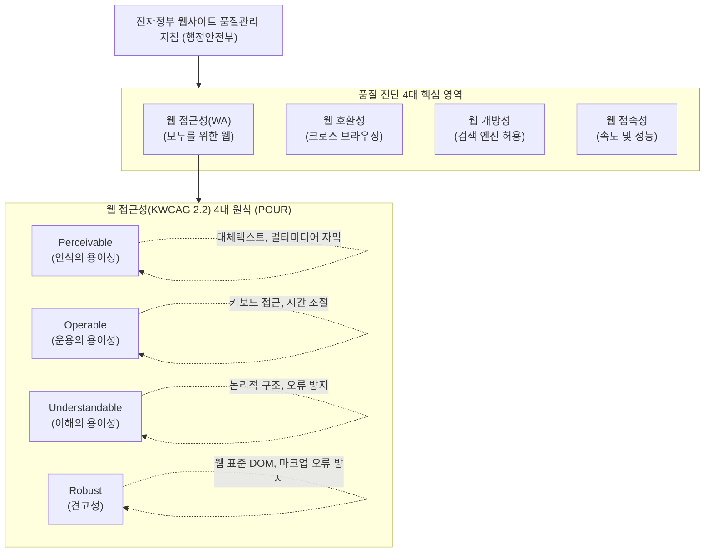

# 웹 접근성(WA) 및 전자정부 웹사이트 품질관리 지침

---

## I. 보편적 정보 접근 보장을 위한 웹 접근성 및 품질관리의 개요

* **정의**: 모든 사용자(장애인, 고령자 포함)가 어떠한 기기나 브라우저 환경에서도 동등하게 전자정부 웹 서비스의 정보와 기능을 이용할 수 있도록 보장하는 설계 원칙(WA) 및 국가 단위의 종합 품질 관리 기준
* **등장배경 및 특징**: 지능정보화기본법 및 장애인차별금지법 기반 법적 의무화, 정보 격차(Digital Divide) 해소, 크로스 브라우징 및 모바일 환경 도래, [[공공데이터]] 개방성 요구 증대

---

## II. 전자정부 웹사이트 품질관리 구성도 및 핵심 기술 요소

### 가. 웹사이트 품질관리 프레임워크 및 웹 접근성(WA) 원리

* 공공 웹사이트는 접근성(4대 원칙 중심), 호환성, 개방성, 접속성 등을 통합 진단하여 보편적이고 안정적인 디지털 공공서비스를 제공함

### 나. 전자정부 웹사이트 품질관리 및 웹 접근성 핵심 기술 요소

| 구분 | 요소기술(키워드) | 세부 설명 |
| --- | --- | --- |
| **접근성(인식)** | 대체 텍스트 (Alt Text) | 시각장애인 스크린 리더기를 위한 이미지 설명 텍스트 제공 |
| **접근성(운용)** | 키보드 접근성 (Tab [[RDBMS 인덱스(index)|Index]]) | 마우스 없이 키보드만으로 모든 웹 기능 및 메뉴 제어 구현 |
| **접근성(이해)** | 논리적 콘텐츠 선형화 | CSS 제거 시에도 논리적인 순서로 콘텐츠가 인지되도록 마크업 |
| **접근성(견고)** | W3C 웹 표준 (HTML5/CSS3) | 웹 표준 문법 준수 및 마크업 오류(Parsing Error) 방지 |
| **웹 호환성** | 크로스 브라우징 (Cross-Browsing) | [[EDGE|Edge]], Chrome, Safari 등 다양한 브라우저 및 OS 환경 동일 동작 |
| **웹 개방성** | 검색 로봇 배제 표준 (robots.txt) | 정보 검색엔진의 접근 허용 및 검색 차단 방지 적용 |
| **웹 접속성** | Web Vitals / 캐싱 최적화 | 초기 로딩 시간 단축, 최적화된 이미지 포맷(WebP 등) 활용 |
| **보안/[[신뢰성]]** | 웹 취약점 대응 / [[시큐어코딩]] | OWASP Top 10 취약점 방어 및 개인정보 노출 방지 아키텍처 |

---

## III. 웹 접근성 및 품질관리의 최신 동향 및 향후 전망

| 구분 | 최신 트렌드 및 발전 방향 (키워드) | 상세 내용 및 산업 적용 방향 |
| --- | --- | --- |
| **평가 자동화** | **AI 기반 접근성 진단 (A11y)** | AI를 활용한 자동 대체 텍스트 생성(Computer Vision) 및 동적 DOM 트리의 실시간 접근성 위반 자동 탐지 |
| **표준 고도화** | **WCAG 2.2 및 KWCAG 2.2 적용** | 인지적/학습 장애인을 위한 지침 강화, 모바일 터치 타겟 크기 기준 구체화, 포커스 가시성(Focus Visibility) 강화 |
| **적용 확대** | **키오스크 및 모바일 앱 접근성** | 공공/민간 무인정보단말기(Kiosk)의 배리어프리(Barrier-Free) UI 적용 및 모바일 앱 접근성(MA) 인증 의무화 확산 |
| **가치 확장** | **디지털 포용성 (Digital Inclusion)** | 단순 규제 준수를 넘어 ESG 경영의 S(Social) 지표로 웹/앱 접근성을 격상하여 보편적 디지털 권리 보장 |

* [[클라우드 네이티브]] 기반 공공 웹사이트 전환에 따라, CI/CD 파이프라인 내 웹 품질 및 접근성 자동화 테스팅 툴(예: Axe-core)의 통합이 필수적으로 요구됨

---

### 🔗 연관 토픽

- **소속 도메인**: [[00_프로젝트관리_MOC|📋 프로젝트관리]]
- **세부 분류**: `1. PMBOK 표준 & 프로젝트 거버넌스`
- **핵심 연관 토픽**:
  - [[신뢰성]]
  - [[클라우드 네이티브]]
  - [[EDGE|edge]]
  - [[RDBMS 인덱스(index)]]
  - [[공공데이터|공공데이터 (Open Data)]]
