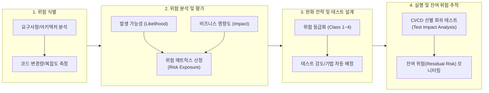

# 위험 기반 테스트 (Risk-Based Testing, RBT)

---

## I. 리스크 정량화를 통한 테스트 최적화, 위험 기반 테스트의 개요

### 가. 위험 기반 테스트의 정의

* 비즈니스 손실 및 결함 발생 가능성(Likelihood)과 영향도(Impact)를 분석하여 테스트 우선순위와 자원 투입 범위를 차등 배정하는 [[소프트웨어 테스트]] 기법
* ISO/IEC/IEEE 29119-2 및 ISTQB 표준 기반으로, 제한된 일정과 예산 내에서 고위험 영역에 검증 역량을 집중하여 품질 비용(CoQ)을 최적화하는 전략적 테스트 접근법

### 나. 위험 기반 테스트의 필요성 및 특징

* **완전 테스트 불가성(Exhaustive Testing Paradox) 극복**: 모든 경로 검증의 현실적 한계를 극복하고 핵심 비즈니스 리스크 집중 제어
* **조기 위험 완화(Shift-Left)**: 요구사항 및 설계 단계부터 잠재 결함 식별 및 선제적 결함 유입 차단
* **정량적 의사결정 체계**: 위험 노출도(Risk Exposure) 및 잔여 위험(Residual Risk) 지표를 기반으로 한 객관적 출시(Release Go/No-Go) 판정

---

## II. 위험 기반 테스트의 프로세스 및 핵심 기술 요소

### 가. 위험 기반 테스트의 수행 프로세스 및 아키텍처

* 리스크 식별 $\rightarrow$ 2차원 매트릭스 평가 $\rightarrow$ 등급별 테스트 설계 및 자원 차등 투입 $\rightarrow$ CI/CD 연계 실행 및 잔여 위험 통제의 폐루프(Closed-Loop) 구조

### 나. 위험 기반 테스트의 핵심 기술 및 구성 요소

| 구분 | 핵심 기술/구성 요소 | 세부 설명 |
| --- | --- | --- |
| 위험 식별 | **[[FMEA (Failure Mode and Effects Analysis)|FMEA]] (고장 모드 및 영향 분석)** | 잠재적 고장 형태를 도출하고 심각도, 발생 빈도, 검출 난이도를 결합해 위험우선순위([[RPN]]) 산출 |
| 위험 식별 | **[[FTA (Fault Tree Analysis)|FTA]] (결함 트리 분석)** | 시스템 장애 요인을 하향식(Top-Down) 연역적 논리 게이트로 분석하여 결함 전파 경로 추적 |
| 위험 평가 | **위험 매트릭스 (Risk Matrix)** | 발생 가능성(기술적 복잡도 등)과 영향도(재무/보안 손실 등)를 축으로 위험 수준(High/Med/Low) 매핑 |
| 위험 평가 | **위험 노출도 (Risk Exposure)** | $RE = P(\text{Failure}) \times I(\text{Cost})$, 수치화된 손실 기대값을 산출해 정량적 우선순위 부여 |
| 전략 수립 | **테스트 강도 차등화** | 고위험군(경계값, 페어와이즈, 구조적 심층 검증), 저위험군(스모크 테스트, 샘플링) 선별 적용 |
| 추적 통제 | **잔여 위험 (Residual Risk)** | 결함 조치 후 남은 잔존 위험을 측정하여 출시 허용 기준(Exit Criteria) 도달 여부 판정 |
| 최신 기술 | **TIA (Test Impact Analysis)** | 코드 변경(Git diff) 추적을 통해 변경 영향권 내 고위험 테스트 케이스만 선별 실행하는 CI/CD 최적화 |
| 최신 기술 | **AI/ML 결함 예측 모델** | 순환 복잡도(Cyclomatic), 코드 수정 빈도(Churn), 과거 결함 이력을 머신러닝으로 학습하여 고위험 모듈 예측 |

---

## III. 전통적 테스트 vs 위험 기반 테스트 비교 및 현대적 발전 방향

### 가. 전통적 테스트 기법 vs 위험 기반 테스트 비교

| 비교 항목 | 전통적 테스트 (명세 기반) | 위험 기반 테스트 (RBT) |
| --- | --- | --- |
| **테스트 목적** | 요구사항 명세서의 기능 전수 커버리지 달성 | 비즈니스 손실 및 치명 결함의 조기 완화 |
| **자원 배분** | 모든 모듈에 균등 또는 일정 순환식 배분 | 위험 노출도(Risk Exposure) 비례 비대칭 집중 투입 |
| **테스트 우선순위** | 기능 구현 순서 또는 단순 아키텍처 계층 순 | 위험 등급(Class) 기반 역동적 우선순위화 |
| **종료 기준** | 사전 정의된 테스트 케이스 100% 실행 완료 | 비즈니스 허용 가능한 잔여 위험(Acceptable Risk) 도달 |
| **적용 시점** | 개발 후반부(System Test 위주) | 요구사항 정의 및 아키텍처 설계 단계부터(Shift-Left) |

* **현대적 발전 방향**: [[DevSecOps]] 환경에서 AI 기반 결함 예측 모델 및 TIA(Test Impact Analysis)와 결합된 '적응형 위험 기반 테스트(Adaptive RBT)'로 진화하고 있으며, [[카오스 엔지니어링]] 및 런타임 옵저버빌리티(Observability) 데이터와 연계되어 프로덕션 환경의 잠재 장애 위험을 사전에 완화하는 체계로 확장됨.

---

### 🔗 연관 토픽

- **소속 도메인**: [[00_소프트웨어공학_MOC|🏗️ 소프트웨어공학]]
- **세부 분류**: `6. 소프트웨어 테스팅 & 품질 보증 (QA/QC)`
- **핵심 연관 토픽**:
  - [[FTA (Fault Tree Analysis)]]
  - [[소프트웨어 테스트|소프트웨어 테스트 (Software Test)]]
  - [[카오스 엔지니어링|카오스 엔지니어링 (Chaos Engineering)]]
  - [[코드 커버리지|코드 커버리지(Code Coverage)]]
  - [[FMEA (Failure Mode and Effects Analysis)]]
