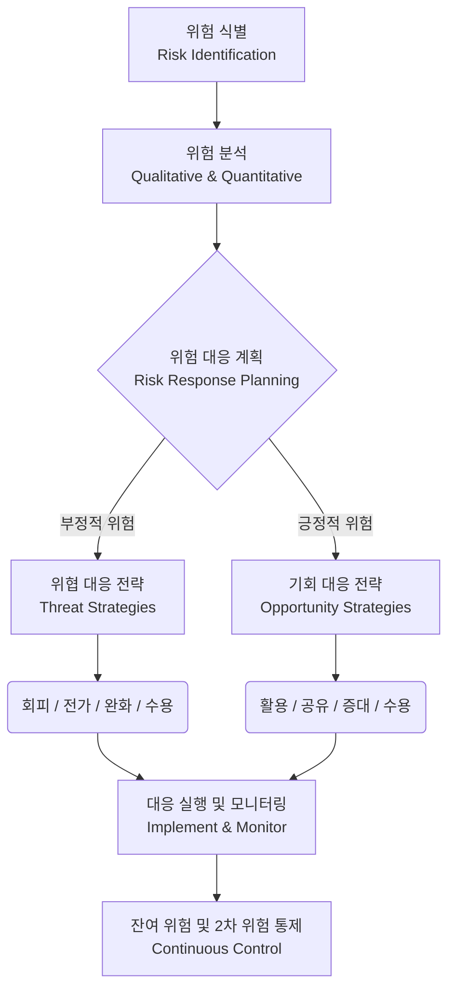

# 위험 대응

---

## I. 위협 최소화 및 기회 극대화, 위험 대응(Risk Response)의 개요

* **정의**: 식별 및 분석된 프로젝트/정보시스템 위험(부정적 위협 및 긍정적 기회)에 대해 최적의 대응 전략을 수립하고 실행 방안을 결정하는 위험 관리 핵심 [[프로세스]]
* **필요성 및 특징**:
* 프로젝트 목표 달성 및 비즈니스 연속성([[BCP]]) 확보를 위한 선제적 대응 체계 마련
* 한정된 자원의 효율적 배분 및 잔여 위험(Residual Risk)을 수용 가능한 허용 임계치(Tolerance) 이내로 통제

---

## II. 위험 대응의 메커니즘 및 핵심 전략 요소

### 가. 위험 대응의 프로세스 및 메커니즘

* 분석된 위험의 성격(위협/기회)에 따라 맞춤형 전략(회피, 완화, 활용 등)을 매핑하여 실행함
* 실행 후 잔여 위험 추적 및 비상 계획(Contingency Plan), 우회 계획(Workaround) 등의 사후 통제 수행

### 나. 위험 대응의 핵심 전략 요소

| 구분 | 요소기술(키워드) | 세부 설명 |
| --- | --- | --- |
| **위협 대응** | 회피 (Avoid) | 프로젝트 계획 변경 등을 통해 위험 발생 원인을 근본적으로 제거하여 영향 원천 차단 |
| **위협 대응** | 전가 (Transfer) | 위험의 결과 및 대응 책임을 제3자에게 이전 (예: 보험 가입, 외주화, [[SLA]] 체결) |
| **위협 대응** | 완화 (Mitigate) | 위험 발생 확률이나 부정적 영향을 수용 가능한 수준(Threshold)으로 감소시키는 조치 |
| **기회 대응** | 활용 ([[Exploit]]) | 긍정적 위험(기회)이 반드시 발생하도록 확률을 100%로 끌어올려 편익을 확보하는 전략 |
| **기회 대응** | 공유 (Share) | 기회를 가장 잘 활용할 수 있는 역량 있는 제3자에게 소유권 할당 (예: 조인트 벤처) |
| **기회 대응** | 증대 (Enhance) | 긍정적 위험의 발생 원인을 식별하여 발생 확률이나 파급 효과를 극대화하기 위한 조치 |
| **공통 대응** | 수용 (Accept) | 위험을 인지하나 능동적(비상 예비비 할당) 또는 수동적(무대응)으로 결과를 받아들임 |
| **공통 대응** | 보고 (Escalate) | PM의 권한을 초과하거나 범위를 벗어난 위험을 상위 조직(스폰서, 경영진)으로 이관 |

---

## III. 위험 대응의 주요 파생 위험 비교 및 향후 전망

### 가. 위험 대응 후 파생 위험(잔여 위험 vs 2차 위험) 비교

| 비교 항목 | 잔여 위험 (Residual Risk) | 2차 위험 (Secondary Risk) |
| --- | --- | --- |
| **발생 원인** | 기 수립된 위험 대응 전략 실행 후 남은 잉여 위험 | 특정 위험 대응 전략을 실행한 직접적인 결과로 새롭게 발생한 위험 |
| **관리 기준** | 허용 임계치(Acceptable Level) 충족 여부 확인 | 새로운 위험에 대한 식별 및 분석 프로세스 재수립 |
| **대응 전략** | 일반적으로 '수용(Accept)' 처리 및 비상 예비비 할당 | 회피, 전가, 완화 등의 새로운 대응 전략 수립 및 적용 |
| **핵심 통제** | 지속적 모니터링 및 임계치 초과 시 추가 완화 | 워크어라운드(Workaround) 대비 및 리스크 레지스터(Risk Register) 업데이트 |

* **전망 및 동향**: 최근 애자일([[Agile]]) 환경 및 [[DevSecOps]]의 확산에 따라, 정적인 위험 대응 계획 수립에서 벗어나 AI/ML 기반의 위험 예측 모델링을 활용한 지속적이고 동적인 실시간 위험 대응 체계(Continuous Risk Response)로 진화 중임

---

### 🔗 연관 토픽

- **소속 도메인**: [[00_프로젝트관리_MOC|📋 프로젝트관리]]
- **세부 분류**: `4. 품질 보증 · 위험 관리 & 정보시스템 감리`
- **핵심 연관 토픽**:
  - [[프로젝트 위험관리]]
  - [[Agile]]
  - [[BCP|BCP (Business Continuity Planning)]]
  - [[IT 거버넌스]]
  - [[개인정보 영향평가|개인정보 영향평가(Privacy Impact Assessment)]]
