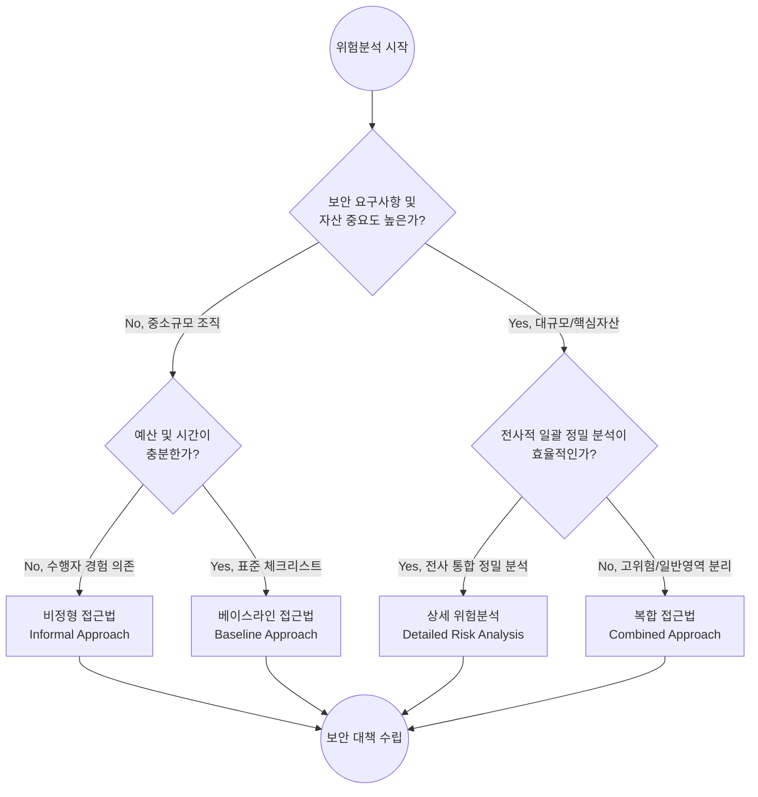

# 위험분석 방법론 (ISO/IEC 13335-1, 위험분석 전략 평가)

---

## I. 최적 보안대책 수립의 기반, 위험분석 방법론(ISO/IEC 13335-1)의 개요

* **정의**: 조직의 정보자산에 대한 위협과 취약성을 식별하고, 위험 규모를 산정하여 한정된 자원 내에서 가장 적절한 보안대책을 수립하기 위한 체계적인 위험 평가 전략.
* **필요성 및 특징**:
* 조직의 규모, 자산의 중요도, 가용한 예산과 시간에 맞춰 유연한 접근법 선택 필요.
* 국제 표준 지침인 ISO/IEC 13335-1을 기반으로 베이스라인, 비정형, 상세, 복합 접근법의 4가지 전략적 접근 모델 제시.

---

## II. 위험분석 전략(ISO/IEC 13335-1)의 개념도 및 핵심 전략 평가

### 가. 위험분석 전략의 선택 개념도 및 의사결정 흐름

* 조직의 자산 규모, 요구되는 보안 수준, 가용한 시간과 예산을 종합적으로 고려하여 4가지 전략 중 최적의 비용 대비 효과를 낼 수 있는 접근법을 선택하여 수행함.

### 나. ISO/IEC 13335-1 위험분석 전략의 핵심 구성 요소

| 구분 | 요소기술(키워드) | 세부 설명 |
| --- | --- | --- |
| **베이스라인 접근법** | 표준 체크리스트 | 조직 전체에 표준화된 보호 기본 수준(Baseline)을 일괄 적용하여 갭(Gap) 분석 수행 |
| **베이스라인 접근법** | 신속성 및 경제성 | 광범위한 자산에 빠르고 저렴하게 적용 가능하나, 조직의 특수한 보안 환경이나 예외 상황 반영 한계 |
| **비정형 접근법** | 전문가 직관 기반 | 구조적인 방법론 없이 보안 실무자 및 전문가의 지식과 경험에 의존하여 주요 위험을 중심으로 분석 |
| **비정형 접근법** | 실무적 유연성 | 중소규모 조직에 적합하며 신속하나, 평가자의 역량 및 경험치에 따라 분석 결과의 주관성 및 편차 발생 |
| **상세 위험분석** | 자산/위협/취약성 분석 | 자산의 가치, 위협 발생 가능성, 취약성 정도를 정형화된 기법으로 깊이 있게 정밀 식별 및 평가 |
| **상세 위험분석** | 정밀성 및 고비용 | 정확하고 포괄적인 보안 대책 수립이 가능하나, 분석 수행 과정에서 막대한 인력, 시간, 비용이 소모됨 |
| **복합 접근법** | 자산 중요도 기반 분류 | 전사 정보자산을 중요도 및 위험도에 따라 분류하여 고위험 영역과 일반 영역으로 분리하여 적용 |
| **복합 접근법** | 선택적 자원 집중 | 고위험 영역은 '상세 위험분석', 나머지는 '베이스라인'을 혼용하여 비용 대비 보안 효과를 극대화하는 합리적 방식 |

---

## III. 위험 평가 기법(상세 위험분석)의 비교 및 향후 동향

### 가. 상세 위험분석 수행을 위한 정량적 vs 정성적 평가 기법 비교

| 비교 항목 | 정성적 위험분석 (Qualitative) | 정량적 위험분석 (Quantitative) |
| --- | --- | --- |
| **기본 개념** | 위험의 크기를 상/중/하 등 서술적 척도로 평가 | 위험으로 인한 잠재적 손실을 금액(화폐 가치) 등 수치로 산출 |
| **주요 기법** | 델파이 기법(전문가 합의), 시나리오법, 순위결정법 | 수학적 기대비용(ALE, SLE, ARO), [[몬테카를로 시뮬레이션]] |
| **장점** | 비재무적 영향(평판 등) 파악 용이, 신속한 평가 가능 | 명확한 수치 제시로 경영진의 보안 투자 의사결정 지원 용이 |
| **단점** | 평가자의 주관 개입, 객관적인 손실 규모 파악 곤란 | 데이터 수집 및 수학적 분석 모델 구축에 막대한 리소스 소요 |

* **향후 동향 및 전망**: 최근 복잡해지는 IT 환경에서 기업들은 비용 효율성을 위해 복합 접근법(Combined Approach)을 가장 선호하는 추세임. 또한 클라우드, AI 중심의 인프라 전환에 따라 전통적인 1회성 위험 평가를 넘어, 위험 가시화 솔루션([[지속적인 위협 노출 관리|CTEM]] 등)과 연동한 **지속적 위험 모니터링(Continuous Risk Management)** 체계로 방법론이 진화하고 있음.

---

### 🔗 연관 토픽

- **소속 도메인**: [[00_보안_MOC|🛡️ 보안]]
- **세부 분류**: `6. 개인정보보호 & 프라이버시 강화 기술`
- **핵심 연관 토픽**:
  - [[지속적인 위협 노출 관리|지속적인 위협 노출 관리(CTEM)]]
  - [[몬테카를로 시뮬레이션]]
  - [[DevSecOps]]
  - [[비식별화]]
  - [[개인정보보호법]]
