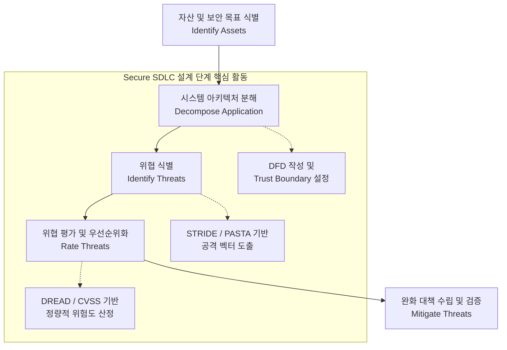

# 위협 모델링 (Threat Modeling)

---

## I. 사전 예방 중심의 보안, 위협 모델링(Threat Modeling)의 개요

* **정의**: Secure [[SDLC]]의 요구사항 및 설계 단계에서 애플리케이션의 데이터 흐름과 신뢰 경계를 분석하여, 잠재적인 보안 위협을 식별하고 완화(Mitigation) 대책을 선제적으로 수립하는 구조적 위험 분석 [[프로세스]]
* **필요성 및 특징**:
* **Shift-Left 보안 실현**: 취약점이 구현/운영 단계로 넘어가는 것을 방지하여 보안 결함 조치 비용을 획기적으로 절감 (운영 단계 조치 대비 압도적 비용 효율성 확보)
* **Security by Design 내재화**: 설계 초기 단계부터 보안 통제를 적용하여 ISMS, FedRAMP 등 최신 글로벌 보안 컴플라이언스 요구사항 충족

---

## II. 위협 모델링의 메커니즘 및 핵심 프레임워크

### 가. 위협 모델링의 수행 프로세스 및 개념도

* [[데이터 흐름도]](DFD)를 통해 시스템 내부의 신뢰 경계(Trust Boundary)를 가시화하고, 도출된 공격 표면에 대해 [[STRIDE]] 등의 기법을 적용하여 선제적 방어 논리를 구성함

### 나. 위협 모델링의 핵심 구성 요소

| 구분 | 요소기술(키워드) | 세부 설명 |
| --- | --- | --- |
| **위협 식별 [[프레임워크]]** | STRIDE | Spoofing, Tampering, Repudiation, Info Disclosure, [[DoS (Denial of Service)|DoS]], EoP의 6가지 핵심 위협 분류 모델 |
| **위협 식별 프레임워크** | PASTA | 비즈니스 영향도와 공격자 관점을 융합한 7단계 위험 기반(Risk-Centric) 위협 모델링 기법 |
| **위협 식별 프레임워크** | VAST | 애자일([[Agile]]) 및 [[DevSecOps]] CI/CD 환경에 최적화된 자동화 및 시각화 중심의 위협 모델링 |
| **위협 평가 및 정량화** | DREAD | Damage, Reproducibility, Exploitability, Affected users, Discoverability 기반 위험도 정량화 기법 |
| **위협 평가 및 정량화** | [[CVSS]] | 취약점의 심각도를 점수화(0.0~10.0)하여 완화 우선순위를 객관적으로 산정하는 범용적 평가 표준 |
| **핵심 분석 도구** | DFD (데이터 흐름도) | 프로세스, 데이터 저장소, 외부 [[엔티티]] 간의 데이터 흐름과 신뢰 경계(Trust Boundary) 시각화 |
| **핵심 분석 도구** | Attack Tree (공격 트리) | 특정 자산 및 시스템 타격을 목표로 하는 공격자의 단계별 침투 경로를 트리 구조로 시각화 모델링 |
| **보안 통제 및 완화** | Mitigation (완화 대책) | 식별된 위협에 대응하기 위한 입력값 검증, 강력한 인증/인가, 최소 권한 원칙 등의 보안 설계 적용 |

---

## III. 위협 모델링의 향후 전망 및 최신 동향 (2026년 기준)

### 가. DevSecOps 및 AI 환경의 위협 모델링 진화 방향

* **Continuous Threat Modeling (연속적 위협 모델링)**:
* 과거 정적 문서(Static Document) 기반의 1회성 모델링 한계를 극복하기 위해, CI/CD 파이프라인과 연동하여 머신리더블(OSCAL 등) 형태의 실시간 위협 모니터링 및 자동화된 컴플라이언스(예: FedRAMP 20x) 검증 체계로 진화 중임

* **AI/[[초거대 언어 모델|LLM]] 파이프라인 특화 위협 모델링**:
* AI 생성 코드가 유발하는 안전하지 않은 기본값(Insecure Defaults) 결함 방지 및 [[프롬프트 인젝션|프롬프트 인젝션(Prompt Injection)]], 모델 중독 등 [[인공지능]] 특화 공격 표면을 사전에 분석하는 보안 통제(OWASP Top 10 for LLMs 연계)가 필수화됨

* **Threat Modeling as a Code (TaC)**:
* 인프라를 코드로 관리(IaC)하듯, 위협 모델 또한 코드로 선언하여 버전 및 형상 관리를 수행하고 개발자와 보안 조직(Sec) 간의 민첩한 협업(Shift-Left) 환경 구축 확산

---

### 🔗 연관 토픽

- **소속 도메인**: [[00_보안_MOC|🛡️ 보안]]
- **세부 분류**: `4. 웹 & 애플리케이션 보안 · 취약점 점검`
- **핵심 연관 토픽**:
  - [[STRIDE]]
  - [[데이터 흐름도]]
  - [[CVSS]]
  - [[스마트카 보안 취약점 및 대응방안|스마트카 보안 취약점 및 대응방안 (Smart Car Security)]]
  - [[SDLC]]
