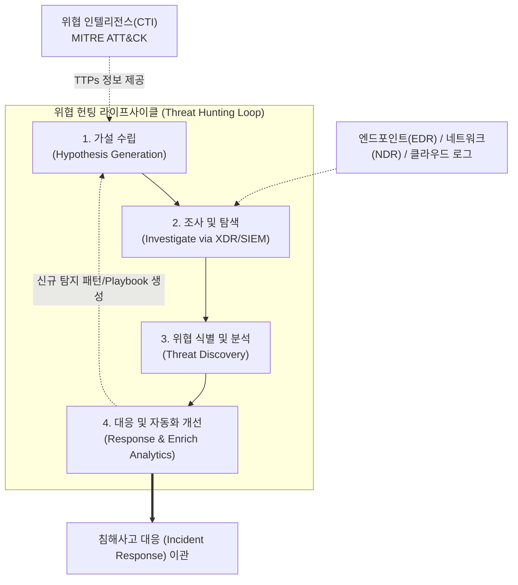

# 위협 헌팅 (Threat Hunting)

---

## I. 능동적 보안 방어, 위협 헌팅(Threat Hunting)의 개요

* **정의**: 네트워크나 시스템에 이미 침투해 있으나 기존 보안 솔루션이 탐지하지 못한 지능형 잠재 위협(APT, Zero-Day 등)을 가설 기반으로 능동적(Proactive)으로 탐색하고 식별하는 보안 활동
* **등장배경 및 특징**:
* **Assume Breach (침해 전제)**: 내부 방어망이 이미 돌파되었다는 가정하에 출발하는 보안 패러다임 전환
* **Proactive (사전 주도적 방어)**: 단순 알럿(Alert) 대응이 아닌, 공격자의 TTPs(전술·기법·절차)를 분석하여 숨겨진 위협을 선제적으로 발굴
* **[[CTI]] 및 AI 융합**: 사이버 위협 인텔리전스(CTI)와 머신러닝(UEBA 등) 기반의 행위 분석을 결합하여 탐지율 극대화

---

## II. 위협 헌팅의 개념도 및 핵심 기술 요소

### 가. 위협 헌팅의 개념도 및 수행 프로세스 (SANS 기반)

* 분석가의 가설 설정부터 시작하여, 방대한 로그 데이터를 탐색하고 발견된 위협을 기존 탐지 룰로 내재화하는 지속적 순환(Continuous Loop) 구조

### 나. 위협 헌팅의 핵심 기술 및 구성 요소

| 구분 | 요소기술(키워드) | 세부 설명 |
| --- | --- | --- |
| **분석 [[프레임워크]]** | [[MITRE ATT&CK (Adversarial Tactics, Techniques & Common Knowledge)|MITRE ATT&CK]] | 공격자의 전술(Tactics), 기법(Techniques), 절차(Procedures)를 표준화한 지식 기반 프레임워크 |
| **분석 지표** | IoC (침해 지표) | 악성 IP, 해시값, 도메인 등 사후적으로 확인 가능한 명시적인 침해 흔적 데이터 |
| **분석 지표** | IoA (공격 지표) | 공격의 의도와 일련의 행위를 나타내는 동적 지표로, 진행 중인 공격 식별에 활용 |
| **핵심 기법** | 가설 기반 분석 | CTI, 과거 사고 이력 등을 바탕으로 "특정 공격이 발생했을 것"이라는 가설 수립 및 검증 |
| **핵심 기법** | 머신러닝 / UEBA | 사용자 및 [[엔티티]] 행위 분석(UEBA)을 통해 정상 기준선(Baseline)을 이탈하는 이상 행위 탐지 |
| **지원 플랫폼** | [[XDR]] (확장 탐지 대응) | 엔드포인트([[EDR(Endpoint Detection and Response)|EDR]]), 네트워크(NDR), 클라우드 데이터를 통합하여 교차 상관 분석 환경 제공 |
| **지원 플랫폼** | [[SIEM]] / Data Lake | 방대한 이기종 보안 이벤트와 시스템 로그를 중앙 집중적으로 수집, 저장, 검색 |
| **자동화 도구** | [[SOAR (Security Orchestration, Automation and Response)|SOAR]] | 식별된 위협에 대한 대응 [[프로세스]](Playbook) 자동화 및 보안 장비 간 오케스트레이션 |

---

## III. 위협 헌팅과 기존 보안관제의 비교 및 향후 전망

### 가. 위협 헌팅(Threat Hunting)과 보안관제(SIEM 기반) 비교

| 비교 항목 | 전통적 보안관제 (Traditional SOC/SIEM) | 위협 헌팅 (Threat Hunting) |
| --- | --- | --- |
| **접근 방식** | 수동적 / 사후 대응적 (Reactive) | 능동적 / 사전 주도적 (Proactive) |
| **시작점(트리거)** | 보안 장비의 알럿(Alert) 및 시그니처 경고 | 분석가의 직관, CTI 기반의 '가설(Hypothesis)' |
| **주요 분석 대상** | 기지(Known) 위협, 알려진 악성코드 및 패턴 | 미지(Unknown) 위협, 파일리스(Fileless) 공격, APT |
| **핵심 지표** | IoC (Indicator of Compromise) 중심 | TTPs, IoA (Indicator of Attack) 중심 |
| **의존성** | 자동화된 탐지 룰, 시스템 의존 | 헌터(보안 전문가)의 역량 및 데이터 분석 기법 의존 |
| **결과물** | 침해사고 대응(IR) 이관 및 차단 | 신규 위협 식별 및 기존 시스템의 '탐지 룰(Rule)' 강화 |

* **전망 및 동향**: 최근 보안 인력 부족 및 경고 피로도(Alert Fatigue) 해소를 위해, 위협 헌팅 과정에 생성형 AI 및 Security Copilot([[초거대 언어 모델|LLM]])을 도입하여 가설 수립과 쿼리 작성을 자동화(AI-Assisted Hunting)하는 방향으로 진화하고 있음.

---

### 🔗 연관 토픽

- **소속 도메인**: [[00_보안_MOC|🛡️ 보안]]
- **세부 분류**: `3. 네트워크 & 엔드포인트 · 인프라 보안`
- **핵심 연관 토픽**:
  - [[EDR(Endpoint Detection and Response)]]
  - [[CTI]]
  - [[XDR|XDR(eXtended Detection Response)]]
  - [[MITRE ATT&CK (Adversarial Tactics, Techniques & Common Knowledge)]]
  - [[SIEM]]
