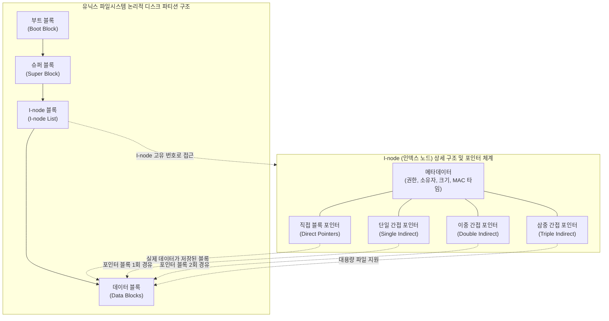

# 파일 시스템 (유닉스 파일시스템 중심)

---

## I. 시스템의 데이터 관리 근간, 유닉스 파일시스템의 개요

* **정의**: 하드 디스크 등 물리적 저장 매체에 데이터를 안전하게 저장, 검색, 수정, 삭제할 수 있도록 계층적 트리(Tree) 구조와 인덱스 노드(I-node)를 활용하여 데이터를 논리적으로 조직화하는 유닉스 운영체제의 핵심 시스템
* **등장 배경**: 다중 사용자(Multi-user) 환경에서 파일에 대한 체계적인 접근 제어(Access Control) 필요, 디스크 공간의 단편화를 막고 대용량 데이터를 빠르게 색인하기 위한 고도화된 자료구조 요구
* **특징**: "모든 것은 파일이다(Everything is a file)" 철학 기반(디바이스, 소켓, 파이프 등을 모두 파일로 취급), I-node 기반의 메타데이터 분리 관리, 마운트(Mount)를 통한 유연한 볼륨 트리 확장성 제공

---

## II. 유닉스 파일시스템의 개념도 및 핵심 구성 요소

### 가. 유닉스 파일시스템 파티션 및 I-node 아키텍처

* 디스크는 크게 4개의 영역으로 분할되며, 파일의 실제 내용은 '데이터 블록'에 저장되고 파일의 속성과 데이터 블록을 찾아가는 지도 역할은 'I-node'가 수행함

### 나. 유닉스 파일시스템의 핵심 기술 및 구성 요소

| 구분 | 요소기술(키워드) | 세부 설명 |
| --- | --- | --- |
| **디스크 영역** | 부트 블록 (Boot Block) | 운영체제를 메모리로 적재(부팅)하기 위한 부트스트랩 코드가 저장되는 파티션의 첫 번째 영역 |
| **디스크 영역** | 슈퍼 블록 (Super Block) | 파일시스템의 총 크기, 빈 데이터 블록 수, I-node 총 개수 등 파일시스템 전체의 핵심 메타데이터 보관 |
| **핵심 식별자** | I-node ([[RDBMS 인덱스(index)|Index]] Node) | 개별 파일의 고유 식별자. 파일 형태, 권한(rwx), 소유자 정보, 생성/수정/접근 시간, 데이터 블록 포인터 포함 (단, **파일명은 미포함**) |
| **디스크 영역** | 데이터 블록 (Data Block) | 파일의 실제 내용이나 디렉토리 내의 파일 목록(파일명 + I-node 번호 매핑 정보)이 저장되는 영역 |
| **논리적 접근** | 직접/간접 포인터 | 파일 크기에 따라 I-node가 직접 데이터를 가리키거나, 간접 블록(인덱스 블록)을 통해 가리켜 대용량 파일 저장 지원 |
| **시스템 계층** | VFS (Virtual File System) | ext4, XFS, NFS 등 서로 다른 파일시스템을 응용 프로그램이 동일한 표준 시스템 콜(open, read 등)로 접근하게 해주는 [[추상화]] 계층 |
| **파일 참조** | 하드 링크 (Hard Link) | 동일한 I-node를 직접 가리키는 서로 다른 파일명 생성 (I-node 참조 카운트 증가) |
| **파일 참조** | 심볼릭 링크 (Symbolic Link) | 원본 파일의 경로(Path) 자체를 데이터로 가지는 바로가기 파일 (별도의 I-node 가짐) |

---

## III. 윈도우 파일시스템(NTFS)과의 비교 및 향후 발전 전망

### 가. 유닉스 파일시스템(UFS/ext 계열) vs 윈도우 파일시스템(NTFS) 비교

| 비교 항목 | 유닉스/리눅스 파일시스템 (ext4, XFS 등) | 윈도우 파일시스템 (NTFS) |
| --- | --- | --- |
| **구조적 철학** | 단일 트리 구조 (Root `/` 기준), **모든 것은 파일** | 드라이브 문자 (C:, D:) 기준의 다중 트리 구조 |
| **메타데이터 관리** | **I-node (인덱스 노드)** 기반 분리 저장 | **MFT (Master File Table)** 기반 중앙 집중 관리 |
| **경로 구분자** | 슬래시 ( `/` ) | 백슬래시 ( `\` ) |
| **권한 제어 방식** | User, Group, Others 3단계 권한 제어 (rwx) | ACL (Access Control List) 기반의 세밀한 권한 제어 |
| **대소문자 구분** | 철저히 구분함 (Case-sensitive) | 기본적으로 구분하지 않음 (Case-insensitive) |

### 나. 유닉스 파일시스템의 최신 진화 동향 및 시사점

* **저널링(Journaling) 체계의 기본화**: 갑작스러운 정전이나 시스템 크래시 시 데이터 블록이 손상되는 것을 막기 위해, 디스크에 실제 쓰기 전 로그(Journal) 영역에 먼저 기록하여 파일시스템의 무결성과 복구 속도를 획기적으로 높인 ext4, XFS 등이 현대 리눅스의 표준으로 자리 잡음
* **CoW (Copy-on-Write) 차세대 파일시스템 도입**: 데이터 수정 시 기존 블록을 덮어쓰지 않고 새로운 블록에 기록한 뒤 포인터를 변경하는 CoW 기술(ZFS, Btrfs)이 도입되어, 즉각적인 스냅샷(Snapshot) 생성 및 볼륨 단위의 동적 크기 조절이 가능해짐
* **분산 및 클라우드 환경으로의 확장**: 단일 서버의 로컬 블록 스토리지를 넘어, 다수의 노드가 하나의 유닉스 파일시스템 트리처럼 동작하는 [[HDFS]], Ceph, AWS EFS 등 네트워크 기반 분산 파일시스템 아키텍처로 진화 중

---

### 🔗 연관 토픽

- **소속 도메인**: [[00_운영체제_MOC|⚙️ 운영체제]]
- **세부 분류**: `5. 가상 메모리 관리 & 페이지 교체 알고리즘`
- **핵심 연관 토픽**:
  - [[추상화|추상화 (Abstraction)]]
  - [[RDBMS 인덱스(index)]]
  - [[HDFS]]
  - [[단편화]]
  - [[LRU]]
