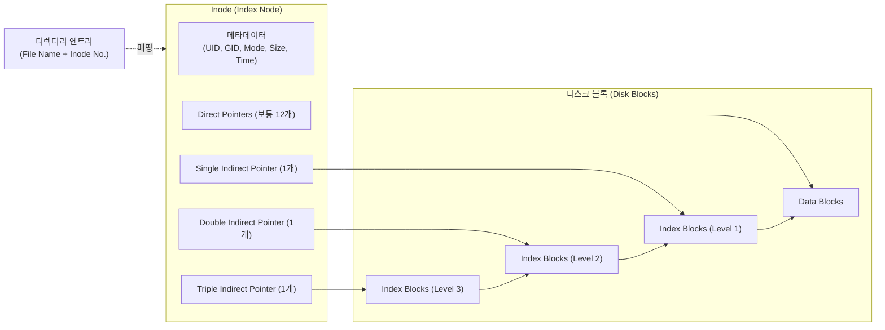

# 유닉스의 Inode

---

## I. 파일시스템 메타데이터 구조체, 유닉스 Inode의 개요

* **정의**: 유닉스(Unix) 및 리눅스(Linux) 계열 파일시스템에서 파일이나 디렉터리의 이름과 실제 데이터(Data Block)를 제외한 모든 논리적 정보(메타데이터)를 저장하는 고정 크기의 데이터 구조체
* **필요성 및 특징**:
* **데이터와 메타데이터 분리**: 디렉터리 엔트리(Directory Entry)는 '파일 이름'과 'Inode 번호'만 매핑하고, 실제 속성 및 포인터는 Inode가 전담하여 관리 효율성 확보
* **효율적인 인덱싱**: Direct 및 다단계 Indirect 포인터 트리를 통해 작은 파일부터 대용량 파일까지 유연하고 신속하게 디스크 블록 주소를 참조함

---

## II. Inode의 아키텍처 및 핵심 구성요소

### 가. Inode의 구조 및 동작 원리

* 디렉터리 엔트리를 통해 Inode 번호를 조회하고, Inode 내부의 메타데이터 확인 후 포인터를 거쳐 실제 데이터 블록(Data Block)에 접근함

### 나. Inode의 핵심 구성 요소

| 구분 | 요소기술(키워드) | 세부 설명 |
| --- | --- | --- |
| **기본 식별자** | Inode Number | 파일시스템 내에서 파일/디렉터리를 유일하게 식별하는 고유 번호 |
| **파일 속성** | File Mode (권한) | 파일의 유형(일반, 디렉터리, 심볼릭 링크 등) 및 접근 권한(rwx, SUID/SGID) |
| **파일 속성** | 소유자 정보 (UID/GID) | 파일을 소유한 사용자의 ID(UID)와 그룹의 ID(GID) 정보 |
| **파일 속성** | 시간 정보 ([[MAC]] Time) | 수정 시간(mtime), 접근 시간(atime), 속성 변경 시간(ctime) |
| **블록 포인터** | Direct Pointer | 실제 데이터 블록의 물리적 주소를 직접 가리키는 배열 (작은 파일에 유리) |
| **블록 포인터** | Single Indirect | 데이터 블록들의 주소를 담고 있는 1차 인덱스 블록을 가리키는 포인터 |
| **블록 포인터** | Double Indirect | 1차 인덱스 블록들의 주소를 담은 2차 인덱스 블록을 가리킴 (대용량 파일 지원) |
| **참조 관리** | Link Count | 하드 링크(Hard Link)를 통해 동일한 Inode를 참조하는 디렉터리 엔트리의 개수 |

---

## III. 전통적 Inode와 최신 파일시스템 인덱싱 비교 및 향후 전망

### 가. 전통적 Inode 방식과 최신 Extents/B-Tree 방식 비교

| 비교 항목 | 전통적 Inode (Ext2/Ext3) | Extents 기반 (Ext4, XFS) | B-Tree / COW 기반 (Btrfs, ZFS) |
| --- | --- | --- | --- |
| **블록 할당 방식** | 개별 데이터 블록마다 포인터 할당 (Block Mapping) | 연속된 블록들을 시작 번호와 길이(Length)로 표현 (Extents) | B-Tree 구조의 동적 할당 및 Copy-on-Write (COW) 적용 |
| **대용량 파일 처리** | 간접 포인터 트리 탐색으로 인한 메타데이터 오버헤드 큼 | Extent 구조로 메타데이터 획기적 감소 및 순차 I/O 성능 우수 | 서브볼륨 및 동적 메타데이터 트리를 통해 무제한적 확장 지원 |
| **데이터 [[무결성]]** | 저널링(Journaling) 의존 | 지연 할당(Delayed Allocation) 및 다중 블록 할당자 최적화 | 자체 Checksum 연산을 통한 Silent Data Corruption 자동 복구(Self-Healing) |
| **대표 사례** | UFS, Ext2, Ext3 | Ext4, XFS | Btrfs, ZFS |

* **전망 및 동향**: 최근 대규모 데이터 센터 및 클라우드 인프라에서는 수많은 낱개 블록 포인터를 가지는 전통적 Inode 구조의 한계를 극복하기 위해, Extents 매핑(Ext4)이나 메타데이터와 데이터를 아우르는 B-Tree 기반 시스템(Btrfs, ZFS)으로 표준이 전환됨. 또한 NVMe, Persistent Memory(PMEM) 등 초고속 저장 매체의 등장으로 메타데이터 캐싱 및 [[트랜잭션]] 오버헤드를 극소화하는 방향으로 파일시스템 내부 자료구조가 지속 최적화되고 있음.

---

### 🔗 연관 토픽

- **소속 도메인**: [[00_운영체제_MOC|⚙️ 운영체제]]
- **세부 분류**: `6. 커널 아키텍처 & 입출력 시스템`
- **핵심 연관 토픽**:
  - [[무결성]]
  - [[트랜잭션]]
  - [[병행 제어|병행 제어 (Concurrency control)]]
  - [[MAC]]
  - [[지역성|지역성(Locality)]]
