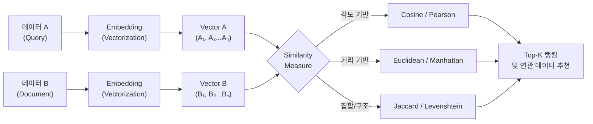

# 유사도(Similarity)

---

## I. 데이터 연관성 정량화 지표, 유사도(Similarity)의 개요

* **정의**: 다차원 특징 공간(Feature Space) 상에서 두 개 이상의 데이터(텍스트, 이미지, 벡터, 집합 등) 간의 거리, 각도, 구조적 차이를 수학적으로 계산하여 의미적·공간적 연관성을 정량화한 측정 지표
* **필요성 및 특징**:
* **머신러닝 핵심 기법**: 추천 시스템(협업 필터링), 군집화(K-Means), 분류(KNN), 정보 검색(Search)의 정확도를 결정하는 핵심 기반 [[알고리즘]]
* **특성 맞춤형 적용**: 데이터의 속성(연속형, 범주형, 텍스트, 비트) 및 희소성(Sparsity)에 따라 최적의 거리(Distance) 또는 각도(Angle) 측정 방식을 선택해야 함
* **[[초거대 언어 모델|LLM]]과 벡터 검색 부상**: 최근 생성형 AI의 RAG(검색 증강 생성) 아키텍처에서 고차원 임베딩 벡터 간의 초고속 유사도 연산 중요성 증대

---

## II. 유사도의 개념도 및 핵심 측정 기술

### 가. 임베딩 벡터 기반 유사도 검색 개념도 및 프로세스

* 원시 데이터(텍스트/이미지 등)를 N차원 벡터로 변환(Embedding)한 후, 벡터 공간상에서 측정 알고리즘을 통해 거리가 가깝거나 방향이 일치하는 데이터를 추출(Top-K)함

### 나. 유사도의 핵심 측정 알고리즘 (거리 및 각도 지표)

| 분류 | 요소기술(키워드) | 세부 설명 |
| --- | --- | --- |
| **각도/방향** | 코사인 유사도 (Cosine) | 두 벡터 간의 사이각(Cosine값)을 계산, 벡터의 '크기'를 무시하고 '방향성'을 측정 (-1 ~ 1 반환), 텍스트/문서 유사도에 최적 |
| **각도/방향** | 피어슨 상관계수 (Pearson) | 두 변수 간의 선형적 상관관계를 측정(-1 ~ 1), 평점 기준이 다른 사용자 간의 추천 시스템(협업 필터링)에 주로 활용 |
| **거리/공간** | 유클리드 거리 (Euclidean) | L2 Norm 기반, 다차원 공간에서 두 점 간의 최단 직선 거리, K-Means 군집화 등 연속형 수치 데이터 비교에 활용 |
| **거리/공간** | 맨해튼 거리 (Manhattan) | L1 Norm 기반, 격자(Grid) 경로를 따라 이동하는 축 방향 총 거리, 차원이 높고 [[이상치]](Outlier)가 많은 데이터에 강건함 |
| **거리/공간** | 민코프스키 거리 (Minkowski) | L-Norm의 일반화된 수식으로 파라미터 p값에 따라 p=1이면 맨해튼, p=2이면 유클리드 거리로 변환되는 유연한 지표 |
| **집합/확률** | 자카드 유사도 (Jaccard) | 두 집합의 합집합(Union) 대비 교집합(Intersection)의 비율(0 ~ 1), 범주형 데이터나 문서 내 중복 단어, 표절 검사에 활용 |
| **문자/구조** | 레벤슈타인 거리 (Levenshtein) | 두 문자열이 같아지기 위해 필요한 최소 편집 횟수(삽입, 삭제, 대체), 오타 교정, DNA 시퀀싱 정렬 등 텍스트 구조 분석에 사용 |
| **이진/비트** | 해밍 거리 (Hamming) | 길이가 같은 두 이진(Binary) 데이터 간의 위치별 비트(Bit)가 다른 개수, 오류 검출/정정 및 카테고리 데이터 비교에 활용 |

---

## III. 대표적 유사도(유클리드 vs 코사인) 비교 및 최근 동향

### 가. 유클리드 거리(Euclidean)와 코사인 유사도(Cosine) 비교

| 비교 항목 | 유클리드 거리 (Euclidean Distance) | 코사인 유사도 (Cosine Similarity) |
| --- | --- | --- |
| **측정 기준** | 다차원 공간 상의 **'절대적 거리' (크기 중시)** | 다차원 공간 상의 **'사이각' (방향성 중시)** |
| **데이터 크기 민감도** | 민감함 (문서 길이가 다르면 거리가 멀어짐) | 둔감함 (벡터의 크기를 정규화하여 각도만 비교) |
| **주요 활용 분야** | 위치 기반 서비스, 이미지 픽셀 간 차이, 좌표 분석 | 자연어 처리(NLP), 문서 군집화, 단어 임베딩 매칭 |
| **한계점** | 차원의 저주(차원이 증가할수록 거리 변별력 상실) | 벡터의 방향이 같더라도 실제 수치적 차이(크기)는 무시됨 |

### 나. 임베딩 유사도 검색 트렌드 및 최신 동향

* **고차원 벡터의 차원의 저주(Curse of Dimensionality) 극복**: 차원이 커질수록 유사도 간격이 균일해지는 문제 해결을 위해 대조 학습(Contrastive Learning, SimCLR) 및 메트릭 학습(Metric Learning) 모델 적용 확산
* **Vector DB 및 ANN 기반 검색**: LLM의 [[할루시네이션]](환각) 방지를 위한 RAG 구현 시, 수십억 개의 임베딩 벡터를 완전 탐색(Exhaustive Search)하는 대신 **HNSW(Hierarchical Navigable Small World), FAISS** 등 근사치 최근접 이웃(ANN) 알고리즘을 적용하여 유사도 탐색 속도를 획기적으로 개선함

---

### 🔗 연관 토픽

- **소속 도메인**: [[00_인공지능_MOC|🤖 인공지능]]
- **세부 분류**: `1. 수학 · 통계학 & 데이터 전처리`
- **핵심 연관 토픽**:
  - [[자연어처리|자연어처리 (NLP)]]
  - [[이상치]]
  - [[할루시네이션|할루시네이션(Hallucination)]]
  - [[벡터 데이터베이스|벡터 데이터베이스(Vector Database)]]
  - [[TF-IDF (Term Frequency - Inverse Document Frequency)]]
