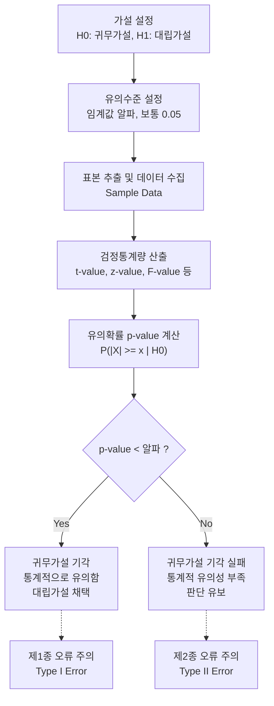

# 유의확률 (p-value)

---

## I. 통계적 가설 검정의 판단 기준, 유의확률(p-value)의 개요

* **정의**: 통계적 가설 검정에서 귀무가설(Null Hypothesis)이 참이라는 가정하에, 표본으로부터 관측된 통계량 이상으로 극단적인 결과가 나올 확률
* **필요성 및 특징**:
* **의사결정 지표**: 연구자가 설정한 유의수준($\alpha$)과 비교하여 귀무가설의 기각(Reject) 여부를 결정하는 핵심 척도
* **직관적 해석의 오류 주의**: p-value는 귀무가설이 참일 확률이 아니며, 데이터가 귀무가설 모델과 얼마나 불일치하는가를 나타냄
* **최신 동향**: 맹목적인 0.05 기준 적용 및 데이터 마사지(p-hacking) 문제로 인해, 효과크기(Effect Size)와 신뢰구간(CI) 병기 권장

---

## II. 유의확률의 산출 메커니즘 및 핵심 구성요소

### 가. 가설 검정 프로세스 및 유의확률 산출 메커니즘

* 관측된 검정통계량을 기반으로 p-value를 도출하고, 이를 사전에 정의된 허용 오차율인 유의수준($\alpha$)과 비교하여 통계적 유의성을 최종 판정함

### 나. 가설 검정 및 유의확률 핵심 구성 요소

| 구분 | 요소기술(키워드) | 세부 설명 |
| --- | --- | --- |
| **가설의 종류** | 귀무가설 ($H_0$) | 검정의 대상이 되는 기본 가설 (예: "두 집단 간 평균 차이가 없다") |
| **가설의 종류** | 대립가설 ($H_1$) | 연구자가 데이터를 통해 적극적으로 입증하고자 하는 가설 (예: "차이가 있다") |
| **평가 지표** | 검정통계량 (Test Statistic) | 표본 데이터로부터 계산되어 가설 검정에 사용되는 확률 변수 (z, t, $\chi^2$ 등) |
| **판단 기준** | 유의수준 ($\alpha$, Alpha) | 귀무가설이 참일 때 기각하는 오류(제1종 오류)를 범할 최대 허용 한계 |
| **판단 기준** | 기각역 (Critical Region) | 귀무가설을 기각하게 되는 검정통계량의 관측 범위 (임계치 밖의 영역) |
| **판단 오류** | 제1종 오류 ($\alpha$ Error) | 귀무가설이 실제로 참(True)인데, 이를 기각(Reject)하는 오류 (False Positive) |
| **판단 오류** | 제2종 오류 ($\beta$ Error) | 대립가설이 실제로 참(True)인데, 귀무가설을 채택하는 오류 (False Negative) |
| **오용 사례** | p-hacking | 통계적으로 유의미한 p-value(<0.05)를 얻기 위해 데이터를 인위적으로 조작/반복 검정하는 행위 |

---

## III. 유의확률의 한계 및 상호 보완 지표 비교

### 가. 전통적 p-value와 보완적 통계 지표 비교

| 비교 항목 | 유의확률 (p-value) | 효과크기 (Effect Size) | 신뢰구간 (Confidence Interval) |
| --- | --- | --- | --- |
| **핵심 목적** | 결과가 우연히 발생했는지 확인 (통계적 유의성) | 실제 차이나 관계의 크기 측정 (실질적 유의성) | 모수가 존재할 것으로 예측되는 범위 제시 (추정의 정밀도) |
| **결과 형태** | 0과 1 사이의 확률값 | 표준화된 수치 (Cohen's d 등) | 하한값과 상한값의 범위 [Lower, Upper] |
| **표본 크기 영향** | 표본이 클수록 극단적으로 작아짐 (과대 추정) | 표본 크기에 독립적 (일관된 크기 제공) | 표본이 클수록 구간이 좁아짐 (정밀도 상승) |
| **제공 정보** | 가설의 기각 여부 (O/X) 판단 | 현상의 실제적인 중요도 (Magnitude) | 모수 추정의 불확실성 (Uncertainty) |

* **향후 전망 및 동향**: 미국통계학회(ASA)의 성명서 발표 이후, 학계와 산업계(A/B 테스트 등)에서는 p-value의 이분법적 판단을 지양하고 있음. 현재는 데이터 중심 의사결정 시 **정확한 p-value 수치 제공, 효과크기(Effect Size) 및 신뢰구간(CI)의 의무 병기**, 그리고 사전 지식을 확률에 반영하는 **베이지안 통계(Bayesian Statistics)** 기법의 도입이 적극적으로 확산되는 추세임.

---

### 🔗 연관 토픽

- **소속 도메인**: [[00_인공지능_MOC|🤖 인공지능]]
- **세부 분류**: `1. 수학 · 통계학 & 데이터 전처리`
- **핵심 연관 토픽**:
  - [[t-검정 (t-test)]]
  - [[가설 검정]]
  - [[회귀분석|회귀분석(Regression Analysis)]]
  - [[다중공선성|다중공선성 (Multicolinearity)]]
  - [[등분산성|등분산성 (Homoscedasticity)]]
