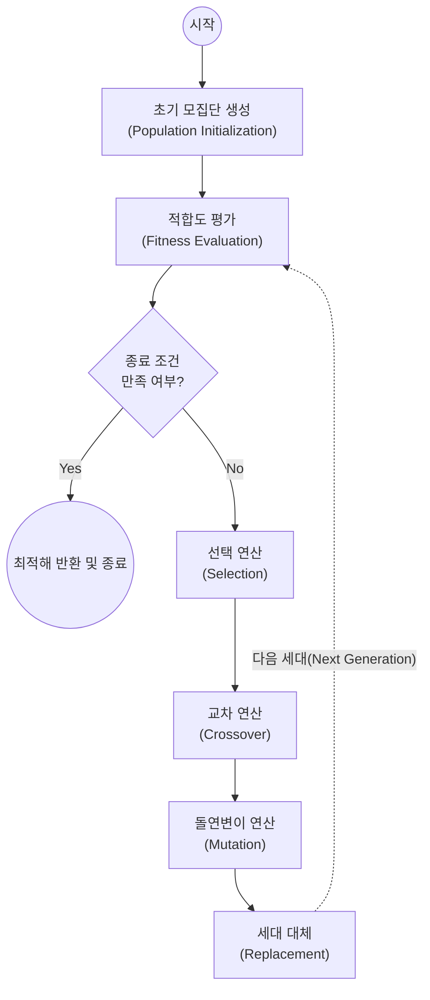

# 유전 알고리즘 (Genetic Algorithm)

---

## I. 생물학적 진화 모방, 유전 알고리즘(Genetic Algorithm)의 개요

* **정의**: 다윈의 진화론적 자연선택(Natural Selection)과 유전학적 메커니즘을 모방하여, 복잡한 최적화 문제의 해를 탐색하는 전역 최적화(Global Optimization) 메타휴리스틱 [[알고리즘]]
* **필요성 및 특징**:
* **NP-Hard 문제 해결**: 완전 탐색(Exhaustive Search)으로 다항 시간 내 풀기 어려운 외판원 문제(TSP), [[스케줄링]] 등의 근사해(Optimal Solution) 도출 필요
* **특징**: 다수 개체의 모집단(Population) 기반 병렬 탐색, 적합도 함수(Fitness Function)를 통한 방향성 제시, 확률적 연산(돌연변이)을 통한 지역 최적해(Local Minima) 탈출

---

## II. 유전 알고리즘의 메커니즘 및 핵심 기술 요소

### 가. 유전 알고리즘의 개념도 및 동작 원리

* 초기 모집단에서 출발하여 [적합도 평가 $\rightarrow$ 선택 $\rightarrow$ 교차 $\rightarrow$ 돌연변이]의 유전 진화 연산을 세대별로 반복 수행하며, 점진적으로 우수한 전역 최적해(Global Optimum)에 수렴함

### 나. 유전 알고리즘의 핵심 기술 및 구성 요소

| 구분 | 요소기술(키워드) | 세부 설명 |
| --- | --- | --- |
| **데이터 구조** | 염색체 (Chromosome) 및 유전자 | 탐색 공간의 해(Solution)를 0과 1의 비트 배열, 실수, 문자열 등의 자료구조체로 인코딩한 객체 |
| **해 평가** | 적합도 함수 (Fitness Function) | 각 개체가 주어진 문제 해결 목적에 얼마나 부합하는지를 수치로 산출하여 생존 가능성 정량화 |
| **진화 [[연산자]]** | 선택 (Selection) | 룰렛 휠(Roulette Wheel), 토너먼트 기법 등을 통해 적합도가 높은 우수 개체가 교차에 참여할 확률을 높임 |
| **진화 연산자** | 교차 (Crossover) | 두 부모 개체의 유전 정보를 결합(단일점, 다중점 교차)하여 새로운 특성을 가진 자식(Offspring) 생성 |
| **진화 연산자** | 변이 (Mutation) | 낮은 임의의 확률로 특정 유전자 값을 변경(비트 반전 등)하여 지역 최적해(Local Minima) 함정에서 탈출 |
| **개체 보존** | 엘리트주의 (Elitism) | 이전 세대에서 가장 우수한 적합도를 가진 상위 개체들을 훼손 없이 다음 세대로 그대로 이관 |
| **세대 대체** | 대체 (Replacement) | 새롭게 생성된 자식 세대의 개체군이 기존 부모 세대를 교체하여 신규 모집단(Population)을 형성함 |
| **종료 조건** | 수렴 (Convergence) / 최대 세대수 | 적합도가 더 이상 개선되지 않거나, 사용자가 사전 정의한 최대 세대수(Iteration)에 도달 시 탐색 종료 |

---

## III. 메타휴리스틱 최적화 알고리즘 비교 및 향후 전망

### 가. 유전 알고리즘과 타 메타휴리스틱 알고리즘 비교

| 비교 항목 | 유전 알고리즘 (GA) | 담금질 기법 (SA, Simulated Annealing) |
| --- | --- | --- |
| **모방 원리** | 생태계의 자연선택 및 적자생존 (진화론) | 고온의 금속이 서서히 식어가는 열역학적 어닐링 (금속공학) |
| **탐색 객체** | **다중 개체** (Population 기반 병렬 탐색) | **단일 개체** (Single Solution 기반 순차 탐색) |
| **지역 최적해 탈출** | **돌연변이 (Mutation)** 연산의 무작위성 활용 | **메트로폴리스(Metropolis)** 확률에 의한 열위 해 수용 |
| **장점** | 광범위한 탐색 공간에서 전역 최적해 탐색 성능 우수 | 알고리즘 구현이 직관적이며 메모리 사용량이 적음 |
| **연산 복잡도** | 다중 해 평가 및 교차 연산으로 인해 상대적으로 높음 | 단일 해를 갱신해 나가므로 연산 복잡도가 상대적으로 낮음 |

### 나. 향후 전망 및 동향

* **AI 융합 최적화 엔진 활용**: 최근 [[딥러닝]] 모델의 복잡한 하이퍼파라미터 최적화(HPO) 및 [[AutoML (Automated Machine Learning)|AutoML]]의 신경망 아키텍처 탐색([[NAS]]) 분야에서 최적의 망 구조를 찾기 위한 핵심 알고리즘으로 채택됨
* **QIGA(Quantum-inspired GA)의 등장**: 양자 컴퓨팅의 중첩(Superposition) 개념을 유전 알고리즘의 유전자 표현형에 도입하여 탐색 속도와 다양성을 비약적으로 향상시키는 양자 유전 알고리즘 연구 활성화 추세임

---

### 🔗 연관 토픽

- **소속 도메인**: [[00_인공지능_MOC|🤖 인공지능]]
- **세부 분류**: `6. 설명가능한 AI (XAI) & AI 윤리 · 거버넌스`
- **핵심 연관 토픽**:
  - [[알고리즘]]
  - [[AutoML (Automated Machine Learning)]]
  - [[딥러닝]]
  - [[Optimization Algorithm]]
  - [[편향]]
