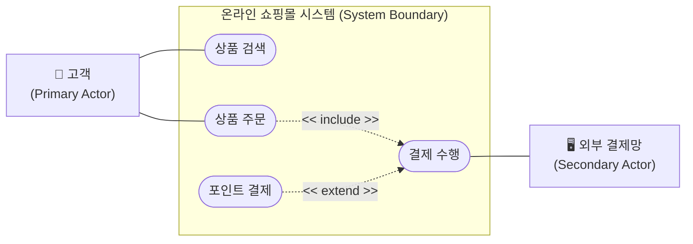

# 유즈케이스 다이어그램 (Use Case Diagram)

---

## I. 사용자 중심 요구사항 명세 표준, 유즈케이스 다이어그램의 개요

* **정의**: 시스템이 제공해야 할 핵심 기능(Use Case)과 외부 환경(Actor) 간의 상호작용을 사용자 관점에서 시각적으로 모델링한 [[UML]] 기반의 행위(Behavioral) 다이어그램
* **필요성 및 특징**:
* **요구사항 가시화**: 개발자 중심의 복잡한 논리를 배제하고, 사용자 관점에서 시스템의 기능적 요구사항을 직관적으로 명세
* **이해관계자 소통**: 기획자, 개발자, 고객 간의 의사소통 도구이자, 추후 [[시스템 테스트]] 케이스(Test Case) 도출 및 검증의 기준점으로 활용됨

---

## II. 유즈케이스 다이어그램의 개념도 및 핵심 구성요소

### 가. 유즈케이스 다이어그램의 개념도 및 관계 모델

* 시스템 경계를 기준으로 내부의 제공 기능(유즈케이스)과 외부 상호작용 주체(액터)를 분리하고, 기능 간의 필수 포함(Include) 및 선택 확장(Extend) 관계를 도식화함

### 나. 유즈케이스 다이어그램의 핵심 구성 요소

| 구분 | 요소기술(키워드) | 세부 설명 |
| --- | --- | --- |
| **핵심 [[엔티티]]** | 액터 (Actor) | 시스템 외부에서 시스템과 상호작용하는 사용자, 하드웨어, 또는 외부 연동 시스템 (졸라맨 아이콘) |
| **핵심 엔티티** | 유즈케이스 (Use Case) | 사용자 관점에서 시스템이 수행하는 단위 기능이나 제공하는 서비스 (타원형 표기) |
| **핵심 엔티티** | 시스템 경계 (System Boundary) | 구축하고자 하는 시스템의 범위를 정의하며, 액터와 유즈케이스를 물리적/논리적으로 구분 (사각형 박스) |
| **관계 (Relation)** | 연관 (Association) | 액터와 유즈케이스 간의 상호작용 및 통신 관계를 표현 (실선으로 연결) |
| **관계 (Relation)** | 포함 (Include) | 기본 유즈케이스 수행 시 반드시 실행되어야 하는 필수적 공통 기능 (`<<include>>` 점선 화살표) |
| **관계 (Relation)** | 확장 (Extend) | 특정 조건(Condition)을 만족할 때만 선택적으로 추가 실행되는 기능 (`<<extend>>` 점선 화살표) |
| **관계 (Relation)** | [[일반화]] (Generalization) | 액터나 유즈케이스 간의 [[추상화]]/구체화 관계를 나타내는 객체지향의 상속(Inheritance) 개념 (빈 삼각형 화살표) |
| **상세 명세서** | 유즈케이스 명세서 (Specification) | 다이어그램만으로 표현하기 힘든 사전조건, 사후조건, 기본 흐름 및 대안 흐름(이벤트)을 텍스트로 상세히 문서화 |

---

## III. 유즈케이스 다이어그램과 유저 스토리 비교 및 향후 전망

### 가. 요구사항 명세 기법 비교 (유즈케이스 vs 유저 스토리)

| 비교 항목 | 유즈케이스 (Use Case) | 유저 스토리 (User Story) |
| --- | --- | --- |
| **개발 방법론** | 전통적 방법론 (구조적, [[객체지향]]) | 애자일([[Agile]]) / [[스크럼]]([[SCRUM|Scrum]]) 방법론 |
| **관점 및 범위** | 시스템과 액터 간의 '상호작용 및 [[프로세스]] 전체 흐름' | 사용자가 얻고자 하는 '비즈니스 가치와 목적' 중심 |
| **포맷 및 형태** | UML 기반 다이어그램 + 상세 명세서 텍스트 | "나는 [역할]로서 [목적]을 위해 [기능]을 원한다" 포맷 |
| **상세화 수준** | 사전/사후 조건, 예외 처리 등 매우 구체적 | 에픽(Epic)에서 세부 스토리로 분할, 융통성 부여 |
| **활용 시점** | 요구사항 분석 및 설계 단계 (Upfront Design) | 스프린트 백로그(Sprint Backlog) 기획 및 지속적 갱신 |

### 나. 유즈케이스 모델링의 향후 전망 및 트렌드

* **AI 기반 Text-to-UML 자동화**: 2026년 현재 생성형 AI([[초거대 언어 모델|LLM]])의 고도화로 인해, 자연어 요구사항 정의서나 회의록 텍스트를 입력하면 PlantUML, Mermaid 코드 기반의 유즈케이스 다이어그램과 상세 명세서를 즉시 자동 생성해주는 [[요구 공학|Requirements Engineering]] 자동화 툴이 보편화됨
* **[[DDD (Domain Driven Design)|DDD]] 및 [[MSA (Micro Service Architecture)|MSA]] 환경에서의 경량화 융합**: 무거운 전통적 UML 산출물 대신, 도메인 주도 설계(DDD)의 이벤트 스토밍(Event Storming) 결과물을 뒷받침하는 핵심 바운디드 컨텍스트(Bounded Context) 중심의 경량화된 모델링 기법으로 진화하여 활용되고 있음

---

### 🔗 연관 토픽

- **소속 도메인**: [[00_소프트웨어공학_MOC|🏗️ 소프트웨어공학]]
- **세부 분류**: `3. 요구사항 공학 & UML 객체지향 분석/설계`
- **핵심 연관 토픽**:
  - [[UML|UML (정적, 동적 다이어그램)]]
  - [[추상화|추상화 (Abstraction)]]
  - [[객체지향]]
  - [[요구 공학|요구 공학 (Requirements Engineering)]]
  - [[시스템 테스트]]
