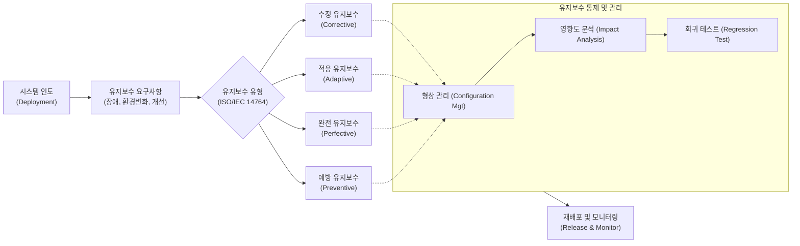

# 유지보수 (Software Maintenance)

---

## I. 소프트웨어 생명주기의 연장, 유지보수의 개요

* **정의**: 소프트웨어가 사용자에게 인도된 후 발생하는 오류 수정, 운영 환경 변화 적응, 성능 및 기능 향상을 위해 수행되는 일련의 소프트웨어 공학적 활동 (ISO/IEC 14764)
* **필요성 및 특징**:
* **TCO의 핵심**: 소프트웨어 총 소유비용(TCO)의 60~80% 이상을 차지하는 최장 주기 단계
* **비즈니스 연속성 보장**: [[기술 부채]](Technical Debt) 해결 및 시스템 수명 연장을 통한 서비스 안정성 확보
* **점진적 진화**: 시스템 퇴역(Decommission) 전까지 요구사항 변경을 수용하며 소프트웨어를 지속 진화시킴

---

## II. 유지보수의 개념도 및 핵심 기술/관리 요소

### 가. 유지보수 프로세스 및 유형 분류 개념도

* 변경 요구사항 접수 후 4가지 유지보수 유형으로 분류하며, 형상 통제, 영향도 분석, 회귀 테스트를 거쳐 운영 환경에 안전하게 재배포함

### 나. 유지보수의 핵심 분류 및 기술 요소

| 구분 | 요소기술(키워드) | 세부 설명 |
| --- | --- | --- |
| **유지보수 유형** | 수정 (Corrective) | 운영 중 발견된 시스템의 논리적 오류, 코딩 결함을 진단하고 수정 (사후 대응) |
| **유지보수 유형** | 적응 (Adaptive) | OS, [[DBMS]] 업그레이드, 법적 규제 등 운영 환경 변화에 맞춰 시스템을 변경 |
| **유지보수 유형** | 완전 (Perfective) | 사용자의 새로운 요구사항 수용, 기능 추가 및 성능 개선 (전체 비용의 50% 이상 차지) |
| **유지보수 유형** | 예방 (Preventive) | 향후 발생할 수 있는 잠재적 오류를 사전에 식별하여 코드 리팩토링 등 수행 (사전 예방) |
| **핵심 통제** | [[형상 관리]] (Configuration) | 소스코드 및 산출물의 변경 사항에 대한 식별, 통제, 감사, 기록 수행 |
| **핵심 통제** | 영향도 분석 (Impact Analysis) | 특정 모듈의 변경이 시스템 내 다른 모듈에 미치는 파급 효과를 식별하고 부작용 최소화 |
| **구조 개선** | 소프트웨어 리엔지니어링 | 기존 레거시 시스템을 역공학(Reverse Engineering)하여 최신 아키텍처 및 코드로 재구성 |
| **서비스 관리** | [[SLA|SLA (Service Level Agreement)]] | 장애 복구 시간(MTTR), 가동률(Availability) 등 정량적 서비스 수준 계약 기반의 유지보수 수행 |

---

## III. 전통적 유지보수와 최신 지능형 유지보수(AIOps) 비교 및 향후 전망

### 가. IT 운영 패러다임 변화에 따른 유지보수 체계 비교

| 비교 항목 | 전통적 유지보수 (Traditional [[ITSM(Information Technology Service Management)|ITSM]]) | 최신 지능형 유지보수 (AIOps / [[DevSecOps]]) |
| --- | --- | --- |
| **대응 방식** | 사후 대응형 (Reactive, 장애 발생 후 조치) | 사전 예측형 (Proactive, 장애 징후 사전 탐지) |
| **배포 주기** | 월간/분기별 정기 배포 (Big Bang 방식) | CI/CD 파이프라인 기반의 상시/지속적 배포 |
| **코드 분석 및 수정** | 개발자의 수동 분석 및 디버깅 의존 | [[초거대 언어 모델|LLM]] / AI 코딩 어시스턴트 기반 자동 결함 탐지 및 수정 제안 |
| **인프라 환경** | 온프레미스 (Monolithic Architecture) | [[클라우드 네이티브]] (Microservices, Container) |
| **핵심 지표** | MTBF (평균 무고장 시간), MTTR (평균 복구 시간) | 배포 빈도(Deployment Frequency), 변경 실패율(CFR) |

### 나. 향후 전망 및 동향

* **생성형 AI(LLM) 기반 레거시 모더나이제이션 가속화**: 수십 년 된 노후화된 레거시 코드(COBOL, 오래된 Java 등)의 분석, 주석 생성 및 최신 프레임워크로의 자동 변환에 AI 기반 유지보수 도구(AI-Assisted Maintenance) 도입이 본격화됨
* **예측적 유지보수(Predictive Maintenance) 고도화**: 머신러닝 모델을 활용해 시스템 로그와 애플리케이션 성능 데이터(APM)를 실시간 분석하여, 장애가 발생하기 전 선제적 자원 증설 및 예방 유지보수(Preventive)를 수행하는 자율 운영(Autonomous Operations) 체계로 진화 중임

---

### 🔗 연관 토픽

- **소속 도메인**: [[00_소프트웨어공학_MOC|🏗️ 소프트웨어공학]]
- **세부 분류**: `1. 소프트웨어 개발 생명주기(SDLC) & 방법론`
- **핵심 연관 토픽**:
  - [[기술 부채]]
  - [[Lehman의 Software 변화의 원리]]
  - [[형상 관리]]
  - [[SDLC]]
  - [[폭포수 모델]]
