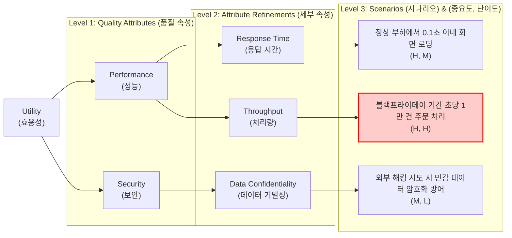

# 유틸리티 트리 (Utility Tree)

---

## I. 소프트웨어 아키텍처 평가의 핵심 도구, 유틸리티 트리의 개요

* **정의**: [[소프트웨어 아키텍처]] 평가 방법론([[ATAM]])에서 비기능적 요구사항(품질 속성)을 구체화하고 우선순위를 도출하기 위해 시나리오 기반으로 계층화한 트리 형태의 분석 모델
* **필요성 및 특징**:
* **품질 속성의 구체화**: 모호한 비즈니스 목표(효용성)를 성능, 보안 등의 품질 속성으로 나누고 이를 다시 측정 가능한 구체적인 시나리오로 하향식(Top-down) 분해함
* **아키텍처 드라이버 도출**: 각 시나리오에 중요도(Importance)와 구현 난이도(Difficulty)를 할당하여 아키텍처 설계에 가장 큰 영향을 미치는 핵심 동인(Driver)을 식별함

---

## II. 유틸리티 트리의 아키텍처 및 핵심 기술 요소

### 가. 유틸리티 트리의 구성도 및 동작 원리

* 최상위 효용성(Utility)에서 시작하여 품질 속성, 세부 속성, 시나리오 단계로 구체화하며, (중요도, 난이도)가 모두 'High(H)'인 시나리오는 핵심 아키텍처 드라이버로 선정되어 중점적으로 평가됨

### 나. 유틸리티 트리의 핵심 구성 요소

| 구분 | 요소기술(키워드) | 세부 설명 |
| --- | --- | --- |
| **계층 구조** | Utility (효용성) | 트리의 최상위 Root 노드로, 시스템이 제공해야 할 전반적인 비즈니스 만족도와 품질의 총합을 의미함 |
| **계층 구조** | Quality Attribute (품질 속성) | 성능, 보안, [[HA(High Availability)|가용성]], 변경 용이성 등 ISO/IEC 25010 기반의 시스템 비기능적 요구사항 영역 |
| **계층 구조** | Refinement (세부 속성) | 품질 속성을 아키텍처로 구현하고 측정할 수 있도록 하위 수준의 특성으로 세분화한 노드 (예: [[응답시간]]) |
| **계층 구조** | Scenario (시나리오) | 트리 최하단(Leaf) 노드이며, 자극(Stimulus), 환경(Environment), 응답(Response)으로 구성된 구체적 상황 명세 |
| **평가 지표** | Importance (중요도) | 비즈니스 목표 달성과 시스템 성공을 위해 해당 시나리오가 얼마나 중요한지를 H/M/L로 평가 |
| **평가 지표** | Difficulty (난이도/위험도) | 아키텍처 관점에서 해당 시나리오를 구현하기 위해 수반되는 기술적 난이도와 리스크를 H/M/L로 평가 |
| **도출 결과물** | Architecture Driver | 평가 지표 상 (H, H)로 식별된 고우선순위 시나리오로, 아키텍처 설계와 트레이드오프 분석의 핵심 기준점 |
| **평가 방법론** | ATAM (트레이드오프 분석) | 유틸리티 트리를 통해 도출된 핵심 시나리오를 바탕으로 아키텍처의 민감점(Sensitivity Point)과 상충관계를 분석함 |

---

## III. 요구사항 도출 기법 비교 및 향후 전망

### 가. 요구사항 명세 도구 비교 (유틸리티 트리 vs 유즈케이스)

| 비교 항목 | 유틸리티 트리 (Utility Tree) | 유즈케이스 (Use Case) |
| --- | --- | --- |
| **중점 목표** | **비기능적 요구사항** (품질 속성) 중심 | **기능적 요구사항** (행위와 동작) 중심 |
| **작성 관점** | 아키텍트 및 시스템 구조 관점 | 사용자(Actor) 및 비즈니스 [[프로세스]] 관점 |
| **구조 형태** | 계층화된 트리(Tree) 구조 및 속성 분해 | 다이어그램([[UML]]) 및 이벤트 흐름 텍스트 명세 |
| **우선순위화** | (중요도, 난이도) 기반 매트릭스 평가 | 비즈니스 가치(ROI), 고객 요구 수준 등 |
| **주요 활용 단계** | 소프트웨어 아키텍처 설계 및 평가 단계 (ATAM) | 소프트웨어 요구사항 분석 및 상세 설계 단계 |

### 나. 향후 전망 및 활용 동향

* **[[MSA (Micro Service Architecture)|MSA]] 및 [[클라우드 네이티브]] 환경에서의 진화**: 전통적인 모놀리식 환경에서 정적으로 활용되던 유틸리티 트리는, 최근 마이크로서비스(MSA) 아키텍처에서 회복 탄력성(Resiliency)과 확장성(Scalability) 속성을 최우선 시나리오로 배치하는 형태로 진화하고 있음.
* **지속적 품질 검증 도구와 융합**: 도출된 고위험(H, H) 시나리오는 [[카오스 엔지니어링]](Chaos Engineering)의 결함 주입 테스트 케이스나, CI/CD 파이프라인의 [[성능 테스트]] 시나리오로 직접 연계되어 **지속적 아키텍처 평가(Continuous Architecture Evaluation)** 모델의 기반 데이터로 활용됨.

---

### 🔗 연관 토픽

- **소속 도메인**: [[00_소프트웨어공학_MOC|🏗️ 소프트웨어공학]]
- **세부 분류**: `3. 요구사항 공학 & UML 객체지향 분석/설계`
- **핵심 연관 토픽**:
  - [[ATAM]]
  - [[성능 테스트]]
  - [[소프트웨어 품질 속성 시나리오]]
  - [[UML|UML (정적, 동적 다이어그램)]]
  - [[소프트웨어 아키텍처|소프트웨어 아키텍쳐]]
