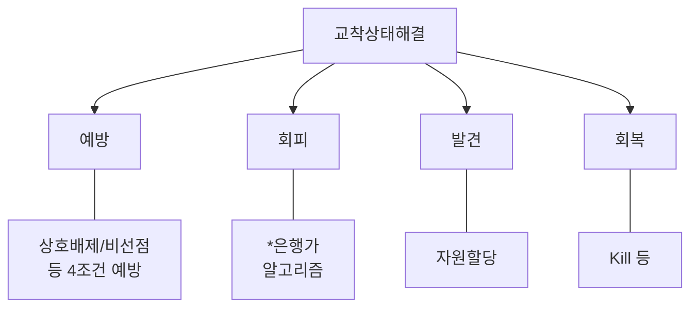
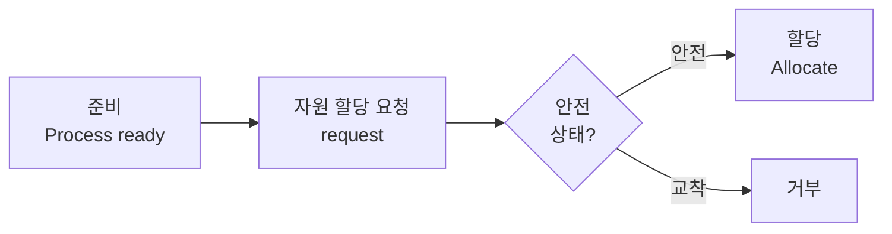
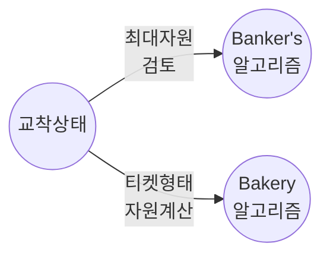
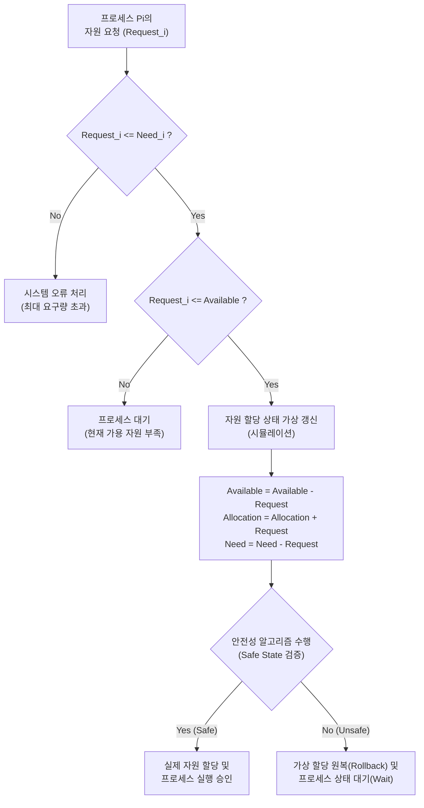

# Banker's 알고리즘(은행가 알고리즘)

---

## I. 교착상태 회피 알고리즘, 은행가 알고리즘 개요

| 구분 | 내용 |
| :--- | :--- |
| **개념** | 운영체제는 "자원 수 감시"하고 [[프로세스]]는 "자원요청" 하는 [[교착상태]] 회피 [[알고리즘]] |

---
## II. 은행가 알고리즘 동작원리 및 구성요소

### 가. 은행가 알고리즘 동작원리

- Available, Max, Allocation, Need 관리

### 나. 은행가 알고리즘 구성요소 설명

| 구성요소 | 설 명 |
| :--- | :--- |
| **Available** | - 가용한 자원의 수   Available[i,j] = k |
| **Max** | - 최대 자원수, Max[i,j] = k |
| **Allocation** | - 자원 할당 현황   Allocation[i,j] = k |
| **Need** | - 필요 자원수, Need[i,j] = k |
- 기타 bakery 알고리즘으로 [[교착상태]] 예방 가능
---
## III. 교착상태 예방 알고리즘, bakery 알고리즘

- Bakery 알고리즘은 자원 대기 순서 티켓형태

---
# 은행가 알고리즘 (Banker's Algorithm)

---

## I. [교착상태 회피 기법], 은행가 알고리즘의 개요

* **정의**: 운영체제가 프로세스에 자원을 할당하기 전에 자원 할당 시뮬레이션을 수행하여, 시스템이 안전 상태(Safe State)를 유지할 수 있을 경우에만 자원을 승인하는 교착상태 회피(Deadlock Avoidance) 알고리즘
* **등장배경 및 특징**:
* 다익스트라(E. W. [[다익스트라 알고리즘|Dijkstra]])가 제안한 은행의 대출 업무 시뮬레이션 원리에서 착안
* **사전 정보 요구**: 각 프로세스의 최대 자원 요구량을 사전에 시스템이 파악하고 있어야 함
* **안전 순서열 보장**: 자원 할당 후에도 모든 프로세스가 정상적으로 종료될 수 있는 '안전 순서열(Safe Sequence)'의 존재 여부 탐색

---

## II. 은행가 알고리즘의 개념도 및 핵심 기술 요소

### 가. 은행가 알고리즘의 개념도 및 동작 원리

* 프로세스의 자원 요청 시, 해당 요청이 가용 자원 내에 있는지 확인 후 가상으로 할당 상태를 변경하고, 안전성 검사를 통과(Safe State)할 때만 실제 자원을 할당함

### 나. 은행가 알고리즘의 핵심 기술 요소

| 구분 | 요소기술(키워드) | 세부 설명 |
| --- | --- | --- |
| **핵심 자료구조** | Available (가용 자원) | 현재 시스템에서 할당 가능한 각 자원 유형별 [[인스턴스]] 수를 나타내는 1차원 배열 |
| **핵심 자료구조** | Max (최대 요구량) | 각 프로세스가 실행 완료를 위해 요구하는 자원의 최대치를 정의한 2차원 행렬 |
| **핵심 자료구조** | Allocation (현재 할당량) | 현재 각 프로세스에 실질적으로 할당되어 있는 자원의 수를 나타내는 2차원 행렬 |
| **핵심 자료구조** | Need (추가 요구량) | 각 프로세스가 향후 추가로 요청할 수 있는 자원량 (Need = Max - Allocation) |
| **핵심 알고리즘** | 자원 요청 알고리즘 | 프로세스의 요청(Request)이 Need와 Available 범위 내에 있는지 검증하는 절차 |
| **핵심 알고리즘** | 안전성 알고리즘 | 가상 할당 후 시스템 내 모든 프로세스를 정상 종료시킬 수 있는 경로를 찾는 절차 |
| **시스템 상태** | Safe State (안전 상태) | 교착상태를 유발하지 않고 모든 프로세스에 자원을 할당할 수 있는 상태 |
| **시스템 상태** | Safe Sequence | 시스템이 안전 상태를 유지하기 위해 프로세스들이 자원을 할당받고 해제하는 순서열 |

---

## III. 교착상태 해결 기법 비교 및 한계점/전망

### 가. 교착상태 예방(Prevention)과 회피(Avoidance) 기법 비교

| 비교 항목 | 교착상태 예방 (Prevention) | 교착상태 회피 (Avoidance - 은행가 알고리즘) |
| --- | --- | --- |
| **기본 개념** | 교착상태 발생 4가지 조건 중 1개 이상을 원천 차단 | 자원 할당 상태를 모니터링하여 안전 상태일 때만 할당 |
| **적용 시점** | 시스템 설계 및 자원 요청 시점 (사전 통제) | 자원 할당 시점 (런타임 시뮬레이션) |
| **자원 활용도** | 매우 낮음 (엄격한 통제로 인한 오버헤드 큼) | 중간 (예방 기법보다는 자원 낭비가 적음) |
| **대표 기법** | 상호배제, 점유대기, 비선점, 환형대기 조건 부정 | **은행가 알고리즘 (Banker's Algorithm)** |

### 나. 은행가 알고리즘의 한계점 및 향후 활용 전망

* **구현 상의 한계점**:
* 프로세스의 동적 생성 및 소멸이 빈번한 현대 OS 환경에서 '최대 자원 요구량(Max)'을 사전에 예측하는 것은 비현실적임
* 안전성 검사 시 발생하는 시간 복잡도($O(M \times N^2)$)로 인해 시스템 오버헤드 큼

* **향후 전망 및 동향**:
* 범용 [[OS(운영체제)|운영체제]](Windows, Linux)에서는 오버헤드를 줄이기 위해 타조 알고리즘(무시)이나 OOM(Out of Memory) Killer 기반의 탐지/회복 기법을 선호함
* 다만, 은행가 알고리즘의 시뮬레이션 사상은 클라우드 컴퓨팅의 **동적 자원 [[프로비저닝]](Dynamic Resource Provisioning)** 제한 조건 설정이나, 극도의 안정성이 요구되는 실시간 임베디드 시스템(RTOS)의 자원 [[스케줄링]] 이론 모델로 지속 응용되고 있음

---

### 🔗 연관 토픽

- **소속 도메인**: [[00_운영체제_MOC|⚙️ 운영체제]]
- **세부 분류**: `3. 프로세스 동기화 & 임계영역 상호배제`
- **핵심 연관 토픽**:
  - [[스케줄링]]
  - [[교착상태|교착상태 (Deadlock)]]
  - [[OS(운영체제)]]
  - [[인스턴스]]
  - [[프로세스]]
