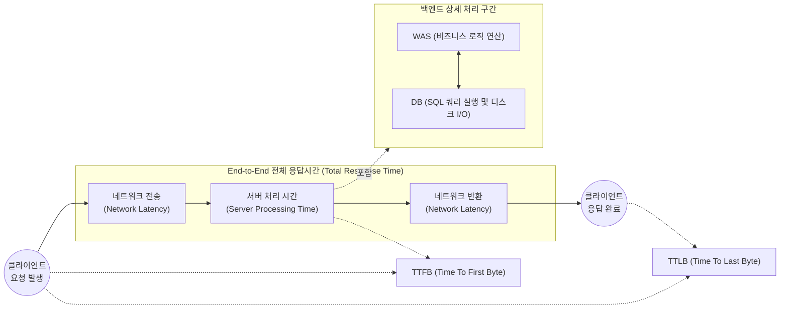

# 응답시간 (Response Time)

---

## I. 사용자 체감 성능의 핵심 지표, 응답시간(Response Time)의 개요

* **정의**: 사용자가 시스템에 특정 작업(Request)을 요청한 시점부터 시스템이 처리를 완료하고 그 결과(Response)를 사용자에게 반환할 때까지 소요되는 총 시간
* **필요성 및 특징**:
* **사용자 경험(UX) 직결**: 시스템의 성능을 평가하는 가장 직관적인 지표로, 지연 발생 시 서비스 이탈률 증가 및 비즈니스 손실 초래
* **성능 병목 구간 식별**: 네트워크, 애플리케이션, [[데이터베이스]] 등 구간별 소요 시간 분석을 통한 시스템 튜닝의 핵심 기준
* **성능 용량 산정 기준**: 동시 접속자 수 및 [[처리량]](TPS)과 함께 시스템 용량 산정(Capacity Planning)을 위한 리틀의 법칙(Little's Law)의 주요 변수

---

## II. 응답시간의 개념도 및 핵심 구성요소

### 가. 응답시간의 세부 구간 분해 개념도

* 전체 응답시간은 '네트워크 왕복 시간(RTT)'과 '서버 연산/DB 쿼리 처리 시간'의 합으로 구성되며, 성능 관제 시 TTFB와 TTLB를 분리하여 측정함

### 나. 응답시간 측정을 위한 핵심 기술 및 지표 요소

| 구분 | 요소기술(키워드) | 세부 설명 |
| --- | --- | --- |
| **시간 지표** | TTFB (Time To First Byte) | 클라이언트가 요청을 보낸 후, 서버로부터 **첫 번째 바이트**를 수신하기까지 걸리는 시간 (서버 반응 속도 측정) |
| **시간 지표** | TTLB (Time To Last Byte) | 서버로부터 **마지막 바이트**까지 모두 수신하여 물리적인 데이터 전송이 완료되는 전체 시간 |
| **시간 지표** | TTI (Time To Interactive) | 웹 페이지 로딩 후 사용자가 실제로 클릭, 스크롤 등 **상호작용이 가능해지기까지** 걸리는 프론트엔드 체감 시간 |
| **품질 지표** | Apdex (Application Performance [[RDBMS 인덱스(index)|Index]]) | 응답시간을 기준으로 사용자 만족도를 만족(Satisfied), 허용(Tolerating), 불만(Frustrated)으로 수치화한 개방형 표준 |
| **지연 요소** | Network Latency | 대역폭, 물리적 거리, 라우팅 홉(Hop) 수 등에 의해 발생하는 패킷 전달 지연 시간 |
| **지연 요소** | Server Processing Time | 애플리케이션의 [[CPU]] 연산, 메모리 할당, 락(Lock) 경합 및 DB [[SQL(Structured Query Language)|SQL]] 쿼리 수행에 소요되는 시간 |
| **모니터링** | APM (Application Performance Mgt) | 핀포인트(Pinpoint), 스카우터(Scouter) 등을 활용하여 메서드 레벨의 응답시간과 병목 지점을 프로파일링하는 도구 |
| **최신 관제** | OpenTelemetry / 분산 추적 | 마이크로서비스([[MSA (Micro Service Architecture)|MSA]]) 환경에서 Trace ID를 통해 여러 서비스 간의 호출 응답시간을 구간별로 통합 추적하는 표준 기술 |

---

## III. 응답시간과 처리량(TPS) 비교 및 최신 동향

### 가. 시스템 성능의 양대 지표: 응답시간 vs 처리량(Throughput) 비교

| 비교 항목 | 응답시간 (Response Time) | 처리량 (Throughput / TPS) |
| --- | --- | --- |
| **측정 관점** | **사용자 관점** (얼마나 빨리 처리되는가?) | **시스템 관점** (얼마나 많이 처리하는가?) |
| **주요 측정 단위** | ms (밀리초), sec (초) | TPS (초당 [[트랜잭션]] 수), RPS (초당 요청 수) |
| **상관 관계** | 포화점(Saturation Point) 도달 시 기하급수적 증가 | 포화점 도달 전까지 선형 증가, 이후 정체 또는 감소 |
| **리틀의 법칙 적용** | $W$ (대기 시간 + 서비스 시간) | $\lambda$ (단위 시간당 도착/처리율) |
| **개선 전략** | SQL 튜닝, 캐싱(Redis 등) 적용, 로직 최적화 | Scale-out(서버 증설), Connection Pool 확대, 비동기 처리 |

* **리틀의 법칙(Little's Law)**: $L = \lambda \times W$ (시스템 내 동시 사용자 수 = 처리량 $\times$ 응답시간) 기반으로 시스템 적정 용량을 산정함

### 나. 응답시간 관리의 최신 트렌드 및 전망

* **프론트엔드 체감 성능 중심(Core Web Vitals)**: 단순한 서버 응답(TTFB)을 넘어, 구글의 INP(Interaction to Next Paint)와 같이 사용자의 UI 상호작용 지연을 최소화하는 프론트엔드 최적화(CSR/SSR 하이브리드, [[EDGE|Edge]] Caching)가 중요해짐
* **AIOps 기반 이상 탐지([[Anomaly(이상현상)|Anomaly]] Detection)**: 클라우드/MSA 환경의 복잡도 증가로 인해, 머신러닝 기반으로 정상적인 응답시간 기준선(Baseline)을 학습하고, 갑작스러운 응답시간 스파이크(Spike) 발생 시 자동으로 원인(Root Cause)을 식별하고 대응하는 체계로 진화 중임

---

### 🔗 연관 토픽

- **소속 도메인**: [[00_소프트웨어공학_MOC|🏗️ 소프트웨어공학]]
- **세부 분류**: `6. 소프트웨어 테스팅 & 품질 보증 (QA/QC)`
- **핵심 연관 토픽**:
  - [[처리량]]
  - [[상용 소프트웨어 품질성능 평가 시험|상용소프트웨어 품질성능 평가 시험]]
  - [[정보시스템 운영 유지보수 감리|정보시스템 운영/유지보수 감리]]
  - [[정보시스템 운영 성과관리]]
  - [[MSA (Micro Service Architecture)]]
