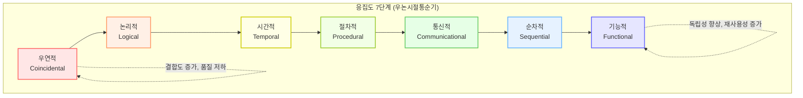

# 응집도 (Cohesion)

---

## I. 모듈의 독립성 확보를 위한 핵심 품질 척도, 응집도의 개요

* **정의**: 소프트웨어 모듈 내부의 구성 요소(명령어, 함수, 데이터 등)들이 단일 목적을 위해 밀접하게 연관되어 있는 정도를 나타내는 [[모듈화]] 품질 측정 지표
* **필요성**: 시스템의 유지보수성 향상, 단일 책임 원칙(SRP) 준수, 모듈 간 파급 효과(Ripple Effect) 최소화
* **특징**: 정보 은닉(Information Hiding), 관심사의 분리(SoC, Separation of Concerns), [[결합도]](Coupling)와 반비례적 [[관계성]](고응집-저결합 지향)

---

## II. 응집도의 분류 체계 및 핵심 구성 요소

### 가. 응집도의 7단계 스펙트럼 및 개념도

* 좌측(우연적)에서 우측(기능적)으로 갈수록 모듈의 응집도가 높아지며, 소프트웨어의 품질 및 유지보수성이 향상됨
* 설계 시 기능적 응집도를 지향하고 우연적 응집도를 지양하는 리팩토링이 필수적임

### 나. 응집도의 7가지 유형 및 세부 설명 (우논시절통순기)

| 구분 | 요소기술(키워드) | 세부 설명 |
| --- | --- | --- |
| **낮음** (지양) | **우연적** (Coincidental) | - 모듈 내 요소 간 아무런 의미적, 논리적 연관성이 없는 상태 - 무분별한 코드 모음, [[유지보수]] 극히 곤란 |
| **낮음** | **논리적** (Logical) | - 유사한 성격이나 형태의 기능들을 논리적 기준으로 그룹화 - 예: 모든 입출력 처리(I/O) 루틴을 한 모듈에 모음 |
| **보통** | **시간적** (Temporal) | - 특정 시간대에 함께 실행되어야 하는 기능들을 모음 - 예: 시스템 초기화 모듈, 예외 발생 시 에러 로깅 |
| **보통** | **절차적** (Procedural) | - 모듈 내 기능들이 순차적으로 수행되나, 데이터 공유는 없음 - 제어 흐름에 따라 순서대로 실행되는 구조 |
| **높음** | **통신적** (Communicational) | - 동일한 입력 데이터나 출력 데이터를 조작하는 기능들의 모음 - 데이터 구조(DB 테이블 등)를 공유하지만 기능은 독립적 |
| **높음** | **순차적** (Sequential) | - 모듈 내 한 활동의 출력 데이터가 다음 활동의 입력 데이터로 사용 - 파이프라인(Pipeline) 처리와 유사한 형태 |
| **최고** (지향) | **기능적** (Functional) | - 모듈 내 모든 요소가 단일 책임(하나의 목적)만을 위해 밀접하게 동작 - 단일 책임 원칙(SRP)이 완벽히 적용된 최적의 상태 |
| **설계 원칙** | **SRP / Bounded Context** | - 객체지향의 SRP 및 [[DDD (Domain Driven Design)|DDD]]의 Bounded Context 기반 모듈 식별 필요 |

---

## III. 응집도와 결합도의 비교 및 최신 아키텍처 적용 동향

### 가. 독립성 확보를 위한 모듈화 양대 지표: 응집도와 결합도 비교

| 비교 항목 | 응집도 (Cohesion) | 결합도 (Coupling) |
| --- | --- | --- |
| **관점** | 모듈 **내부** 요소 간의 연관성 | 모듈 **외부**(타 모듈) 간의 의존성 |
| **평가 기준** | 우/논/시/절/통/순/기 | 내/공/외/제/스/자 (내용~자료) |
| **지향점** | **강할수록(High)** 품질 향상 (기능적 지향) | **약할수록(Low)** 품질 향상 (자료 결합 지향) |
| **설계 원칙** | 단일 책임 원칙(SRP) 적용 | 의존성 역전 원칙(DIP), 인터페이스 활용 |
| **부작용 (역행 시)** | 코드 산재(Shotgun Surgery), 재사용성 저하 | 스파게티 코드, 모듈 연쇄 수정(Ripple Effect) |

### 나. 마이크로서비스 아키텍처(MSA)에서의 응집도 활용 전망

* **DDD 기반 Bounded Context 식별**: [[MSA (Micro Service Architecture)|MSA]] 환경에서는 서비스 간 결합도를 낮추기 위해, 도메인 주도 설계(DDD)의 Bounded Context 단위로 비즈니스 도메인을 분해하여 **마이크로서비스 내부의 기능적 응집도를 극대화**함
* **[[데이터베이스]] 분리 (Database per Service)**: 통신적/절차적 응집도에 머물지 않기 위해 서비스별 독립된 DB를 구축하여 결합도를 낮추고 데이터 응집도를 높이는 아키텍처 패턴이 표준으로 자리 잡음

---

### 🔗 연관 토픽

- **소속 도메인**: [[00_소프트웨어공학_MOC|🏗️ 소프트웨어공학]]
- **세부 분류**: `4. 아키텍처 스타일 & 객체지향 설계 원리`
- **핵심 연관 토픽**:
  - [[결합도]]
  - [[DDD (Domain Driven Design)]]
  - [[모듈화|모듈화 (Modularity)]]
  - [[MSA (Micro Service Architecture)]]
  - [[Design Pattern (23개 패턴)]]
