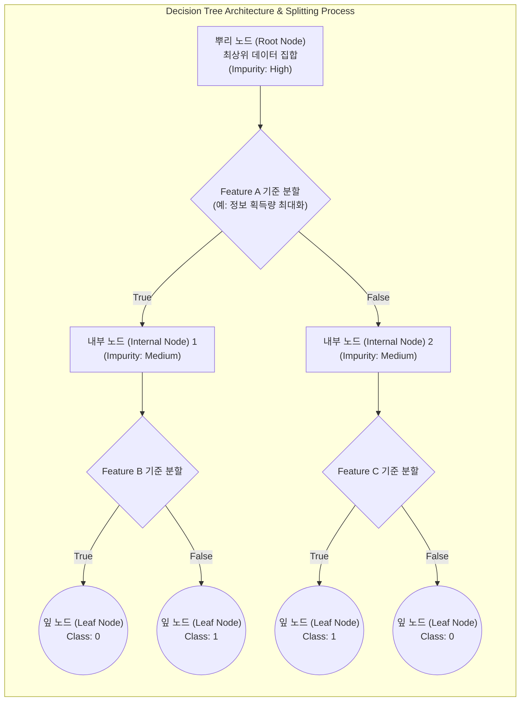

# 의사결정나무 (Decision Tree)

---

## I. 화이트박스 모델의 핵심, 의사결정나무의 개요

* **정의**: 데이터의 불순도(Impurity)가 감소하는 방향으로 분할 기준에 따라 노드를 재귀적으로 나누어 분류(Classification) 및 회귀(Regression)를 수행하는 [[지도학습]] [[알고리즘]]
* **특징**:
* 직관적 규칙(If-Then) 도출 및 높은 설명가능성(Explainability) 제공
* [[데이터 전처리]](정규화, 스케일링 등)에 대한 의존도 낮음
* 트리가 깊어질수록 학습 데이터에 과적합(Overfitting)될 위험성 존재

---

## II. 의사결정나무의 아키텍처 및 핵심 기술 요소

### 가. 의사결정나무의 개념도 및 동작 원리

* 부모 노드에서 자식 노드로 분할 시, 불순도 감소량(Information Gain)이 최대가 되는 최적의 독립변수와 임계값을 탐색하여 재귀적(Recursive)으로 가지 분할 수행

### 나. 의사결정나무의 핵심 기술 요소

| 분류 | 요소기술(키워드) | 세부 설명 |
| --- | --- | --- |
| **트리 구조** | 노드(Node) | 전체 데이터(Root), 중간 분기점(Internal/Decision), 최종 예측값(Leaf) 노드로 구성 |
| **분할 원리** | 정보 획득량 (Information Gain) | 부모 노드와 자식 노드 간의 불순도 차이, 이 값이 최대화되는 방향으로 분기 |
| **분류 지표** | 지니 계수 (Gini [[RDBMS 인덱스(index)|Index]]) | 데이터의 통계적 분산 정도 및 불평등도 측정 (CART 알고리즘의 분류 기준으로 활용) |
| **분류 지표** | 엔트로피 (Entropy) | 데이터 집합의 무질서도를 측정, 0(순수)에 가까울수록 분류가 잘 된 상태 (ID3, C4.5) |
| **회귀 지표** | 분산 감소량 (Variance Reduction) | 연속형 타겟 변수 예측 시, 각 분할 영역 내 타겟 변수의 분산 최소화 기준 적용 |
| **최적화** | 가지치기 (Pruning) | 과적합 방지를 위해 트리 최대 깊이 제한(사전), 불필요한 하위 노드 병합(사후) 수행 |
| **알고리즘** | CART (Classification And Regression Tree) | 지니 지수 및 분산 감소량을 활용한 **이진 분할(Binary Split)**, 분류/회귀 모두 지원 |
| **알고리즘** | C4.5 / C5.0 | 엔트로피 기반의 **정보 획득 비율(Gain Ratio)** 을 활용하여 **다항 분할(Multiway Split)** 지원 |

---

## III. 의사결정나무의 비교 및 활용 동향

### 가. 단일 모델(Decision Tree) vs 앙상블 모델(Random Forest) 비교

| 비교 항목 | 의사결정나무 (Decision Tree) | [[랜덤 포레스트|랜덤 포레스트 (Random Forest)]] |
| --- | --- | --- |
| **학습 [[모델 구조]]** | 단일 트리 (Single Tree) | 다중 트리의 앙상블 ([[배깅]], Bagging 기반) |
| **해석력 (설명성)** | 매우 높음 (화이트박스 모델, 룰 도출 용이) | 낮음 (다수 트리의 결합으로 룰 추적 곤란) |
| **과적합 (Overfitting)** | 노드가 깊어질수록 학습 데이터에 쉽게 과적합 | 다수 트리 결과의 투표(Voting)/평균화로 과적합 방지 |
| **예측 성능 (Accuracy)** | 복잡한 데이터 패턴 학습 시 상대적으로 한계 | 트리 간 상관관계를 줄여 매우 높은 예측 성능 제공 |
| **데이터 변동 민감도** | 작은 데이터 변화에도 트리 구조가 크게 변함(불안정) | 데이터 변동에 강건함 (Robustness) |

### 나. 최신 활용 전망 및 동향

* **앙상블 모델의 기틀 (Base Learner)**: 단일 의사결정나무의 과적합 한계를 극복하기 위해, 현재 AI 실무에서는 **XGBoost, LightGBM, CatBoost** 등 강력한 그래디언트 [[부스팅]](GBM) 알고리즘의 기본 약한 학습기(Weak Learner)로 핵심적인 역할을 수행함
* **설명 가능한 AI ([[XAI]])**: 금융(신용평가), 의료(질병진단) 등 모델의 예측 근거(Why)가 법적/윤리적으로 반드시 필요한 도메인에서, 블랙박스 [[딥러닝]] 모델의 판단 근거를 모방하여 설명하는 대리 모델(Surrogate Model) 및 룰(Rule) 추출 목적으로 활발히 재조명됨

---

### 🔗 연관 토픽

- **소속 도메인**: [[00_인공지능_MOC|🤖 인공지능]]
- **세부 분류**: `1. 수학 · 통계학 & 데이터 전처리`
- **핵심 연관 토픽**:
  - [[랜덤 포레스트|랜덤 포레스트 (Random Forest)]]
  - [[딥러닝]]
  - [[배깅]]
  - [[결측치]]
  - [[XAI]]
