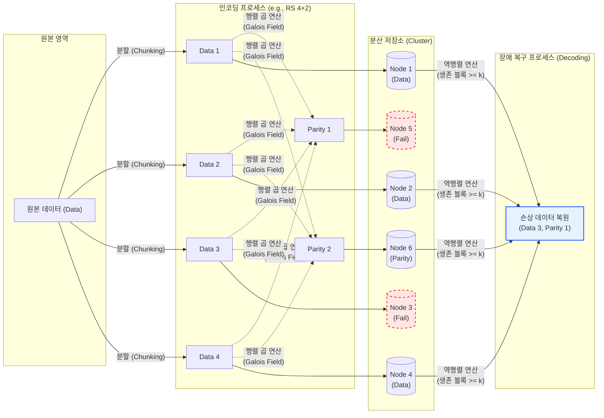

# 이레이저 코딩 (Erasure Coding)

---

## I. 대규모 분산 스토리지의 데이터 보호 기술, 이레이저 코딩의 개요

* **정의**: 원본 데이터를 여러 개의 데이터 블록($k$)으로 분할하고, 다항식 연산을 통해 복구용 패리티 블록($m$)을 생성한 후 서로 다른 노드에 분산 저장하는 데이터 보호 및 복구 기술
* **배경**: 클라우드 및 빅데이터 환경에서 기존 3중 복제(3-Way Replication) 방식이 초래하는 스토리지 공간 낭비(저장 효율성 33%) 문제 해결 필요성 대두
* **특징**: 스토리지 공간 효율성 극대화(약 67%~80%), 다중 노드 동시 장애 허용(High Fault Tolerance), 연산 오버헤드 존재([[CPU]] 연산량 증가)

---

## II. 이레이저 코딩의 아키텍처 및 핵심 기술 요소

### 가. 이레이저 코딩의 개념도 및 동작 원리

* 원본을 $k$개(Data)로 나누고 $m$개(Parity)를 생성하여 총 $k+m$개의 블록을 분산 저장하며, 이 중 임의의 $m$개 노드에 장애가 발생해도 남은 $k$개의 블록을 역행렬 연산하여 원본 복원 가능

### 나. 이레이저 코딩의 핵심 기술 요소

| 구분 | 요소기술(키워드) | 세부 설명 |
| --- | --- | --- |
| **핵심 기법** | 데이터 청킹 (Chunking) | 원본 데이터를 인코딩 연산을 위해 동일한 크기의 $k$개 블록으로 분리하는 기술 |
| **핵심 기법** | 패리티 생성 (Parity) | 갈루아 필드(Galois Field) 기반 다항식 연산을 통해 $m$개의 복구용 중복 데이터 생성 |
| **핵심 기법** | 역행렬 연산 (Decoding) | 노드 장애 시, 살아남은 $k$개의 블록과 생성 매트릭스의 역행렬을 곱하여 유실 데이터 복원 |
| **[[알고리즘]]** | Reed-Solomon (RS) Code | 가장 널리 쓰이는 인코딩 알고리즘, 스토리지 효율성이 우수하며 주로 RS(4,2), RS(10,4) 구조 사용 |
| **알고리즘** | LRC (Local Reconstruction) | 글로벌 패리티 외에 로컬 패리티를 추가 생성하여 복구 시 네트워크 대역폭(I/O) 낭비를 최소화 (Azure, Ceph 등 적용) |
| **알고리즘** | Fountain Code | $m$값을 고정하지 않고 무한대에 가까운 패리티 스트림을 생성하여 네트워크 패킷 유실 환경에 최적화 |
| **성능 최적화** | 하드웨어 가속 (ISA-L) | 인텔 ISA-L(Intelligent Storage Acceleration Library) 등 CPU의 SIMD 명령어를 활용한 연산 오버헤드 최소화 기법 |
| **저장 아키텍처** | 스트라이핑 (Striping) | 생성된 청크와 패리티를 동일 물리 디스크가 아닌 서로 다른 장애 도메인(Rack, Node)에 분산 배치 |

---

## III. 이레이저 코딩과 다중 복제(Replication) 비교 및 향후 전망

### 가. 데이터 보호 기법 비교 (Erasure Coding vs 3-Way Replication)

| 비교 항목 | 이레이저 코딩 (Erasure Coding) | 3중 복제 (3-Way Replication) |
| --- | --- | --- |
| **작동 원리** | 분할 + 패리티 연산 ($k+m$) | 원본 데이터 단순 복사 (3 Copy) |
| **저장 공간 효율성** | **높음** (약 67%~80% 저장 효율) | **낮음** (약 33% 저장 효율, 3배 공간 필요) |
| **장애 복구 속도** | **느림** (디코딩을 위한 CPU 역행렬 연산 필요) | **빠름** (정상 복제본에서 단순 네트워크 카피) |
| **시스템 오버헤드** | CPU 연산 부하 증가, 복구 시 다중 노드 I/O 발생 | CPU 연산 부하 없음, 스토리지 비용 막대함 |
| **주요 적용 대상** | Cold Data, 클라우드 오브젝트 스토리지 (S3), 백업 | Hot Data, [[데이터베이스]], 고성능 블록 스토리지 |
| **대표 솔루션** | [[Hadoop 3.0]] ([[HDFS]] EC), Ceph, MinIO, AWS S3 | Hadoop 2.x, 로컬 서버 클러스터링 기반 [[DBMS]] |

### 나. 전망 및 활용 동향

* **HDFS 및 클라우드 스토리지의 기본 표준**: AWS S3, Azure Blob Storage, Ceph 등 현대적인 오브젝트 스토리지 및 분산 파일 시스템(Hadoop 3.0 이상)에서 스토리지 TCO(총소유비용) 절감을 위해 이레이저 코딩을 기본 아키텍처로 채택 중임.
* **연산 병목 한계 극복 (HW/SW 가속)**: 이레이저 코딩의 최대 단점인 CPU 인코딩/디코딩 오버헤드 문제를 해결하기 위해, 인텔 ISA-L과 같은 소프트웨어적 가속뿐만 아니라 SmartNIC 및 DPU(Data Processing Unit)로 인코딩 연산을 오프로딩(Offloading)하는 하드웨어 가속 기술 융합이 가속화되고 있음.

---

### 🔗 연관 토픽

- **소속 도메인**: [[00_컴퓨터구조_MOC|💻 컴퓨터구조]]
- **세부 분류**: `2. 캐시 & 메모리 계층 구조 · 스토리지`
- **핵심 연관 토픽**:
  - [[HDFS]]
  - [[Hadoop 3.0]]
  - [[RAID]]
  - [[알고리즘]]
  - [[CPU]]
