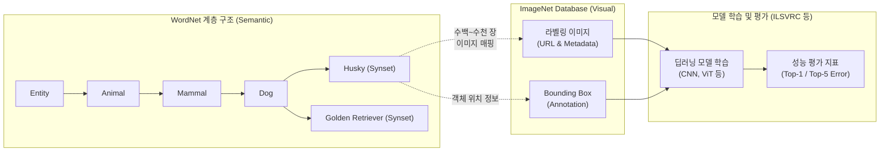

# 이미지넷 (ImageNet)

---

## I. 딥러닝 기반 컴퓨터 비전 혁명을 촉발한 대규모 데이터셋, 이미지넷의 개요

* **정의**: 스탠포드 대학(Fei-Fei Li 교수 팀) 등에서 구축한, 워드넷(WordNet) 계층 구조 기반의 수천만 장 규모 이미지 분류 및 객체 인식용 시각 [[데이터베이스]]
* **배경**: 고성능 컴퓨터 비전 [[알고리즘]] 학습을 위한 대규모 고품질 라벨링 데이터의 부재, 기존 소규모 데이터셋(PASCAL VOC 등)의 한계 극복 필요성
* **특징**: 크라우드소싱(Amazon Mechanical Turk) 기반 라벨링, 계층적 유의어 집합(Synset) 연동, 전이학습(Transfer Learning) 및 사전학습(Pre-training)의 글로벌 표준 벤치마크

---

## II. 이미지넷의 아키텍처 및 핵심 구성요소

### 가. 이미지넷의 데이터 구조 및 활용 개념도

* 워드넷의 유의어 집합(Synset) 노드마다 크라우드소싱으로 수집·검증된 이미지를 매핑하여, 컴퓨터 비전 모델의 범용적 객체 인식 및 분류 학습에 활용함

### 나. 이미지넷의 핵심 구성 및 기술 요소

| 구분 | 요소기술(키워드) | 세부 설명 |
| --- | --- | --- |
| **데이터 구조** | WordNet / Synset | 명사 위주의 유의어 집합(Synset)으로 구성된 계층적 온톨로지 사전 구조 채택 |
| **데이터 확보** | Crowdsourcing | 아마존 메커니컬 터크(AMT)를 활용하여 대규모 이미지 수집 및 인간 개입 라벨링 수행 |
| **메타데이터** | Bounding Box | 이미지 내 특정 객체의 정확한 위치를 사각형 좌표로 제공하여 Object Detection 학습 지원 |
| **경연 대회** | ILSVRC | 이미지넷 대규모 시각 인식 챌린지, 2012년 AlexNet 우승으로 [[딥러닝]]([[CNN]]) 부흥 촉발 |
| **평가 지표** | Top-1 / Top-5 Error | 모델이 예측한 최상위 1개 또는 5개 [[클래스]] 내에 실제 정답이 포함되지 않을 확률(오류율) |
| **활용 기법** | 사전학습 (Pre-training) | 대규모 ImageNet 데이터로 모델의 가중치를 1차 학습시켜 일반적인 시각 특징(Feature) 추출 |
| **활용 기법** | [[전이학습|전이학습 (Transfer Learning)]] | ImageNet으로 사전학습된 모델(Backbone)을 의료, [[Smart Car(자율주행)|자율주행]] 등 타 도메인에 미세조정([[Fine-Tuning|Fine-tuning]]) 적용 |
| **최신 정제** | Data Debiasing | AI 편향성 및 프라이버시 문제 해결을 위해 공격적 라벨 삭제 및 얼굴 블러(Blur) 처리 적용 |

---

## III. 이미지넷의 컴퓨터 비전 기여도 및 최신 발전 동향

### 가. 이미지넷이 컴퓨터 비전 및 AI 분야에 미친 기여 (ILSVRC 중심)

| 모델명 (연도) | 핵심 아키텍처 및 특징 | 기여 및 시사점 |
| --- | --- | --- |
| **AlexNet (2012)** | 8-Layer CNN, ReLU, [[Dropout]] 적용 | 전통적 머신러닝 탈피, **딥러닝(Deep Learning) 시대의 개막** |
| **VGGNet / GoogLeNet (2014)** | 19-Layer / 22-Layer(Inception 모듈) | 네트워크 깊이 증가 및 병렬 합성곱 연산을 통한 성능 극대화 |
| **ResNet (2015)** | Residual Block (Skip Connection) 적용 | 152-Layer 구현, 기울기 소실(Vanishing Gradient) 극복, **인간의 인식 오류율(5%) 돌파** |

### 나. 최신 트렌드 및 향후 전망

* **[[파운데이션 모델]](Foundation Model)의 표준 벤치마크**: ILSVRC 대회 자체는 2017년에 종료되었으나, ImageNet-1K 및 ImageNet-21K는 최근 Vision Transformer(ViT) 및 멀티모달(Multi-modal) AI 모델의 사전학습 및 성능 평가용 디팩토(De facto) 표준으로 지속 활용됨
* **데이터 윤리 및 거버넌스 강화**: 학습 데이터의 편향성(Bias)이 AI 모델에 전이되는 문제를 방지하기 위해 비윤리적 카테고리 제거, 성별/인종 편향성 분석, 초상권 보호(얼굴 모자이크 처리) 등 신뢰할 수 있는 AI(Trustworthy AI)를 위한 데이터셋 정제(Refinement) 작업이 지속적으로 이루어지고 있음

---

### 🔗 연관 토픽

- **소속 도메인**: [[00_인공지능_MOC|🤖 인공지능]]
- **세부 분류**: `2. 머신러닝 기초 & 핵심 알고리즘`
- **핵심 연관 토픽**:
  - [[딥러닝]]
  - [[CNN|CNN (Convolutional Neural Network)]]
  - [[Dropout]]
  - [[전이학습|전이학습 (Transfer Learning)]]
  - [[Smart Car(자율주행)]]
