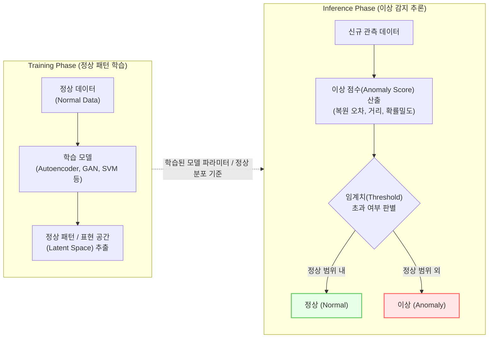

# 이상 감지 (Anomaly Detection)

---

## I. 데이터 내 숨겨진 패턴과 결함을 찾는 식별자, 이상 감지의 개요

* **정의**: 대량의 데이터 집합에서 예상되는 정상적인 패턴이나 기대 관측값을 벗어나는 특이 데이터([[이상치]], Outlier/Novelty)를 식별해내는 분석 기법 및 기계학습 기술
* **필요성 및 특징**:
* 극도의 [[클래스 불균형|클래스 불균형(Class Imbalance)]] 환경에서 소수의 비정상 징후 탐지
* 제조 공정 품질 관리(Vision 검사), 사이버 보안 위협(Intrusion), 금융 부정 거래(FDS) 및 예지보전 필수 기술
* 데이터의 종류 및 라벨 존재 여부에 따라 비지도 및 반지도 학습(Semi-supervised) 기법이 주로 활용됨

---

## II. 이상 감지의 아키텍처 및 핵심 기술 요소

### 가. 딥러닝 기반 이상 감지의 프로세스 및 동작 원리

* 학습 단계에서 정상 데이터의 고유한 패턴과 분포만을 학습하고, 추론 단계에서 신규 데이터의 복원 오류(Reconstruction Error) 또는 정상 군집과의 거리를 계산하여 이상 점수([[Anomaly(이상현상)|Anomaly]] Score)를 임계값과 비교해 이상 유무를 판정함

### 나. 이상 감지의 핵심 기술 및 알고리즘 요소

| 분류 | 요소기술(키워드) | 세부 설명 |
| --- | --- | --- |
| **학습 방법론** | 반지도 학습 (Semi-supervised) | 정상 데이터만으로 모델을 학습시켜 경계를 짓는 One-Class Classification 기법 적용 |
| **학습 방법론** | [[비지도 학습]] (Unsupervised) | 라벨링 없이 데이터의 본질적 분포를 파악하여 밀도가 낮은 영역을 이상치로 판별 |
| **판단 기준** | 복원 오차 (Reconstruction) | Autoencoder 기반, 차원 압축 후 복원 과정에서 오차가 큰 데이터를 이상으로 판정 |
| **판단 기준** | 밀도 및 거리 기반 (Distance) | K-NN, GMM, PatchCore 등 정상 데이터 군집과의 거리나 확률 밀도를 측정하여 판별 |
| **기반 [[알고리즘]]** | One-Class [[서포트 벡터 머신|SVM]] / Deep SVDD | 정상 데이터를 둘러싸는 최소 부피의 초구(Hypersphere)를 형성해 데이터 경계를 최적화 |
| **[[딥러닝]] 알고리즘** | [[GAN (Generative Adversarial Network)|GAN]] (생성적 적대 신경망) | 생성자와 판별자의 경쟁 학습을 통해 정상 데이터 분포를 정밀하게 모델링하여 탐지 |
| **최신 알고리즘** | Diffusion Model / GNN | 노이즈 주입 및 복원 역과정을 통한 정밀 이상 탐지(비전) 및 그래프 기반 상호작용 감지(GNN) |
| **응용 아키텍처** | AIOps / [[MLOps]] | IT 인프라 스트리밍 로그 및 시계열 센서 데이터의 실시간 병렬 처리 및 지속적 예지보전 파이프라인 |

---

## III. 이상 감지의 학습 방식 비교 및 최신 동향

### 가. 데이터 라벨링 유무에 따른 이상 감지 기법 비교

| 비교 항목 | 지도 학습 (Supervised) | 반지도 학습 (Semi-supervised) | 비지도 학습 (Unsupervised) |
| --- | --- | --- | --- |
| **사용 데이터** | 정상 및 비정상(이상) 라벨 모두 보유 | 오직 정상 데이터만 사용 (라벨 불필요) | 전체 데이터 (라벨 없음, 대부분 정상 가정) |
| **핵심 알고리즘** | Random Forest, MLP, [[CNN]] Classifier | One-Class SVM, Deep SVDD | [[PCA(Principal Component Analysis)|PCA]], Autoencoder, Isolation Forest |
| **장점** | 정확도가 가장 높고, 특정 이상 유형 탐지 용이 | 비정상 데이터 확보 비용 제로, 새로운 패턴 대응 가능 | 데이터 구축 비용이 가장 낮으며 범용적 적용 가능 |
| **단점 (한계)** | 비정상 라벨 구축 비용 과다, 미학습 이상치 탐지 불가 | 지도 학습 대비 정확도 다소 낮음, 임계치 설정 민감 | 오탐율(False Alarm)이 높음, 하이퍼파라미터 민감 |

### 나. 최신 트렌드 및 향후 발전 전망

* **설명 가능한 AI ([[XAI]])의 결합**: 블랙박스 모델의 한계를 극복하고 사용자의 조치(Actionable)를 유도하기 위해 판단 근거를 Attention Map이나 SHAP 등으로 시각화하는 기술이 산업 안전 필수 요건으로 부상
* **멀티모달(Multi-modal) 기반 이상 감지**: 비전 이미지 단일 분석을 넘어 진동, 소음 센서 데이터 및 텍스트 로그를 결합하여 복합적인 이상 징후를 추론함으로써 오탐(과검)을 최소화
* **[[EDGE|Edge]] AI를 활용한 실시간 예방**: 클라우드 지연(Latency) 문제와 네트워크 비용 증가를 막기 위해, 산업용 IoT 센서나 카메라 장비 단에서 직접 경량화 딥러닝 모델이 구동되어 즉각적인 다운타임 예방 수행

---

### 🔗 연관 토픽

- **소속 도메인**: [[00_인공지능_MOC|🤖 인공지능]]
- **세부 분류**: `1. 수학 · 통계학 & 데이터 전처리`
- **핵심 연관 토픽**:
  - [[이상치]]
  - [[PCA(Principal Component Analysis)]]
  - [[비지도 학습]]
  - [[클래스 불균형|클래스 불균형(Class Imbalance)]]
  - [[CNN|CNN (Convolutional Neural Network)]]
