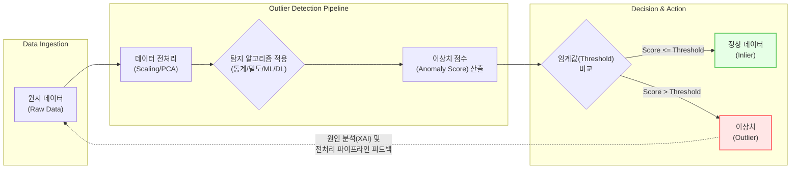

# 이상치 (Outlier)

---

## I. 데이터 품질 확보 및 특이 징후 판별의 핵심, 이상치의 개요

* **정의**: 전체 관측치 분포의 일반적인 패턴이나 정상 범주에서 크게 벗어나, 측정 오류나 특이 현상을 반영하는 이질적인 데이터 포인트
* **필요성 및 특징**:
* **[[데이터 전처리]]/품질 향상**: 머신러닝 모델의 학습 왜곡(과적합/성능 저하) 방지 및 강건성(Robustness) 확보
* **이상 징후 탐지**: [[클래스 불균형|클래스 불균형(Class Imbalance)]] 환경에서 소수의 비정상 패턴(금융 사기, 설비 고장 등) 식별
* **다차원 특성**: 변수 개수에 따라 단변량(Univariate) 탐지와 변수 간 종속성을 고려하는 다변량(Multivariate) 탐지로 구분

---

## II. 이상치 탐지의 개념도 및 핵심 기술 요소

### 가. 이상치 탐지 아키텍처 및 동작 원리

* 원시 데이터의 스케일링 후 통계, 밀도, 기계학습 모델을 통해 각 데이터의 이상 점수(Score)를 산출하고, 임계값을 초과하는 객체를 이상치로 격리함

### 나. 이상치 탐지의 핵심 기술 및 구성 요소

| 구분 | 요소기술(키워드) | 세부 설명 |
| --- | --- | --- |
| **통계적 기법** | Z-Score | - 데이터가 정규분포를 따른다는 가정하에 평균으로부터의 표준편차 거리를 측정하여 탐지 (보통 |Z| > 3) |
| **통계적 기법** | IQR (Interquartile Range) | - 사분위수(Q1, Q3)를 기반으로 IQR(Q3-Q1)을 산출하여 $Q1 - 1.5 \times IQR$ 미만, $Q3 + 1.5 \times IQR$ 초과를 이상치로 간주 |
| **밀도/거리 기반** | LOF (Local Outlier Factor) | - 주변 이웃 데이터의 밀도와 해당 데이터의 밀도를 비교하여, 국소적(Local)으로 고립된 정도를 수치화 |
| **밀도/거리 기반** | [[DBSCAN(밀도 기반 클러스터링)|DBSCAN]] | - 데이터의 밀집 지역을 군집화하고, 어떤 군집에도 속하지 않는 외곽 노이즈 포인트를 이상치로 판별 |
| **기계학습 (트리)** | Isolation Forest | - 랜덤하게 데이터를 분할하는 트리를 생성하고, 적은 분할 횟수(짧은 경로 길이)로 고립되는 객체를 이상치로 분류 |
| **기계학습 (경계)** | One-Class [[서포트 벡터 머신|SVM]] | - 정상 데이터만을 학습하여 고차원 공간상에서 정상 데이터를 둘러싸는 최적의 경계(Decision Boundary)를 생성 |
| **[[딥러닝]] (복원)** | Autoencoder | - 데이터 압축(Encoder) 및 복원(Decoder) 과정을 거치며, 정상 범위를 벗어나 복원 오차(Reconstruction Error)가 큰 객체를 이상치로 판별 |
| **최신 딥러닝/FM** | Tabular Foundation Model | - 정형 데이터 대규모 사전학습 모델(예: OUTFORMER)을 통해 라벨 없이(Zero-shot) In-context 입력만으로 이상치 추론 |

---

## III. 이상치 탐지 기법의 비교 및 최신 동향

### 가. 이상치 탐지 기법별 주요 특징 비교

| 비교 항목 | 통계적 기법 (Statistical) | 기계학습/밀도 기반 기법 (ML/Density) | 딥러닝 기반 기법 (Deep Learning) |
| --- | --- | --- | --- |
| **대표 [[알고리즘]]** | Z-Score, IQR, MAD | LOF, DBSCAN, Isolation Forest, OCSVM | Autoencoder, [[GAN (Generative Adversarial Network)|GAN]], Tabular FM |
| **데이터 가정** | 특정 분포([[정규분포]] 등) 가정 필요 | 데이터 분포에 대한 사전 가정 불필요 | 복잡하고 비선형적인 데이터 구조 |
| **적용 차원** | 주로 단변량(1차원) 데이터 탐지에 적합 | 다변량(다차원) 간의 상관관계 파악 가능 | 이미지, 시계열 등 고차원 및 비정형 데이터 |
| **연산 복잡도** | 매우 낮음 (실시간 처리에 유리) | 중간 (거리 계산 시 오버헤드 발생 가능) | 매우 높음 ([[GPU]] 가속 및 사전학습 필요) |
| **설명력 (해석)** | 직관적이며 원인 파악 용이 (명확한 수식) | 모델에 따라 다름 (트리 구조는 양호) | 블랙박스 (해석을 위해 [[XAI]] 기술 필요) |

### 나. 이상치 탐지의 최신 트렌드 및 향후 전망

* **Data-Centric AI 관점의 정제 고도화**: [[인공지능]] 모델의 성능을 결정짓는 핵심이 모델 알고리즘에서 고품질 데이터(Zero-Defect) 확보로 이동함에 따라, 다변량 이상치 탐지가 데이터 전처리 파이프라인의 필수 내재화 요소로 자리매김함.
* **[[파운데이션 모델]](FM) 기반 Zero-Shot 이상치 탐지**: 최근 OUTFORMER 등 정형 데이터(Tabular Data)에 특화된 파운데이션 모델이 등장하여, 별도의 학습 과정 없이(Zero-shot) Few-shot 프롬프팅만으로 금융 및 산업 현장의 이상치를 신속하게 판별하는 추세임.
* **설명 가능한 AI(XAI)와의 융합**: 이상 탐지 결과가 실제 비즈니스 조치(설비 중단, 계좌 동결 등)로 이어지기 위해 SHAP, [[LIME]], Attention Map 기법을 결합하여 '어떤 변수가 이상치 점수에 기여했는가'에 대한 인과성 추적 및 시각화 연구가 활발히 진행 중임.

---

### 🔗 연관 토픽

- **소속 도메인**: [[00_인공지능_MOC|🤖 인공지능]]
- **세부 분류**: `1. 수학 · 통계학 & 데이터 전처리`
- **핵심 연관 토픽**:
  - [[클래스 불균형|클래스 불균형(Class Imbalance)]]
  - [[서포트 벡터 머신|서포트 벡터 머신 SVM(Support Vector Machine)]]
  - [[DBSCAN(밀도 기반 클러스터링)]]
  - [[데이터 전처리]]
  - [[결측치]]
