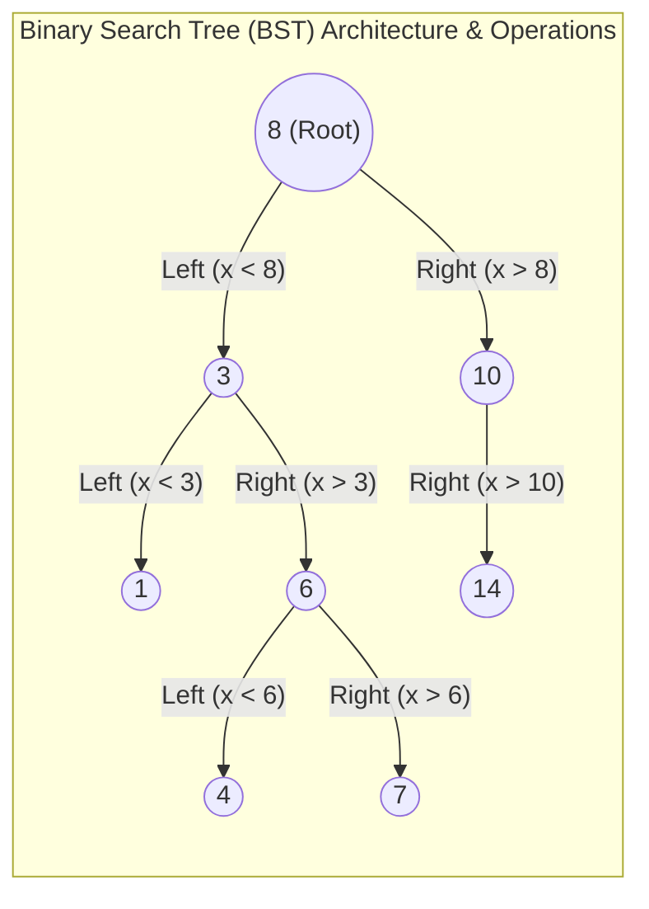

# 이진 탐색 트리 (Binary Search Tree)

---

## I. 데이터 탐색 효율성을 극대화하는 자료구조, 이진 탐색 트리의 개요

* **정의**: 트리의 모든 노드에 대해 왼쪽 자식 노드는 부모보다 작고, 오른쪽 자식 노드는 부모보다 큰 값을 가지도록 정렬된 이진 트리 기반의 핵심 자료구조.
* **등장배경 및 특징**:
* **동적 연산 효율성**: 배열을 활용한 이진 탐색(Binary Search)의 고속 탐색 장점과 연결 리스트(Linked List)의 동적 삽입/삭제 장점을 결합하여 설계됨.
* **평균 시간복잡도 보장**: 이상적인 상태에서 데이터의 삽입, 삭제, 탐색 연산 시 평균 $O(\log N)$의 고속 성능을 제공함.
* **[[편향]](Skewed) 문제**: 삽입되는 데이터가 이미 정렬된 상태일 경우 트리가 한쪽으로 치우쳐 성능이 최악인 $O(N)$으로 저하되는 한계 존재(이에 따라 자가 균형 트리로 발전).

---

## II. 이진 탐색 트리의 개념도 및 핵심 기술 요소

### 가. 이진 탐색 트리의 개념도 및 동작 원리

* 루트 노드(8)를 기준으로 작은 값(3)은 좌측 서브트리로, 큰 값(10)은 우측 서브트리로 재귀적으로 분기하여 탐색 공간을 매 단계마다 절반으로 축소함.
* 중위 순회(Inorder Traversal: Left $\rightarrow$ Root $\rightarrow$ Right) 수행 시, 항상 오름차순(1, 3, 4, 6, 7, 8, 10, 14)으로 정렬된 데이터를 추출할 수 있음.

### 나. 이진 탐색 트리의 핵심 기술 및 구성 요소

| 구분 | 요소기술(키워드) | 세부 설명 |
| --- | --- | --- |
| **구조/노드** | Node & Pointer | - 데이터가 저장되는 Key/Value 영역과 좌/우측 자식 노드의 메모리 주소를 가리키는 2개의 포인터(Left/Right)로 구성 |
| **탐색 연산** | Search ($O(\log N)$) | - 루트에서 시작하여 타겟 값이 현재 노드보다 작으면 왼쪽, 크면 오른쪽으로 이동하며 일치 값을 탐색 |
| **삽입 연산** | Insert ($O(\log N)$) | - 루트부터 타겟 크기를 비교하며 빈 단말(Leaf) 노드 위치를 도출한 후, 새로운 노드를 메모리에 할당 및 연결 |
| **삭제 연산 1** | 차수(Degree) 0 삭제 | - 자식이 없는 단말 노드의 경우, 부모 노드와의 링크를 끊고 메모리에서 즉시 해제 |
| **삭제 연산 2** | 차수(Degree) 1 삭제 | - 삭제할 노드의 유일한 자식 노드를 삭제 대상의 부모 노드와 직접 연결하여 구조를 유지 |
| **삭제 연산 3** | 차수(Degree) 2 삭제 | - 삭제 노드를 왼쪽 서브트리의 최댓값 또는 오른쪽 서브트리의 최솟값(Inorder Successor)으로 대체하여 이진 탐색 규칙 유지 |
| **균형 제어** | AVL Tree | - 삽입/삭제 시 좌우 서브트리의 높이 차이(Balance Factor)가 1 이하가 되도록 회전(Rotation)하여 균형 유지 |
| **균형 제어** | Red-Black Tree | - 노드에 색상(Red/Black) 속성을 부여하고 5가지 규칙을 통해 $O(\log N)$ 균형을 엄격하게 보장 (Java Map, C++ set의 기반 구조) |

---

## III. 이진 탐색 트리의 한계점 및 최신 활용 전망

### 가. 이진 탐색 트리의 한계 극복 및 최신 동향

* **캐시 친화적(Cache-Conscious) 아키텍처 최적화**: 전통적 BST는 잦은 포인터 추적(Pointer Chasing)으로 인해 메인 메모리 환경에서 심각한 [[CPU]] 캐시 미스(Cache Miss)를 유발함. 이를 극복하기 위해 메모리 연속성을 보장하는 배열형 트리나 노드 크기를 캐시 라인(Cache-line)에 맞춘 캐시 민감형 트리(CSB+-Tree 등)로 구조를 전환하는 추세임.
* **멀티코어 환경의 동시성(Concurrency) 제어 향상**: 고성능 [[DBMS]] 및 분산 저장소에서 다중 스레드의 동시 접근에 따른 병목(Bottleneck) 현상을 해결하기 위해, 전통적인 노드 레벨의 잠금([[Locking]]) 대신 낙관적 락(Optimistic Lock) 기법이나 락 프리(Latch-Free) 알고리즘을 결합한 병행성(Concurrent) 트리 아키텍처가 적극 도입됨.
* **학습된 색인(Learned [[RDBMS 인덱스(index)|Index]])과의 하이브리드 융합**: 데이터의 고유한 분포를 기계학습 모델이 학습(누적 분포 함수, CDF)하여 단일 추론으로 물리적 탐색 위치를 즉시 예측하는 Learned Index 모델이 대두됨. 인공지능이 최상위 내부 노드들의 이진 탐색 분기(Branch) 계층을 대체하여 메모리 접근 비용과 탐색 트리의 깊이를 획기적으로 낮추는 연구가 활발히 진행 중임.

---

### 🔗 연관 토픽

- **소속 도메인**: [[00_컴퓨터구조_MOC|💻 컴퓨터구조]]
- **세부 분류**: `4. 기본 자료구조 (Data Structures)`
- **핵심 연관 토픽**:
  - [[AVL 트리]]
  - [[트리 순회|트리 순회 (Tree Traversal)]]
  - [[힙|힙 (Heap)]]
  - [[Balanced Tree B-Tree|Balanced Tree B-Tree (비트리)]]
  - [[CPU]]
