# 이항분포 (Binomial Distribution)

---

## I. 독립적 베르누이 시행 기반 이산확률분포, 이항분포의 개요

* **정의**: 상호 배타적인 두 가지 결과(성공/실패)만 갖는 베르누이 시행을 독립적으로 $n$회 반복했을 때 나타나는 성공 횟수 $X$의 [[확률분포]]
* **배경 및 필요성**: 이진 데이터 모델링, 데이터 통계적 유의성 검정(A/B Test), ML 분류기 [[손실함수]](Binary Cross Entropy) 도출 및 SW 품질 [[신뢰성]] 평가의 수학적 기반 제공
* **핵심 전제조건**: 고정된 시행 횟수($n$), 상호 배타적 결과($p + q = 1$), 각 시행의 상호 독립성(Independence), 성공 확률($p$)의 불변성

---

## II. 이항분포의 메커니즘 및 핵심 수리/기술 요소

### 가. 이항분포의 개념도 및 생성 메커니즘

```mermaid
flowchart LR
    subgraph Trial["단일 베르누이 시행 (Bernoulli Trial)"]
        direction TB
        T1["결과 집합: {성공(p), 실패(1-p)}"]
    end

    subgraph Conditions["4대 전제조건"]
        direction TB
        C1["독립 시행 (Independent)"]
        C2["시행 횟수 고정 (Fixed n)"]
        C3["성공 확률 불변 (Constant p)"]
        C4["결과 이원화 (Binary)"]
    end

    subgraph Binomial["이항확률변수 X ~ B(n, p)"]
        direction TB
        PMF["PMF: P(X=k) = nCk * p^k * (1-p)^(n-k)"]
        STAT["기댓값: E(X) = np<br/>분산: V(X) = np(1-p)"]
    end

    subgraph Approximation["극한 정리 및 근사 (Approximation)"]
        direction TB
        NORM["정규 근사: N(np, np(1-p))<br/>(np >= 5, n(1-p) >= 5)"]
        POIS["푸아송 근사: Poisson(λ=np)<br/>(n -> ∞, p -> 0)"]
    end

    Trial --> Conditions
    Conditions --> Binomial
    Binomial --> Approximation

```

* 각 시행이 독립적인 베르누이 프로세스를 $n$회 누적하여 성공 횟수 $k$에 대한 결합 확률을 조합($\binom{n}{k}$)을 통해 모델링함
* 표본 크기($n$)와 발생 확률($p$) 조건에 따라 [[중심극한정리]] 기반 [[정규분포]] 또는 희귀사건 기반 푸아송분포로 수렴함

### 나. 이항분포의 핵심 구성 요소 및 수리적 특성

| 구분 | 핵심 요소(키워드) | 세부 설명 |
| --- | --- | --- |
| **기본 파라미터** | 시행 횟수 ($n$) | 상호 독립적인 베르누이 시행의 총 반복 횟수 (자연수 고정값) |
| **기본 파라미터** | 성공 확률 ($p$) | 매 단일 시행마다 특정 사건이 발생할 고정 확률 ($0 \le p \le 1, q = 1-p$) |
| **확률질량함수** | 조합 계수 ($\binom{n}{k}$) | $n$번 중 순서와 상관없이 성공 $k$번이 나타나는 경우의 수 ($n! / (k!(n-k)!)$) |
| **확률질량함수** | PMF 수식 | $P(X=k) = \binom{n}{k} p^k (1-p)^{n-k}$ ($k = 0, 1, \dots, n$) |
| **통계적 척도** | 기댓값 (Mean) | 분포의 중심 경향성, $E(X) = np$ |
| **통계적 척도** | 분산 (Variance) | 데이터 흩어짐 측도, $V(X) = np(1-p)$ (최대 분산은 $p=0.5$일 때 형성) |
| **극한 분포** | 드무아브르-라플라스 정리 | $np \ge 5$ 및 $n(1-p) \ge 5$ 충족 시 연속확률분포인 정규분포 $N(np, np(1-p))$로 근사 |
| **극한 분포** | 소수의 법칙 (Poisson 근사) | $n$이 매우 크고 $p$가 극히 작아 $\lambda = np$가 일정한 경우 푸아송분포로 수렴 |

---

## III. 이항분포 vs 푸아송분포 비교 및 IT/AI 적용 동향

### 가. 이항분포 vs 푸아송분포 비교

| 비교 항목 | 이항분포 (Binomial) | 푸아송분포 (Poisson) |
| --- | --- | --- |
| **정의** | 고정된 $n$회 중 성공 횟수의 분포 | 단위 시간/공간당 발생하는 희귀 사건 수의 분포 |
| **시행 횟수 ($n$)** | 고정 유한 ($n < \infty$) | 연속적 구간 (이론상 $n \to \infty$) |
| **핵심 모수** | 시행 횟수 $n$, 성공 확률 $p$ ($B(n, p)$) | 단위당 평균 발생률 $\lambda$ ($Poisson(\lambda)$) |
| **평균과 분산 관계** | 평균($np$) > 분산($np(1-p)$) | 평균($\lambda$) = 분산($\lambda$) |
| **주요 IT 적용** | 웹 UI 전환율 검정, ML 이진 분류 | 서버 트래픽 유입률, 시스템 장애/[[DDOS|DDoS]] 발생 모델링 |

### 나. 최신 IT 및 AI/ML 분야 활용 동향

* **데이터 기반 의사결정 (A/B Testing)**: 신규 UI/UX 기능 적용 시 전환율(CVR), 클릭률(CTR) 모비율 차이에 대한 가설검정(Two-proportion Z-test)의 이론적 근거로 활용
* **AI/ML 손실함수 설계**: 로지스틱 회귀 및 [[딥러닝]] 이진 분류 모델에서 우도함수(Likelihood)의 로그 변환을 통한 Binary Cross-Entropy 손실함수 도출
* **[[초거대 언어 모델|LLM]] 안전성 및 신뢰도 검증**: 생성형 AI의 환각(Hallucination) 발생률 및 가드레일 통과 여부를 이항 프로세스로 모델링하여 벤치마크 테스트셋 표본 크기 산정에 적용

---

### 🔗 연관 토픽

- **소속 도메인**: [[00_인공지능_MOC|🤖 인공지능]]
- **세부 분류**: `1. 수학 · 통계학 & 데이터 전처리`
- **핵심 연관 토픽**:
  - [[손실함수]]
  - [[정규분포|정규분포(Normal Distribution)]]
  - [[중심극한정리|중심극한정리 (Central Limit Theorem)]]
  - [[확률분포]]
  - [[포아송 분포|포아송 분포 (Poisson Distribution)]]
