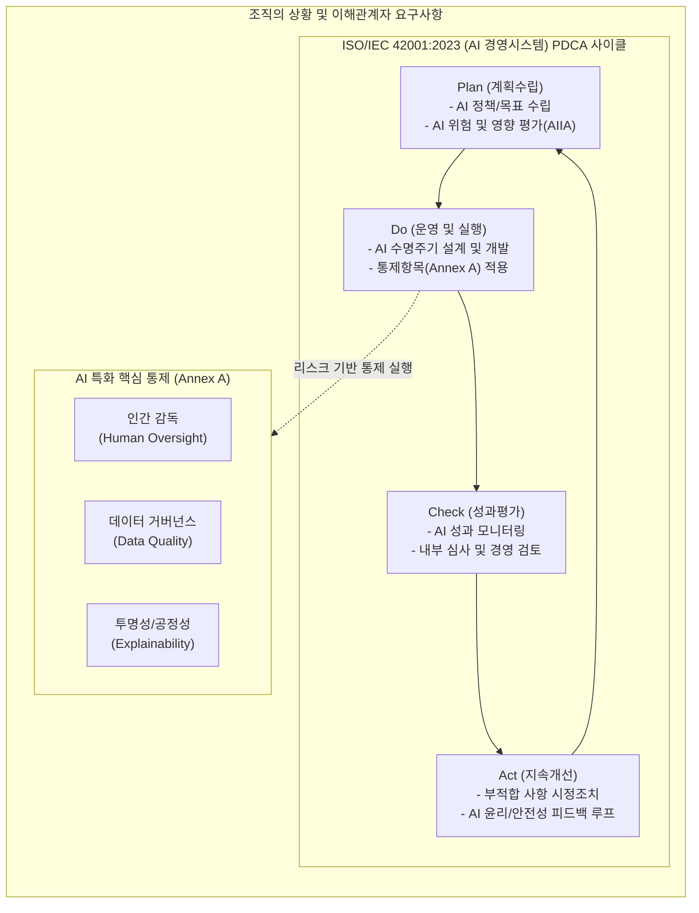

# 인공지능 경영시스템(ISO 42001:2023)

---

## I. 신뢰할 수 있는 AI 생태계를 위한 국제 표준, ISO/IEC 42001의 개요

* **정의**: 조직이 [[인공지능]](AI) 시스템을 안전하고 투명하며 책임감 있게 개발, 제공, 사용(활용)할 수 있도록 요구사항을 규정한 세계 최초의 인공지능 경영시스템(AIMS, AI Management System) 국제 표준.
* **등장배경 및 특징**:
* **새로운 IT 리스크의 대두**: 환각(Hallucination), [[편향]](Bias), 설명 불가능성, 저작권 침해 등 AI 고유의 위험을 통제할 거버넌스 부재.
* **글로벌 규제 대응 체계 필요**: EU AI Act 등 각국의 강력한 법적 규제가 본격화됨에 따라 컴플라이언스 입증 수단 요구.
* **특징**: 기존 ISO의 [[PDCA(Plan-Do-Check-Act, Deming Cycle)|PDCA]](Plan-Do-Check-Act) 기반 HLS(High-Level Structure) 구조를 채택하여 ISO 9001, 27001 등 타 경영 표준과 유연한 통합이 가능.

---

## II. ISO 42001의 개념도 및 핵심 통제/기술 요소

### 가. ISO 42001의 개념도 및 동작원리

* 조직의 목표에 맞춰 AI 위험과 기회를 식별(Plan)하고, AI 생명주기 전반에 거버넌스를 실행(Do)하며, 성과를 점검(Check)하고 지속 개선(Act)하는 구조로 작동함.

### 나. ISO 42001의 핵심 구성 요소 (요구사항 및 Annex A 기반)

| 구분 | 요소기술(키워드) | 세부 설명 |
| --- | --- | --- |
| **기획 / 위험관리** | AI 영향 평가 (AIIA) | - AI 시스템이 인간, 사회, 프라이버시, 안전에 미칠 잠재적 영향을 사전에 식별하고 평가하는 체계 |
| **기획 / 위험관리** | AI 위험 평가 체계 | - 편향성, 모델 드리프트, 데이터 품질 저하 등 AI 고유의 위험(Risk)을 식별하고 완화 우선순위를 결정 |
| **정책 / 조직지원** | AI 리더십 및 거버넌스 | - 최고경영진 주도의 AI 정책 수립, 전사적 R&R 배분 및 AI 시스템 인벤토리(Inventory) 자산 관리 체계 확립 |
| **운영 / 데이터** | [[데이터 거버넌스]] | - 학습 및 추론에 사용되는 데이터의 출처, 품질, 정합성, 개인정보 보호 및 편향 방지를 위한 통제 활동 |
| **운영 / [[프로세스]]** | AI 수명주기(Lifecycle) | - 기획-데이터 준비-설계-학습-검증-배포-폐기에 이르는 AI 전 주기별 승인 기준 및 기술 문서화 프로세스 구축 |
| **[[신뢰성]] / 윤리** | 인간 감독 (Oversight) | - AI의 오작동 및 윤리적 오류를 방지하기 위해 중요 의사결정 과정에 인간이 개입하고 통제할 수 있는 장치 마련 |
| **신뢰성 / 윤리** | 투명성 및 설명가능성 | - 의사결정 알고리즘의 도출 근거를 투명하게 제시(Explainability)하고, 챗봇/[[딥페이크]] 등의 경우 AI 활용 여부를 명시 |
| **통제 / 보안** | 공급자(Supply Chain) 관리 | - 타사의 외부 AI 모델(API), 클라우드 인프라 활용 시 발생할 수 있는 서드파티(제3자) 리스크 관리 및 평가 수행 |

---

## III. ISO 42001과 EU AI Act 비교 및 산업 활용 전망

### 가. ISO 42001과 글로벌 규제(EU AI Act) 비교

| 비교 항목 | ISO/IEC 42001 (국제 표준) | EU AI Act (유럽연합 인공지능법) |
| --- | --- | --- |
| **성격 및 지위** | 자발적 국제 경영시스템 표준 (인증 체계) | 법적 구속력을 가지는 강력한 국제 무역 규제법 |
| **적용 대상** | AI를 개발/제공/사용하는 모든 유형의 조직 | 위험도(금지/고위험/제한적/최소)에 따라 차등 적용 |
| **핵심 목적** | 조직 내 자율적 [[AI 거버넌스]] 내재화 및 지속 개선 | 시민의 기본권 보호 및 고위험 AI에 대한 의무 부과 |
| **위반 시 제재** | 인증 취소 (비즈니스 입찰/신뢰도 하락) | 최대 3,500만 유로 또는 글로벌 매출의 7% 과징금 |

### 나. 향후 활용 동향 및 시사점

* **규제 준수를 위한 강력한 증적(Evidence) 수단**: EU AI Act의 고위험(High Risk) 인공지능 시스템이 요구하는 데이터 거버넌스, 리스크 관리, 인간 감독 등의 엄격한 의무 사항을 충족하고 있음을 증명하는 디팩토(De facto) 기준표로 자리 잡고 있음.
* **타 인증(ISO 27001 등)과의 통합 심사 확대**: AI 시스템은 본질적으로 데이터 보안 및 개인정보 문제와 직결되므로, 기존 정보보안(ISO 27001) 및 프라이버시([[ISO 27701]]) 경영시스템 위에 ISO 42001을 Add-on 방식으로 통합 확장하여 구축하는 통합 거버넌스 컨설팅이 활성화되는 추세임.

---

### 🔗 연관 토픽

- **소속 도메인**: [[00_인공지능_MOC|🤖 인공지능]]
- **세부 분류**: `6. 설명가능한 AI (XAI) & AI 윤리 · 거버넌스`
- **핵심 연관 토픽**:
  - [[편향]]
  - [[AI 거버넌스|AI 거버넌스 (AI Governance)]]
  - [[인공지능]]
  - [[XAI]]
  - [[딥페이크|딥페이크(Deepfake)]]
