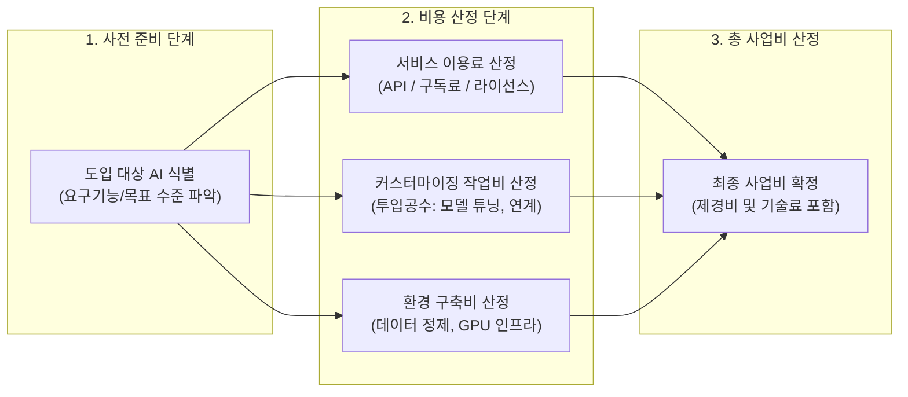

# 인공지능 (AI) 도입 사업비 산정 절차

---

## I. SW 대가산정의 패러다임 전환, AI 도입 사업비 산정의 개요

* **정의**: 기존 기능점수(FP) 방식으로는 산출하기 어려운 [[인공지능]] 솔루션 도입 시, 서비스 이용료와 모델 튜닝·데이터 학습 등을 위한 커스터마이징 작업비(투입공수)를 합산하여 적정 사업 대가를 산출하는 체계
* **등장배경 및 특징**:
* **FP 방식의 한계 극복**: AI 프로젝트는 화면 및 데이터 입출력 기능(CRUD)보다 모델 학습, 반복 튜닝, 데이터 정제에 많은 비용이 소요됨
* **구독형 AI 서비스 확산**: 클라우드 API 및 SaaS 기반의 AI 서비스 요금(구독료/종량제) 반영 필요성 대두
* **제도화 및 현실화**: 한국소프트웨어산업협회(KOSA) 주도로 '전문작업비'를 신설하고, 이후 '커스터마이징 작업비용'으로 명칭을 현실화하며 지속 개정 중임

---

## II. AI 도입 사업비 산정의 개념도 및 핵심 구성 요소

### 가. AI 도입 사업비 산정 프로세스

* 인공지능 도입 대가는 단일 기능 규모(FP) 중심에서 벗어나, 서비스 이용료 + 커스터마이징(M/M) + 별도 환경구축비([[GPU]], 데이터)의 합산 구조로 산출됨

### 나. AI 도입 사업비 산정 체계의 핵심 요소

| 구분 | 요소기술(키워드) | 세부 설명 |
| --- | --- | --- |
| **사전 준비** | AI 수준 및 아키텍처 식별 | - 사업 목표에 부합하는 AI 기능 수준과 서비스 방식(On-Prem, Cloud API) 정의 |
| **요금 항목** | 서비스 이용료 (구독형) | - 클라우드 솔루션 이용에 따른 구독형 정액 요금 또는 API 호출량 기반 종량제 비용 |
| **요금 항목** | 환경 구축비 (인프라) | - 대규모 연산이 필수적인 AI 모델 학습 및 추론을 위한 고성능 GPU/[[NPU]] 컴퓨팅 사용료 |
| **전문 작업** | 데이터 준비 및 가공비 | - 원시 데이터 수집, 정제 및 라벨링([[Annotation]]) 등 데이터 품질 고도화에 투입되는 비용 |
| **전문 작업** | AI 모델 튜닝비 (커스터마이징) | - 도메인 특화 파인튜닝([[Fine-Tuning|Fine-tuning]]), [[프롬프트 엔지니어링]], RAG 파이프라인 구축 비용 |
| **산정 방식** | 투입공수 (M/M) 산정 | - AI 아키텍트, 데이터 엔지니어 등 고숙련 인력의 직접 인건비를 투입공수 기반으로 산출 |
| **산정 방식** | 일반 기능점수(FP) 병행 | - AI 외의 업무 화면(UI), DB 연동 등 일반 어플리케이션 개발 영역은 2024년 상향된 FP 단가(605,784원) 적용 |
| **원가 보정** | 제경비 및 기술료 | - 투입 인력 기반 개발원가 산출 후 기업의 제경비 및 이윤(기술료)을 합산하여 최종 사업비 확정 |

---

## III. 일반 SW 대가산정(FP)과 AI 도입 대가산정 비교 및 향후 전망

### 가. 일반 SW 개발 대가산정 vs AI 도입 대가산정 비교

| 비교 항목 | 일반 SW 개발 대가 (기존) | AI 솔루션/서비스 도입 대가 (신규) |
| --- | --- | --- |
| **핵심 산정 기준** | 소프트웨어 기능 규모 (기능점수, FP) | 서비스 구독료 + 커스터마이징 전문작업 (투입공수) |
| **주요 원가 동인** | 데이터 입출력 수(TR) 및 내부 논리파일(ILF) | 모델 튜닝 시간, 고품질 데이터 구축량, API 호출량 |
| **인프라 비중** | 보조적 (일반 웹/WAS/DB 서버 환경) | 핵심적 (고가 GPU 가속기 등 기계 자원 비용 분리 산정) |
| **제도적 한계/특징** | 고정된 단가로 인해 복잡도 높은 AI 작업 미반영 | 데이터 준비, 아키텍처 구성 공수를 M/M 기반 명확화 및 현실화 보완 중 |

* **동향 및 전망**: KOSA(한국인공지능·소프트웨어산업협회)는 기존 '전문작업비'를 '커스터마이징 비용'으로 구체화하고, GPU 인프라와 데이터 구축 비용을 별도로 명확히 산정하도록 가이드를 개선 중임. 향후 AI 성과(KPI) 달성 여부에 따른 가치 기반(Value-based) 대가 체계로의 고도화 연구가 요구됨.

---

### 🔗 연관 토픽

- **소속 도메인**: [[00_인공지능_MOC|🤖 인공지능]]
- **세부 분류**: `6. 설명가능한 AI (XAI) & AI 윤리 · 거버넌스`
- **핵심 연관 토픽**:
  - [[인공지능]]
  - [[프롬프트 엔지니어링|프롬프트 엔지니어링(Prompt Engineering)]]
  - [[NPU|NPU(Neural Processing Unit)]]
  - [[Fine-Tuning]]
  - [[소버린 AI|소버린 AI(Artificial Intelligence)]]
