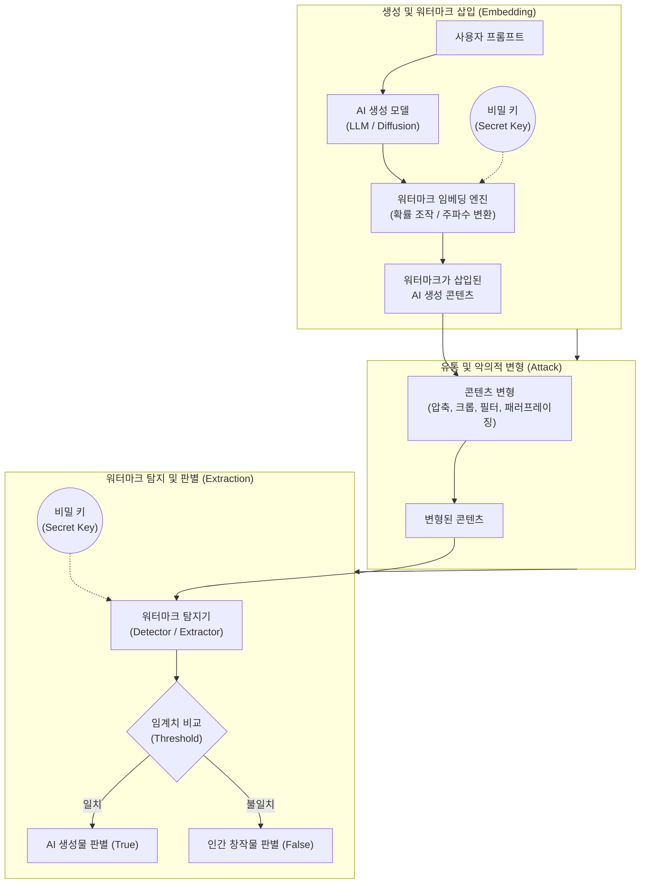

# 인공지능 생성물 워터마크 적용 기술

---

## I. 딥페이크 방지 및 신뢰성 확보를 위한, 인공지능 생성물 워터마크의 개요

* **정의**: [[인공지능]](AI)이 생성한 텍스트, 이미지, 오디오, 비디오 등의 산출물에 인간이 인지할 수 없는 고유한 식별 정보(마커)를 삽입하여, 생성물의 출처 및 AI 생성 여부를 추적·판별하는 보안 기술
* **등장배경**: [[딥페이크]] 범죄 및 가짜 뉴스 확산에 따른 사회적 혼란 가중, 저작권 침해 분쟁 증가, EU AI Act 및 미국 행정명령 등 AI 투명성 의무화 법제화
* **특징**: 육안 식별 불가(Imperceptibility), 변형 및 공격에 대한 훼손 내성(Robustness), 오탐율 최소화(Low FPR), 다중 모달리티(Multi-modal) 지원

---

## II. 인공지능 생성물 워터마크의 개념도 및 핵심 기술 요소

### 가. 인공지능 생성물 워터마크의 아키텍처 및 동작 원리

* AI 모델의 생성 과정 중(In-processing) 또는 사후(Post-processing)에 비밀 키를 활용하여 시각적·청각적 왜곡 없이 식별 정보를 삽입하고, 탐지기를 통해 검출 및 판별함

### 나. 인공지능 생성물 워터마크의 핵심 기술 요소

| 분류 | 요소기술(키워드) | 세부 설명 |
| --- | --- | --- |
| **텍스트 워터마크** | 로짓 조작 (Logit Altering) | 토큰 생성 시 암호화된 난수(Nonce)를 기반으로 어휘를 그린/레드 리스트로 분할하여 특정 단어 등장 확률을 인위적으로 편향시킴 |
| **이미지/영상 워터마크** | 주파수 변환 (DCT/DWT) | 이미지의 픽셀(공간 도메인) 대신 주파수 대역(주로 중간 주파수)으로 변환하여 워터마크를 삽입, 압축 및 리사이징에 강건함 |
| **이미지/영상 워터마크** | 스테가노그래피 (Steganography) | 인간의 시각 시스템이 인지하지 못하는 미세한 픽셀 단위의 변화를 주어 암호화된 서명을 은닉하는 기법 (예: Google SynthID) |
| **오디오 워터마크** | 비가시적 주파수 대역 삽입 | 인간의 청각을 벗어난 고주파수 대역이나 마스킹 효과를 이용하여 오디오 스펙트로그램 내에 식별 신호를 주입 |
| **외재적 워터마크** | [[C2PA]] (콘텐츠 출처 증명) | 콘텐츠 파일의 메타데이터에 암호화된 해시값을 결합하여 생성자, 도구, 변경 이력을 [[01_IT Tech/블록체인]] 및 공개키 기반으로 기록 |
| **평가 지표** | 강건성 (Robustness) | 자르기, 회전, 색상 변경, 노이즈 추가 등 악의적 또는 비악의적 콘텐츠 훼손 후에도 워터마크가 파괴되지 않는 성질 |
| **평가 지표** | 비가시성 (Imperceptibility) | 워터마크 삽입 전후의 콘텐츠 품질 저하가 없으며, 인간의 오감으로 차이를 인지할 수 없는 수준 |
| **평가 지표** | 위양성율 (FPR) | 실제로는 인간이 만든 콘텐츠이나 AI가 생성한 것으로 잘못 판별할 확률 (False Positive Rate 최소화 필수) |

---

## III. AI 생성물 워터마크 삽입 방식 비교 및 향후 전망

### 가. 워터마크 삽입 방식 비교 (내재적 vs 외재적)

| 비교 항목 | 내재적 워터마크 (Invisible / Steganography) | 외재적 워터마크 (Metadata / C2PA) |
| --- | --- | --- |
| **삽입 위치** | 콘텐츠 데이터 자체 (픽셀, 텍스트 토큰 구조 등) | 콘텐츠 파일 구조 내 메타데이터 영역 |
| **주요 기술** | SynthID(Google), 주파수 도메인 변환, Logit [[편향]] | C2PA, [[암호화]] 기반 해시 트리, EXIF 확장 |
| **장점** | 포맷이 변환되거나 일부가 잘려도 추적 가능 (높은 강건성) | 별도의 탐지 모델 없이 메타데이터 리더기로 즉시 확인 가능 |
| **단점 (한계)** | 고도화된 [[적대적 공격]](워터마크 제거 AI 등)에 취약 | 악의적 사용자가 메타데이터를 강제로 삭제/초기화 시 무력화 |
| **적용 방향** | 딥페이크 탐지 시스템 및 생성형 AI 모델 내부 내재화 | 소셜 미디어 플랫폼(SNS) 및 언론사의 표준 메타데이터 연동 |

### 나. 전망 및 동향

* **하이브리드 워터마킹 적용 의무화**: 단일 방식의 한계를 극복하기 위해 내재적 스테가노그래피 기술과 C2PA 메타데이터 표준을 동시 적용하는 다중 계층(Multi-layer) 방어 체계로 발전 중임.
* **글로벌 규제 및 표준화 가속**: EU AI Act의 AI 생성물 명시 의무화 및 미국 바이든 행정부의 행정명령에 따라, OpenAI, Google, Meta 등 빅테크 기업을 중심으로 AI 생성물 워터마크 표준화 연합(C2PA) 참여가 글로벌 디팩토(De facto)로 자리 잡고 있음.
* **적대적 공격 방어 고도화**: 삽입된 워터마크를 역산하여 파괴하는 회피 공격(Evasion Attack)에 대응하기 위해, 노이즈 주입 학습 및 [[난독화]] 알고리즘이 지속적으로 고도화되고 있음.

---

### 🔗 연관 토픽

- **소속 도메인**: [[00_인공지능_MOC|🤖 인공지능]]
- **세부 분류**: `5. 컴퓨터 비전 · 음성 & 에이전트`
- **핵심 연관 토픽**:
  - [[딥페이크|딥페이크(Deepfake)]]
  - [[C2PA]]
  - [[인공지능]]
  - [[편향]]
  - [[01_IT Tech/블록체인|블록체인 (Block Chain)]]
