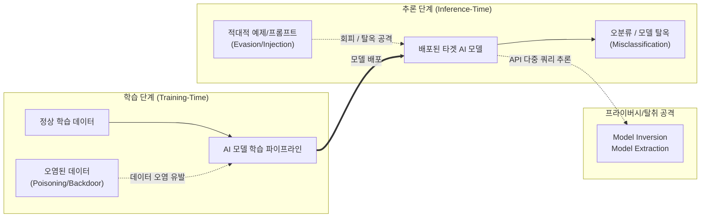

# 인공지능 적대적 공격 (Adversarial Attack)

---

## I. AI 시스템의 취약점을 노리는 보안 위협, 인공지능 적대적 공격의 개요

* **정의**: [[인공지능]] 모델의 착각이나 오분류를 유도하기 위해 의도적으로 조작된 데이터(적대적 예제)를 입력하거나, 학습 데이터를 오염시켜 AI 시스템의 무결성과 기밀성을 훼손하는 사이버 공격 기법
* **배경 및 특징**:
* **AI 보안 중요성 대두**: [[Smart Car(자율주행)|자율주행]], 금융, [[초거대 언어 모델|LLM]](대규모 언어 모델) 등 AI 의존도가 높아짐에 따라 AI 고유의 블랙박스 특성을 악용한 위협 증가
* **미세한 섭동(Perturbation)**: 인간의 오감으로는 인지하기 어려운 수준의 노이즈를 추가하여 기계학습 모델의 치명적인 오판 유도
* **NIST 분류 체계**: 위협 발생 시점에 따라 학습 단계(Poisoning)와 추론 단계(Evasion), 프라이버시 탈취(Inversion) 공격으로 체계화됨

---

## II. 인공지능 적대적 공격의 개념도 및 핵심 기술 요소

### 가. 적대적 공격의 발생 단계별 개념도

* 학습 단계에서는 악의적 데이터를 주입하여 의사결정 경계를 왜곡(Poisoning)하고, 배포 후 추론 단계에서는 조작된 입력(Evasion)으로 오작동 및 정보 유출을 유발함

### 나. 인공지능 적대적 공격의 핵심 기술 요소

| 구분 | 요소기술(키워드) | 세부 설명 |
| --- | --- | --- |
| **추론 방해** | 회피 공격 (Evasion Attack) | - FGSM, PGD [[알고리즘]] 등을 사용하여 원본 이미지/데이터에 미세한 노이즈를 추가해 AI 모델의 오분류(Misclassification)를 유도 |
| **학습 방해** | 데이터 오염 (Data Poisoning) | - 라벨 플리핑(Label Flipping) 등 학습 데이터셋 자체를 악의적으로 조작하여 모델의 정상적인 패턴 학습을 방해하고 정확도를 저하함 |
| **학습 방해** | 백도어 공격 (Backdoor) | - 특정 패턴(Trigger)이 입력으로 들어올 때만 공격자가 의도한 오동작을 수행하도록 모델 내부에 은닉된 취약점을 심는 기법 |
| **정보 탈취** | 모델 역전 (Model Inversion) | - 배포된 API 모델의 예측 결과(Confidence Score 등)를 지속 분석하여 역으로 학습에 사용된 민감한 원본 데이터를 재구성해 내는 공격 |
| **LLM 특화** | [[프롬프트 인젝션]] (Injection) | - 사용자 입력이나 외부 문서(웹, PDF)에 숨겨진 악성 메타 지시어를 삽입하여 LLM의 기존 시스템 프롬프트를 무력화(간접 인젝션 등) |
| **LLM 특화** | 모델 탈옥 (Jailbreaking) | - DAN(Do Anything Now) 등 롤플레잉이나 우회적 맥락을 부여하여 LLM의 안전 가드레일(윤리, 유해성 필터)을 무력화하고 금지된 응답을 유도 |
| **공격 특성** | 전이성 (Transferability) | - 한 AI 모델을 공격하기 위해 생성한 적대적 예제가 내부 구조가 전혀 다른 타 AI 모델에서도 동일한 오분류를 유발하는 현상 |
| **방어 기술** | 적대적 학습 (Adv. Training) | - 알려진 적대적 예제들을 사전 학습 데이터에 포함시켜 훈련함으로써 모델의 의사결정 경계를 견고하게(Robustness) 만드는 대표적 방어 기법 |

---

## III. 인공지능 적대적 공격의 타겟 생명주기별 비교 및 향후 전망

### 가. 학습 단계 공격과 추론 단계 공격의 비교

| 비교 항목 | 학습 단계 공격 (Training-Time Attack) | 추론 단계 공격 (Inference-Time Attack) |
| --- | --- | --- |
| **주요 공격 유형** | 데이터 오염(Poisoning), 백도어(Backdoor) 삽입 | 회피 공격(Evasion), 모델 역전(Inversion) |
| **공격 타겟/진입점** | 학습 데이터셋, 전처리 파이프라인, 사전학습 모델 | 학습이 완료되어 배포된 시스템 API 및 사용자 프롬프트 |
| **주요 공격 목표** | 모델의 의사결정 경계 영구적 왜곡, [[HA(High Availability)|가용성]] 파괴 | 입력값 조작을 통한 보안 인가 우회, 내부 시스템 지시어 탈취 |
| **생성형 AI(LLM) 위협** | 악의적 문서가 크롤링되어 RAG(검색 증강 생성) 지식 베이스 중독 | 프롬프트 인젝션, 가상 [[페르소나]] 부여를 통한 탈옥(Jailbreak) |
| **주요 방어 및 완화 체계** | 데이터 출처 증명(Provenance), [[무결성]] 검증, 샌드박싱 | 적대적 학습, 입력 정제(Input Sanitization), AI 가드레일 적용 |

### 나. 향후 전망 및 시사점

* **LLM의 확산과 간접 인젝션(Indirect Injection)의 위협**: AI 에이전트가 외부 웹페이지나 이메일을 스스로 읽고 요약하는 기능이 활성화됨에 따라, 외부 데이터에 숨겨진 악성 지시어를 무비판적으로 수용하게 되는 간접 프롬프트 인젝션 방어가 최우선 과제로 대두됨.
* **레드팀(Red Teaming) 기반의 능동적 보안 내재화**: MITRE ATLAS(Adversarial Threat Landscape for AI Systems) 등 글로벌 AI 공격 프레임워크를 기반으로, 배포 전 AI 레드팀을 가동하여 취약점을 선제적으로 탐지 및 보완하는 [[AI TRiSM]]([[신뢰성]], 위험 및 보안 관리) 체계 구축이 필수적임.

---

### 🔗 연관 토픽

- **소속 도메인**: [[00_인공지능_MOC|🤖 인공지능]]
- **세부 분류**: `2. 머신러닝 기초 & 핵심 알고리즘`
- **핵심 연관 토픽**:
  - [[인공지능]]
  - [[무결성]]
  - [[Smart Car(자율주행)]]
  - [[강화학습]]
  - [[AI 거버넌스|AI 거버넌스 (AI Governance)]]
