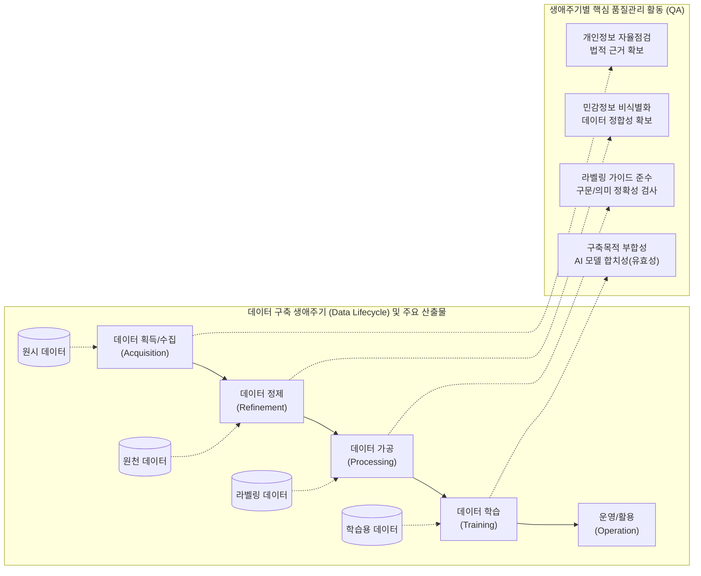

# 인공지능 학습용 데이터 품질관리 가이드라인 v3.1

---

## I. 초거대 AI 시대 고품질 데이터 생태계의 기준, 인공지능 학습용 데이터 품질관리 가이드라인 v3.1의 개요

* **정의**: NIA(한국지능정보사회진흥원) 주도로 대규모 AI 학습용 데이터 구축 사업의 품질 거버넌스, 생애주기 [[프로세스]] 및 검증 지표를 체계화하여 민·관에 제시한 표준 지침서
* **등장배경 및 특징**:
* **초거대 AI 패러다임 변화**: [[초거대 언어 모델|LLM]], 멀티모달(LMM), [[합성 데이터]] 등 생성형 AI 기술 발전에 따른 신규 데이터 품질 평가 기준 요구 대두
* **핵심 특징**: 3권 분리 구조(총괄/초거대AI 특화/양식), [[PMBOK 프로세스 그룹 (5단계)|5단계]] 생애주기(Life-Cycle) 기반 품질 통제, 법적/윤리적 준거성(개인정보 [[비식별화]] 등) 및 AI 모델 유효성 검증 강화

---

## II. 인공지능 학습용 데이터 품질관리 가이드라인 v3.1의 개념도 및 핵심 구성 요소

### 가. 인공지능 학습용 데이터 품질관리 프로세스 개념도

* 데이터 획득부터 학습까지 5단계 생애주기에 따른 연속적 산출물(원시 $\rightarrow$ 원천 $\rightarrow$ 라벨링 $\rightarrow$ 학습용) 흐름 정의
* 각 공정별로 법률적 준거성(저작권/개인정보), 데이터 포맷 정합성, 어노테이션([[Annotation]])의 정확성, 모델 학습 유효성을 교차 검증함

### 나. 인공지능 학습용 데이터 품질관리 가이드라인 v3.1의 핵심 기술/구성 요소

| 분류 | 요소기술(키워드) | 세부 설명 |
| --- | --- | --- |
| **가이드라인 체계** | 3권 분리 아키텍처 | - 제1권(일반 [[품질관리]]), 제2권(초거대AI/생성형AI 데이터 특화), 별권(산출물 양식 및 예시)으로 분리하여 확장성 확보 |
| **핵심 검증 지표** | 구문 정확성 (Syntax) | - 라벨링 데이터가 사전에 정의된 메타데이터 구조, 파일 포맷, [[JSON]] [[스키마]] 등의 규칙을 기술적으로 준수하는지 검증 |
| **핵심 검증 지표** | 의미 정확성 (Semantic) | - 원천 데이터와 라벨링 데이터 간의 의미적 일치성(객체 Bounding Box, 태깅 정확도 등) 및 논리적 오류 여부 검증 |
| **핵심 검증 지표** | 유효성 (Effectiveness) | - 최종 구축된 학습용 데이터 세트를 실제 AI 알고리즘에 적용 시 목표하는 성능(AI 모델 합치성)을 달성하는지 검증 |
| **초거대 AI 특화** | LLM/LMM 대응 지표 | - 텍스트 코퍼스, 이미지 캡셔닝 등 멀티모달 생성형 AI를 위한 데이터 특성 및 합성 데이터 구축 방법론 신규 제시 |
| **윤리 및 보안** | 개인정보 비식별화 | - 획득 및 정제 단계에서 '개인정보 자율점검표' 작성을 의무화하고 가명/익명 처리 및 모자이크(Blur) 조치 수행 |
| **윤리 및 보안** | 법적 준거성 확보 | - 웹 크롤링 데이터 등의 출처 명시, 저작권 라이선스 확보, 편향성(Bias) 및 혐오 표현 배제를 통한 [[신뢰성]] 구축 |
| **거버넌스 통제** | 자가점검 / 제3자 검증 | - 데이터 구축 기관의 체계적 자가점검(내부 QA) 수행 및 TTA 등 외부 전문 검증 기관을 통한 객관적 교차 검증 수행 |

---

## III. 전통적 데이터 품질관리와의 비교 및 향후 발전 전망

### 가. 전통적 데이터 품질관리와 AI 학습용 데이터 품질관리 비교

| 구분 | 전통적 [[데이터 품질관리(ISO 8000)|데이터 품질관리]] (DQM) | [[인공지능]] 학습용 데이터 품질관리 |
| --- | --- | --- |
| **핵심 목적** | 시스템 간 데이터 정합성, [[무결성]] 및 적시성 유지 | AI 모델의 학습 성능 극대화 및 편향성/환각 최소화 |
| **주요 대상** | RDB 중심의 정형 데이터 (메타데이터, 마스터데이터 등) | 텍스트, 이미지, 음성, 영상 등 비정형 멀티모달 데이터 |
| **품질 지표** | 정확성, 완전성, 일관성, 유효성 (데이터 값 자체 중심) | 구문 정확성, 의미 정확성, AI 모델 합치성 (라벨링 중심) |
| **기준 문서** | [[공공데이터]] 품질관리 매뉴얼, ISO 8000 | 인공지능 학습용 데이터 품질관리 가이드라인 (NIA) |

### 나. 최신 기술 동향 및 향후 발전 전망

* **Data-Centric AI 관점의 내재화**: 모델의 [[알고리즘]] 튜닝보다 양질의 데이터 확보(Zero-Defect)가 AI 성능에 미치는 영향이 지대해짐에 따라, [[MLOps]] 파이프라인 내 필수 품질 기준으로 공공뿐만 아니라 민간 산업군으로 확산 적용 중임.
* **글로벌 규제 대응 및 지표 지속 고도화**: EU AI Act 제정 등 글로벌 저작권, 데이터 편향성 규제가 강화됨에 따라, NIA는 생성형 AI 데이터의 특성을 반영하여 v3.5 등 매년 지표를 지속적으로 고도화하여 발간하고 있음.

---

### 🔗 연관 토픽

- **소속 도메인**: [[00_인공지능_MOC|🤖 인공지능]]
- **세부 분류**: `4. 거대언어모델 (LLM) & 생성형 AI`
- **핵심 연관 토픽**:
  - [[인공지능]]
  - [[합성 데이터|합성 데이터(Synthetic Data)]]
  - [[MLOps]]
  - [[공공데이터|공공데이터 (Open Data)]]
  - [[데이터 품질관리(ISO 8000)]]
